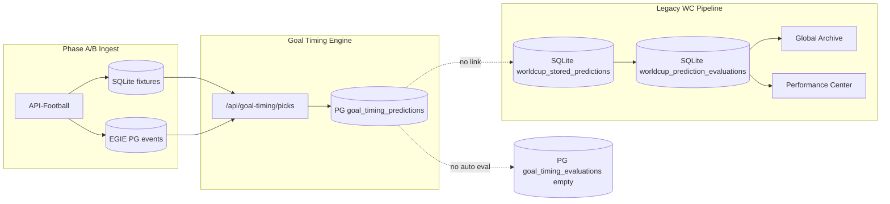
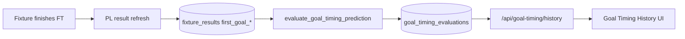

# EGIE Evaluation Pipeline Audit — Phase EGIE-AUDIT-1

**Mode:** Audit only — no code changes, no deploy  
**Date:** 2026-06-22  
**Subject:** 48 published Elite Goal Timing picks (Phase B, Premier League 2026/27 upcoming fixtures)  
**Scope:** Storage, evaluation automation, UI surfaces (Archive / Accuracy Center / Performance Center)

---

## Executive verdict

| Question | Answer |
|----------|--------|
| **1. Stored in archive?** | **No** — not in legacy Global Archive, My History, or `worldcup_stored_predictions` |
| **2. Linked to `fixture_id`?** | **Yes** — PostgreSQL `goal_timing_predictions.fixture_id` (plus related child tables) |
| **3. Auto-evaluated when match finishes?** | **No** — no scheduler, job, or hook exists for Elite Goal Timing |
| **4. Evaluator for First Goal / Minute / Range?** | **Designed:** `evaluate_goal_timing_prediction()` — **not wired**. Legacy WC evaluators exist but read a different payload shape and never see these picks |
| **5. Results in Archive / Accuracy / Performance?** | **No** — by architecture (Phase 51) and because Phase 51E is not implemented |
| **6. Missing pieces?** | See §6 — evaluation persistence, finish-trigger job, PL result refresh, API history routes, UI |

**Bottom line:** The 48 picks are **live and persisted for picks API**, but they sit in a **parallel PostgreSQL silo** with **no post-match evaluation pipeline** and **no connection** to the existing accuracy/archive stack.

---

## 1. Where the 48 published picks live

### Primary store (YES — linked to fixture)

Phase B / `GoalTimingPredictionService.predict_fixture(..., persist=True)` writes to **PostgreSQL** via `GoalTimingRepository.save_prediction()`:

| Table | Role | `fixture_id` link |
|-------|------|-------------------|
| `goal_timing_predictions` | Main prediction row (`no_prediction_flag=false`, `status='published'`) | **YES** — `fixture_id BIGINT NOT NULL` |
| `goal_timing_prediction_markets` | Markets: `first_goal_team`, `first_goal_time_range`, range probs | Via `prediction_id` → parent `fixture_id` |
| `goal_timing_agent_outputs` | Specialist agent breakdown | Via `prediction_id` |
| `goal_timing_features` | Feature snapshots | **YES** — `fixture_id` |

Migrations: `alembic/versions/007_goal_timing_engine.py`, `009_goal_timing_display_minutes.py`.

**Fixture context (SQLite):** Upcoming PL rows (`fixtures` table, `competition_key='premier_league'`, status `NS`) were synced in Phase B. Picks resolve teams/kickoff from this table via `StoredGoalTimingAdapter` / `list_upcoming_fixtures()`.

### Legacy archive stores (NO)

| Store | Used by | Contains Elite Goal Timing picks? |
|-------|---------|-----------------------------------|
| SQLite `predictions` / `worldcup_stored_predictions` | Global Archive (`global_prediction_archive.py`) | **No** — WC background predictions only |
| PostgreSQL `user_prediction_history` | My History (`/api/user/history`) | **No** |
| SQLite `worldcup_prediction_evaluations` | Archive detail, Performance Center, Accuracy summary | **No** — evaluated **legacy** WC payloads only |

`GoalTimingPredictionService` does **not** call `WorldcupPredictionStore`, `record_from_match_prediction()`, or any archive writer.

---

## 2. Are picks in “Archive”?

### Global Archive (`/history`, scope=global)

- **Source:** `FootballIntelligenceRepository.list_worldcup_stored_predictions(competition_key="world_cup_2026")`
- **Competition filter:** Hard-coded **World Cup 2026** in `list_global_archive_rows()`
- **Payload shape:** JSON with `detailed_markets`, `one_x_two`, etc. — not `goal_timing_predictions` columns

**Verdict:** **48 Elite picks are not in Global Archive.**

### My History Archive

- **Source:** SaaS `user_prediction_history` (user-scoped 1X2 / multi-market cards)
- Goal Timing picks are generated system-side on `/api/goal-timing/picks`; no user-history insert

**Verdict:** **Not in My History.**

### Goal Timing History (`/goal-timing/history`)

- Frontend: `GoalTimingHistoryPage.jsx` — **placeholder only** (`showComingSoonFooter`)
- Backend: **no** `/api/goal-timing/history` or `/api/goal-timing/evaluations` route in `api/routes/goal_timing.py`
- Dashboard hard-codes `"recent_evaluations": []`

**Verdict:** **Dedicated history UI not built; no evaluated rows to show.**

---

## 3. Automatic evaluation when match finishes?

### Designed behavior (Phase 51 foundation doc)

`PHASE_51_ELITE_GOAL_TIMING_FOUNDATION.md` §Evaluation:

- After match finish: compare `first_goal_team`, `first_goal_time_range`, `estimated_first_goal_minute`
- Persist to `goal_timing_evaluations`
- **Explicit:** “Do not use legacy `worldcup_prediction_evaluations` for this engine”
- Phase **51E** = “Evaluation pipeline + goal-timing history UI” — **not shipped**

### What actually runs in production today

| Job | File | Default competition | Touches goal timing picks? |
|-----|------|---------------------|---------------------------|
| `run_production_auto_evaluation` | `auto_evaluation_job.py` | `world_cup_2026` | **No** |
| `run_evaluate_worldcup_results` | `result_evaluation_job.py` | `world_cup_2026` | **No** |
| `refresh_stored_prediction_results` | `result_refresh.py` | `world_cup_2026` | **No** — only fixtures with **WC stored predictions** |

No cron, systemd timer, or `prematch_scheduler` path references `goal_timing`, `premier_league`, or `GoalTimingRepository`.

### Evaluation logic exists but is orphaned

`worldcup_predictor/goal_timing/evaluation.py`:

```python
evaluate_goal_timing_prediction(
    fixture_id, prediction_id,
    predicted_first_goal_team, predicted_first_goal_time_range, estimated_first_goal_minute,
    actual_first_goal_team, actual_first_goal_minute,
) -> GoalTimingEvaluationResult
```

Outputs per market:

| Market | Result field | Status values |
|--------|--------------|---------------|
| First Goal Team | `first_goal_team_status` | correct / wrong / pending |
| Goal Range | `time_range_status` | correct / wrong / pending |
| Goal Minute | `minute_tolerance_status` | correct / partial / wrong / pending (bands: exact ±0, close ±5, acceptable ±10) |

**Gap:** `GoalTimingRepository` has **no** `save_evaluation()` / `upsert_evaluation()`. Table `goal_timing_evaluations` is created by migration but **never written** in application code (grep: zero callers outside migration + `evaluation.py`).

### Finish detection for PL fixtures

When a Phase B fixture (e.g. `1557367`) finishes:

1. SQLite `fixtures.status` must become `FT` and `fixture_results` must get `first_goal_minute` / `first_goal_team`
2. **No production job** currently refreshes PL results for goal-timing fixture IDs
3. `FixtureOutcomeResolver` *could* resolve outcomes from SQLite if results exist — but nothing invokes goal-timing evaluation

**Verdict:** **Picks will not be automatically evaluated** when matches finish unless new pipeline work (Phase 51E) is added.

---

## 4. Which evaluator scores each market?

### Intended evaluator (Elite Goal Timing — not wired)

| Market | Function | Scoring rule |
|--------|----------|--------------|
| **First Goal Team** | `evaluate_goal_timing_prediction` → `_team_status` | Predicted `home`/`away` vs actual first scorer side |
| **Goal Range** | `evaluate_goal_timing_prediction` → `_range_status` | Predicted bucket (`0-15` … `76-90+`) vs `minute_to_range(actual_minute)` |
| **Goal Minute** | `evaluate_goal_timing_prediction` → `_minute_status` | `display_estimated_first_goal_minute` vs actual with tolerance bands |

Helper: `minute_to_range()` in same module; ranges from `GOAL_TIMING_MINUTE_RANGES` in `goal_timing/config.py`.

### Legacy evaluators (active for WC only — different payload)

Used by `pick_evaluator.evaluate_stored_prediction()` → `evaluate_advanced_markets()` when **SQLite WC stored prediction** exists:

| Market | Module | Input expected |
|--------|--------|----------------|
| First Goal Team | `advanced_market_evaluator.evaluate_first_goal_team` | `payload.detailed_markets.first_goal.team` |
| Goal Minute / Range | `goal_minute_evaluator.evaluate_goal_minute` | `payload.detailed_markets.first_goal.minute_range` / `expected_minute` |

These read **legacy MatchPrediction JSON**, not `goal_timing_predictions.first_goal_team` / `first_goal_time_range` / `display_estimated_first_goal_minute`.

Archive detail maps a **display** market key `goal_timing` from legacy `first_goal` block (`prediction_archive_detail.py`) — still WC stored payloads, not Elite engine rows.

**Verdict for 48 picks:** **No evaluator will score them today.** The correct future evaluator is `evaluate_goal_timing_prediction`; legacy evaluators are irrelevant unless picks are duplicated into WC payload format (not done).

---

## 5. Will results appear in Archive / Accuracy Center / Performance Center?

| Surface | Route / module | Data source | Elite goal timing results? |
|---------|----------------|-------------|----------------------------|
| **Global Archive** | `/history` → `global_prediction_archive.py` | `worldcup_stored_predictions` + `worldcup_prediction_evaluations` | **No** |
| **Archive detail** | `/api/history/{id}` → `prediction_archive_detail.py` | Same + `evaluate_stored_prediction` | **No** — `goal_timing` block needs legacy `detailed_markets.first_goal` |
| **Accuracy Center** | `/accuracy` → `fetchPerformanceSummary` | `performance_center.build_performance_summary` → `worldcup_prediction_evaluations` / `accuracy_summary` | **No** — aggregates WC eval rows; “Goal Minute” column reads `market_goal_minute_status` on those rows |
| **Performance Center** | Embedded in Accuracy Center | `performance_center.py` `_MARKET_DEFS` includes “Goal Minute” | **No** — same WC evaluation table |
| **Goal Timing Dashboard** | `/goal-timing/dashboard` | `recent_evaluations: []` stub | **No** |
| **Goal Timing History** | `/goal-timing/history` | Coming soon UI | **No** |

Phase 51A intentionally **hid** legacy Archive/Accuracy from primary nav in favor of Goal Timing section; Elite engine was meant to get **its own** history/eval UI in 51E — not connected to old centers.

---

## 6. Exact missing tables / routes / evaluators / jobs

### Database (PostgreSQL) — schema exists, writes missing

| Artifact | Status |
|----------|--------|
| Table `goal_timing_evaluations` | **Exists** (migration 007) |
| `GoalTimingRepository.save_evaluation()` | **Missing** |
| `GoalTimingRepository.list_evaluations()` / join predictions | **Missing** |
| Idempotent upsert on `goal_timing_predictions` per fixture | **Missing** — current code **INSERT** only (duplicate rows on re-predict) |

### Evaluation engine — logic exists, orchestration missing

| Artifact | Status |
|----------|--------|
| `evaluate_goal_timing_prediction()` | **Exists** (`goal_timing/evaluation.py`) |
| Finish trigger job (scan `goal_timing_predictions` where `match_date < now` and fixture `FT`) | **Missing** |
| Actual outcome source wiring (`FixtureOutcomeResolver` or `fixture_results.first_goal_minute`) | **Resolver exists**; **not called** for goal timing |
| PL result refresh for synced fixture IDs | **Missing** — `result_refresh.py` is WC-stored-prediction scoped |

### API routes — missing

| Route | Purpose | Status |
|-------|---------|--------|
| `GET /api/goal-timing/history` | List evaluated predictions | **Missing** |
| `GET /api/goal-timing/evaluations/{fixture_id}` | Single evaluation detail | **Missing** |
| `POST /api/goal-timing/evaluations/run` (admin) | Manual backfill | **Missing** |

Existing: `/api/goal-timing/picks`, `/predictions/{fixture_id}`, `/dashboard` (evaluations stub empty).

### Frontend — placeholder

| Page | Status |
|------|--------|
| `GoalTimingHistoryPage.jsx` | **Coming soon** — no API fetch |
| `GoalTimingBacktestPage.jsx` | Placeholder |
| `GoalTimingInsightsPage.jsx` | Placeholder |

### Legacy integration gaps (if cross-surface reporting desired later)

| Integration | Status |
|-------------|--------|
| Write-through to `worldcup_stored_predictions` | **Not implemented** (and wrong competition_key for PL) |
| `worldcup_prediction_evaluations` columns `market_fg_team_status`, `market_goal_minute_status` | **WC only**; different payload contract |
| `rebuild_accuracy_summary(competition_key=...)` for `premier_league` | **Not implemented** |
| `performance_center.build_performance_summary` for goal timing | **Not implemented** |

### Backtest path (manual / Phase 51F — not production eval)

`GoalTimingBacktestRunner.run()` returns `"status": "not_started"` — DB-only backtest not operational. Does **not** substitute for live pick evaluation.

---

## 7. Data-flow diagram (current vs required)

### Current (Phase B picks)



### Required for Phase 51E (documented, not built)



---

## 8. Per-question checklist (48 published picks)

| # | Question | Result |
|---|----------|--------|
| 1 | Archive? | **No** (legacy archive WC-only; goal timing history not built) |
| 2 | `fixture_id` link? | **Yes** in `goal_timing_predictions` + features |
| 3 | Auto-eval on finish? | **No** |
| 4a | First Goal Team scorer | `evaluate_goal_timing_prediction` (unwired) |
| 4b | Goal Minute | `minute_tolerance_status` in same (unwired) |
| 4c | Goal Range | `time_range_status` in same (unwired) |
| 5a | Archive | **No** |
| 5b | Accuracy Center | **No** |
| 5c | Performance Center | **No** |
| 6 | Gaps | §6 — `save_evaluation`, finish job, PL refresh, history API/UI |

---

## 9. Recommendations (audit only — not implemented)

Priority order aligned with `PHASE_51_ELITE_GOAL_TIMING_FOUNDATION.md` Phase **51E**:

1. **`GoalTimingRepository.save_evaluation()`** — persist to `goal_timing_evaluations` with FK to `prediction_id`
2. **`run_evaluate_goal_timing_results`** — scan published predictions for finished PL fixtures; call `FixtureOutcomeResolver` + `evaluate_goal_timing_prediction`
3. **PL result refresh** — extend or parallel `result_refresh` for `competition_key=premier_league` on synced fixture IDs (populate `fixture_results.first_goal_minute`)
4. **API + UI** — `GET /api/goal-timing/history`; implement `GoalTimingHistoryPage`
5. **Optional later** — feed aggregated stats into Performance Center as a **separate** `goal_timing` section (do not reuse `worldcup_prediction_evaluations` per Phase 51 rule)

---

## 10. References (code)

| Path | Relevance |
|------|-----------|
| `worldcup_predictor/goal_timing/prediction_service.py` | Picks generation + PG persist |
| `worldcup_predictor/goal_timing/storage/repository.py` | `save_prediction`, `get_prediction_by_fixture` |
| `worldcup_predictor/goal_timing/evaluation.py` | Evaluation logic (orphaned) |
| `worldcup_predictor/api/routes/goal_timing.py` | Picks API; no history/eval routes |
| `worldcup_predictor/api/global_prediction_archive.py` | WC archive only |
| `worldcup_predictor/api/performance_center.py` | WC eval aggregates |
| `worldcup_predictor/automation/worldcup_background/result_evaluation_job.py` | WC auto-eval |
| `worldcup_predictor/automation/worldcup_background/goal_minute_evaluator.py` | Legacy goal minute (different payload) |
| `worldcup_predictor/automation/worldcup_background/advanced_market_evaluator.py` | Legacy first goal team |
| `alembic/versions/007_goal_timing_engine.py` | `goal_timing_evaluations` DDL |
| `PHASE_51_ELITE_GOAL_TIMING_FOUNDATION.md` | Intended separation from legacy archive |

---

**Audit complete.** No code changes. No deploy. No quota spent.
