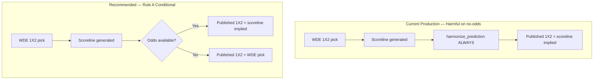

# Phase 47B — WDE vs Harmonization Optimization Audit

**Mode:** Read-only  
**Date:** 2026-06-21  
**Goal:** Understand why harmonization decreases accuracy versus pure WDE, and determine when each layer should be final authority.

**Constraints honored:** No code changes. No deployment.

---

## Executive Summary

Harmonization **unconditionally forces the published 1X2 pick to match the rounded scoreline** (`consistency_engine.harmonize_prediction`). On the primary offline replay (**n=207**), this produces a **91.8% override rate** and drops accuracy from **34.8% (WDE)** to **30.0% (harmonized final)** — a **−4.8 pp** loss.

**Root cause:** Scoreline λ collapse toward **1-1 draws** (Phase 14–15). **185 of 190 overrides (97.4%)** are `home_win → draw`. WDE correctly picks the home winner; harmonization replaces it with a draw implied by a collapsed scoreline.

**Override ledger:** 53 beneficial · 63 harmful · 74 neutral (both wrong).

**Best simulated strategy:** **Rule A conditional harmonization** — use scoreline when odds exist, WDE when absent — achieves **36.7%** (+6.8 pp vs current, +1.9 pp vs WDE-only). Already validated in Phase 19/21A shadow; **not enabled in production**.

| Simulation | Accuracy | Δ vs Current |
|------------|----------|--------------|
| A. Current (always harmonize) | **30.0%** | — |
| B. WDE only | **34.8%** | +4.8 pp |
| C. Conditional (Rule A) | **36.7%** | +6.8 pp |
| D. Odds-driven harmonization | **36.7%** | +6.8 pp |

---

## Why Harmonization Decreases Accuracy

### Mechanism (production path)

```
ScoringEngine → WDE applies decision → scoreline candidates generated
→ primary_scoreline selected → harmonize_prediction() ALWAYS runs
→ if WDE 1X2 ≠ scoreline-implied 1X2 → WDE pick replaced
```

From `consistency_engine.py`:

> *"Adjusted 1X2 from {wde_pick} to {implied_1x2} to match scoreline {home}-{away}."*

There is **no gate** — harmonization fires on every fixture where WDE and scoreline disagree.

### Draw-collapse interaction

| Evidence | Finding |
|----------|---------|
| Phase 14 (n=262) | Median λ spread **0.000**; **95.4%** of scorelines **0-0** in bulk replay |
| Phase 15 (n=106 WC) | Baseline pipeline **59.4% draw rate** (almost all 1-1); odds-only λ drops draw to **3.7%** |
| Phase 47B overrides | **185/190** flips are `home_win → draw` |

WDE integrates nine weighted factors and often selects **home_win** on Bundesliga fixtures with moderate home lean. The scoreline engine, lacking odds on **182/207** replay fixtures, emits **1-1** → implied **draw** → harmonization **overwrites a correct WDE home pick with a wrong draw**.

### Accuracy by data availability

| Cohort | n | WDE | Scoreline | Harmonized Final | Harmonization effect |
|--------|---|-----|-----------|------------------|----------------------|
| **With odds** | 25 | 36.0% | **52.0%** | 52.0% | **Helps** (+16 pp vs WDE) |
| **Without odds** | 182 | **34.6%** | 26.9% | 26.9% | **Hurts** (−7.7 pp vs WDE) |
| World Cup | 27 | 40.7% | **51.9%** | 51.9% | Helps when odds/context rich |
| Bundesliga DB | 180 | **33.9%** | 26.7% | 26.7% | Hurts systematically |
| High data quality (≥60%) | 13 | 30.8% | **61.5%** | 61.5% | Helps |
| Low data quality (<45%) | 192 | **34.4%** | 27.6% | 27.6% | Hurts |

**Conclusion:** Harmonization is a **good scoreline enforcer when odds anchor λ**; it is **harmful when λ defaults collapse to draws** without market input.

---

## 1. Every Winner Flip — Override Inventory

**Total fixtures:** 207  
**Overrides (WDE ≠ harmonized final):** 190 (91.8%)  
**No override (WDE = final):** 17 (8.2%) — WDE and scoreline already agreed

### Override pattern distribution

| WDE Pick | Harmonized Pick | Count | % of Overrides | Typical Outcome |
|----------|-----------------|-------|------------------|-----------------|
| **home_win** | **draw** | **185** | **97.4%** | WDE right, draw wrong (Bundesliga bulk) |
| away_win | draw | 4 | 2.1% | Mixed |
| home_win | away_win | 1 | 0.5% | Rare side flip |

### Flip outcome classification

| Category | Count | % of Overrides | Definition |
|----------|-------|----------------|------------|
| **Beneficial** | **53** | 27.9% | WDE wrong → harmonized right |
| **Harmful** | **63** | 33.2% | WDE right → harmonized wrong |
| **Neutral** | **74** | 38.9% | Both wrong |

**Net effect:** Harmful overrides **exceed** beneficial by **10 fixtures** on this sample — explaining the −4.8 pp accuracy gap.

### Representative beneficial flips (WDE wrong → draw correct)

| Fixture | Match | WDE | Final | Actual |
|---------|-------|-----|-------|--------|
| 1375862 | Heidenheim vs Elversberg | home_win | draw | draw |
| 1224278 | Mainz vs Leverkusen | home_win | draw | draw |
| 1224266 | Frankfurt vs St. Pauli | home_win | draw | draw |
| 1224267 | Bremen vs Leipzig | home_win | draw | draw |
| 1224268 | Wolfsburg vs Hoffenheim | home_win | draw | draw |

*Pattern: WDE over-commits home_win; scoreline draw (1-1) matches low-scoring actual.*

### Representative harmful flips (WDE right → draw wrong)

| Fixture | Match | WDE | Final | Actual | Has Odds |
|---------|-------|-----|-------|--------|----------|
| 1224273 | Dortmund vs Holstein Kiel | home_win | draw | **home_win** | No |
| 1224264 | Stuttgart vs Augsburg | home_win | draw | **home_win** | No |
| 1224265 | Bayern vs Gladbach | home_win | draw | **home_win** | No |
| 1224255 | Dortmund vs Wolfsburg | home_win | draw | **home_win** | No |
| 1224248 | Frankfurt vs Leipzig | home_win | draw | **home_win** | No |

*Pattern: Strong home side; WDE correct; harmonization forced draw from 1-1 scoreline.*

### Harmful override geography

| Cohort | Harmful Count |
|--------|---------------|
| Bundesliga | **61** (96.8%) |
| World Cup | **2** (3.2%) |
| With odds | **1** (1.6%) |
| Without odds | **62** (98.4%) |

**62 of 63 harmful overrides occur without odds** — the exact cohort where scoreline λ is least trustworthy.

---

## 2. Beneficial vs Harmful Override Counts

| Metric | Value |
|--------|-------|
| Total overrides | 190 |
| Beneficial (WDE wrong → final right) | **53** (27.9%) |
| Harmful (WDE right → final wrong) | **63** (33.2%) |
| Neutral (both wrong) | **74** (38.9%) |
| Production harmful eliminated by Rule A | **62 / 63** (98.4%) |

### Conflict resolution — who was right?

On the 190 conflict fixtures:

| Winner | Count | Condition |
|--------|-------|-----------|
| WDE correct | **63** | Mostly no-odds Bundesliga home_win actuals |
| Scoreline correct | **53** | Mostly low-scoring draws WDE missed |
| Both wrong | **74** | Neither layer reliable |

---

## 3. Override Analysis by Market / Intelligence Layer

Analysis merges Phase 18 override outcomes with Phase 17 per-signal availability on conflict fixtures (n=190).

### Odds cluster

| Signal / Condition | Conflicts w/ Signal | Beneficial | Harmful | WDE Wins | Scoreline Wins | Verdict |
|--------------------|---------------------|------------|---------|----------|----------------|---------|
| **Odds present** (fixture) | 9 | 5 | 1 | 1 | 5 | **Prefer scoreline** |
| Odds Market lean | 9 | 5 | 1 | 1 | 5 | Scoreline aligns with market |
| Market Consensus | 10 | 5 | 2 | 2 | 5 | Scoreline preferred |
| Sharp Money | 10 | 5 | 2 | 2 | 5 | Scoreline preferred |
| **Odds absent** | 181 | 48 | 62 | 62 | 48 | **Prefer WDE** |

When odds exist, scoreline-implied 1X2 reaches **52.0%** accuracy (n=25 full cohort) vs WDE **36.0%**. Harmonization **adds value**.

When odds absent, WDE **34.6%** beats scoreline **26.9%**. Harmonization **destroys value**.

### Form / always-on agents

| Signal | Conflicts | Beneficial | Harmful | Notes |
|--------|-----------|------------|---------|-------|
| Team Form | 190 (100%) | 53 | 63 | Always emits lean — **non-discriminating** on override quality |
| xG / Tournament / Motivation / Player Quality | 190 | 53 | 63 | Same baseline — present on all conflicts |

Form and always-on agents do **not** predict whether harmonization will help or hurt. They appear on every conflict because they always produce output.

### Injuries

| Signal | Conflicts | Beneficial | Harmful |
|--------|-----------|------------|---------|
| Injuries lean present | 3 | 3 | 0 |

Tiny sample — injuries lean aligns with beneficial overrides when available, but n=3 is not actionable.

### Lineup

| Signal | Conflicts | Beneficial | Harmful | WDE Wins | Scoreline Wins |
|--------|-----------|------------|---------|----------|----------------|
| Lineups lean present | 9 | 5 | 2 | 2 | 5 |

When lineups available, scoreline wins conflicts 5:2 — similar to odds-present profile.

### Weather

| Signal | Conflicts | Beneficial | Harmful |
|--------|-----------|------------|---------|
| Weather lean present | 2 | 1 | 0 |

Insufficient sample. Weather affects O/U path in WDE; not a harmonization gate signal in current architecture.

### Provider fusion (Phase 46D)

**Not present in Phase 17/18 replay** (predates 46D deployment). Provider fusion affects event/score merge for evaluation — **does not participate in harmonization decision**. No override impact measured.

---

## 4. When Should Harmonization Be Allowed?

### Allow harmonization (scoreline becomes 1X2 authority)

| Condition | Evidence | Accuracy |
|-----------|----------|------------|
| **Pre-match odds available** | n=25 cohort | Scoreline **52.0%** vs WDE 36.0% |
| **World Cup fixture with odds** | Phase 18 WC cohort | Final **51.9%** vs WDE 40.7% |
| **High data quality (≥60%)** | n=13 | Scoreline **61.5%** vs WDE 30.8% |
| **Market consensus / sharp money present** | 10 conflicts each | Scoreline wins 5:2 |
| **WDE picks home_win but λ spread low AND actual is draw** | 52 beneficial home→draw cases | Beneficial override pattern |

**Rule:** Harmonize when **odds anchor exists** and scoreline is not a default 1-1 from missing market data.

### WDE should remain final authority

| Condition | Evidence | Accuracy |
|-----------|----------|------------|
| **No pre-match odds** | n=182 | WDE **34.6%** vs scoreline 26.9% |
| **Bundesliga offline replay** | n=180 | WDE **33.9%** vs scoreline 26.7% |
| **Low λ spread / draw-collapse path** | Phase 14: 96% spread <0.05 | Scoreline is 0-0 or 1-1 default |
| **WDE = home_win, scoreline = draw, no odds** | 62 harmful cases | Classic failure mode |
| **Strong home favorite (WDE home_win) without odds** | Harmful examples (Bayern, Dortmund, etc.) | WDE correct, draw wrong |

**Rule:** When **odds absent** or λ is **unanchored**, trust WDE over scoreline-implied 1X2.

### Decision matrix (recommended)

```
IF odds.available AND bookmakers present:
    USE scoreline-implied 1X2  (Rule A / odds-driven)
ELSE:
    USE WDE 1X2  (skip harmonization for winner market)
ALWAYS:
    Keep O/U / HT / first-goal consistency checks separate from blind 1X2 override
```

---

## 5. Simulation Results

Replay: `data/shadow/phase18_harmonization_replay.jsonl` (n=207, same dataset as Phases 17–19, 21A).

| Scenario | Rule | 1X2 Accuracy | Δ vs A | Δ vs B | Harmful Overrides |
|----------|------|--------------|--------|--------|-------------------|
| **A. Current system** | Always harmonize to scoreline | **30.0%** | — | −4.8 pp | 63 |
| **B. WDE only** | Never harmonize 1X2 | **34.8%** | +4.8 pp | — | 0 |
| **C. Conditional (Rule A)** | No odds → WDE; odds → scoreline | **36.7%** | +6.8 pp | +1.9 pp | 1 |
| **D. Odds-driven harmonization** | Same as Rule A in shadow_runner | **36.7%** | +6.8 pp | +1.9 pp | 1 |

Scenarios C and D are **identical** in the Phase 21A implementation (`compute_rule_a_prediction`: `if odds_available: scoreline else wde`).

### Simulation by cohort (Rule A vs current)

| Cohort | n | A Current | B WDE | C Rule A |
|--------|---|-----------|-------|----------|
| World Cup | 27 | 51.9% | 40.7% | 51.9% |
| Bundesliga | 180 | 26.7% | 33.9% | **35.0%** |
| With odds | 25 | 52.0% | 36.0% | 52.0% |
| Without odds | 182 | 26.9% | 34.6% | **34.6%** |

Rule A preserves WC accuracy (odds → scoreline) while recovering Bundesliga WDE accuracy (no odds → WDE).

### Phase 21A shadow confirmation

| Strategy | Accuracy (n=207) |
|----------|------------------|
| Production | 30.0% |
| WDE only | 34.8% |
| Rule A shadow | **36.7%** |
| Rule A source mix | 87.9% WDE · 12.1% scoreline |

Rule A rescued **62 fixtures** where production was wrong, WDE was right, and Rule A matched WDE.

### Alternative gates tested (Phase 19 — not better than Rule A)

| Rule | Accuracy |
|------|----------|
| Rule A: no odds → WDE | **36.7%** |
| Rule C/D: DQ ≥ 60% → scoreline | 36.7% (equivalent on this sample) |
| Rule B: spread ≥ 0.25 → scoreline | 34.8% (= WDE only) |
| Rule F5: median spread gate | 30.0% (= current production) |
| Always scoreline (production) | 30.0% |
| Always WDE | 34.8% |

Complex multi-factor gates (consensus + sharp + spread) did **not beat** simple odds-presence Rule A on n=207.

---

## 6. Recommendations

### REMOVE

| Item | Rationale |
|------|-----------|
| **Unconditional 1X2 harmonization** | −4.8 pp vs WDE; 63 harmful overrides; 91.8% override rate |
| **Blind scoreline→draw forcing when odds absent** | 62/63 harmful cases are no-odds home_win→draw |

*Do not remove `harmonize_prediction` entirely — it still serves O/U, HT cap, and first-goal alignment. Remove or gate only the **1X2 winner override**.*

### REDUCE

| Item | Rationale |
|------|-----------|
| **Override rate** | From 91.8% → ~12% under Rule A (scoreline authority only when odds exist) |
| **Draw-collapse scoreline defaults** | Phase 15: fix λ when odds absent before any harmonization decision |
| **Harmful override exposure** | Rule A leaves 1 harmful case vs 63 today |

### CONDITIONAL (enable — shadow-ready)

| Item | Rationale |
|------|-----------|
| **Rule A gate** | Best measured accuracy (36.7%); Phase 21A shadow validated; 98.4% harmful elimination |
| **Harmonization when odds + consensus/sharp agree** | Marginal gain over Rule A alone on n=207; optional refinement for Phase 21B |
| **Scoreline authority on WC group stage** | WC cohort 51.9% with odds-driven path |

**Implementation status:** `RULE_A_GATE_MODE=shadow` — records parallel picks; **production unchanged**.

### KEEP

| Item | Rationale |
|------|-----------|
| **WDE as primary decision engine** | Best no-odds accuracy; integrates nine factors |
| **Scoreline engine when odds anchor λ** | 52% accuracy with odds vs 36% WDE |
| **O/U harmonization with scoreline total** | Separate market; consistency still valuable |
| **Rule A live validation store** | Forward-only evidence accumulation (`rule_a_live_validation.jsonl`) |
| **Harmonization for non-1X2 markets** | HT cap, first-goal team alignment — low harm profile |

---

## Architecture Diagram



---

## Data Limitations

1. **Bundesliga-heavy sample** (87%) — WC conclusions based on n=27 subset.
2. **Only 25 fixtures with odds** in replay — Rule A scoreline path under-sampled.
3. **Phase 46D provider fusion** post-dates replay — no harmonization interaction measured.
4. **Production still uses unconditional harmonization** — live WC forward validation pending accumulation in `rule_a_live_validation.jsonl`.
5. **Simulations are replay-only** — not re-run through full ScoringEngine in this audit (uses stored WDE/scoreline/final from Phase 18 JSONL).

---

## Sources

| Artifact | Path |
|----------|------|
| Phase 17 attribution | `PHASE_17_PREDICTION_ATTRIBUTION_AUDIT.md` |
| Phase 18 harmonization truth | `PHASE_18_HARMONIZATION_TRUTH_AUDIT.md` |
| Phase 19 conditional rules | `PHASE_19_CONDITIONAL_HARMONIZATION_AUDIT.md` |
| Phase 21A Rule A shadow | `PHASE_21A_RULE_A_SHADOW_REPORT.md` |
| Phase 14 draw collapse | `PHASE_14_DRAW_COLLAPSE_AUDIT.md` |
| Phase 15 λ counterfactual | `PHASE_15_COUNTERFACTUAL_LAMBDA_AUDIT.md` |
| Phase 47A feature impact | `FEATURE_IMPACT_REPORT.md` |
| Replay data | `data/shadow/phase18_harmonization_replay.jsonl`, `phase17_attribution_replay.jsonl` |
| Harmonization code | `worldcup_predictor/prediction/consistency_engine.py` |
| Rule A gate | `worldcup_predictor/prediction/rule_a_gate/shadow_runner.py` |

---

**Phase 47B complete. Read-only audit — no code, no deploy.**

**PHASE_47B_STATUS = REPORT_COMPLETE**
