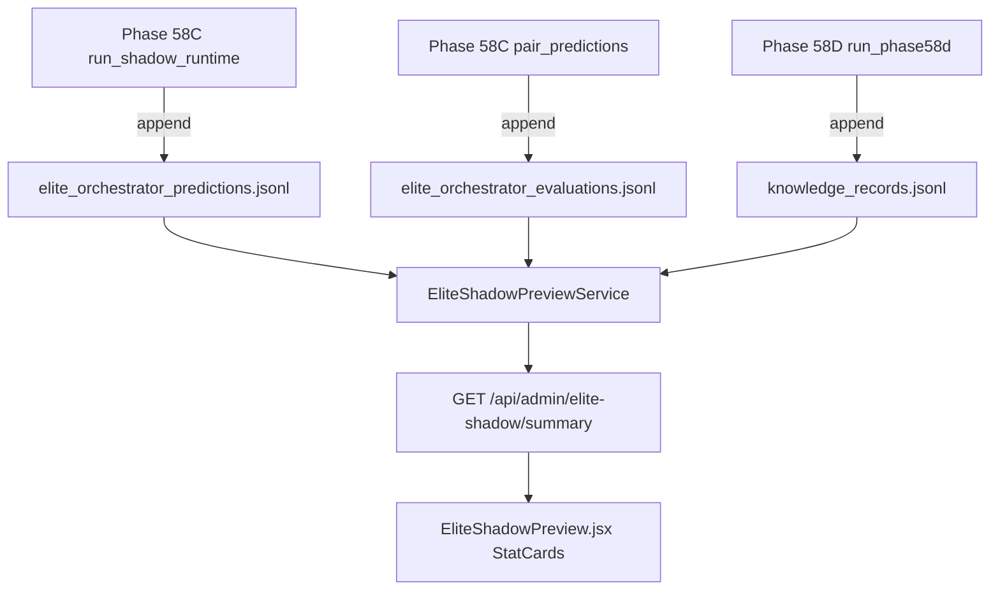

# HOTFIX H3 — Elite Shadow Empty Audit

**Date:** 2026-06-25  
**Symptom:** `/admin/elite-shadow` shows **Fixtures = 0**, **Prediction Rows = 0**, **Root Cause = 0**  
**Final status:** `ROOT_CAUSE_IDENTIFIED — SHADOW_JSONL_MISSING_ON_PRODUCTION` (UI mapping OK; data path empty on server)

---

## Executive summary

Elite Shadow Preview is **not broken at the React layer**. The admin API and UI correctly read shadow statistics from **JSONL files on the API host**. Historical shadow work (Phase 58C / 58D / 59A) produced data **locally**, but production either **never retained** or **lost** those JSONL files after later deploys. The UI therefore receives a valid `200` summary with all counts at zero.

Shadow **is producing predictions locally** (108 rows / 18 fixtures). It is **not** wired to an automatic hourly generator on the server. Phase 61 autonomous scheduler reads JSONL but does not create it.

---

## Data flow (designed path)



**Important:** `autonomous_prediction_snapshots` (SQLite, Phase 61) is a **parallel store**. The Elite Shadow admin UI **does not query it**.

---

## Row counts

### Local workspace (`C:\Users\kaman\Desktop\Footbal`)

| Store | Path | Rows | Fixtures |
|-------|------|------|----------|
| Shadow predictions | `data/shadow/elite_orchestrator_predictions.jsonl` | **108** | **18** |
| Shadow evaluations | `data/shadow/elite_orchestrator_evaluations.jsonl` | **108** | — |
| Root cause knowledge | `data/shadow/root_cause_store/knowledge_records.jsonl` | **476** | — |

`EliteShadowPreviewService().preview_summary()` (local):

```json
{
  "fixtures_with_predictions": 18,
  "prediction_rows": 108,
  "evaluation_rows": 108,
  "evaluations_pending": 108,
  "evaluations_resolved": 0,
  "root_cause_records": 476,
  "sources": {
    "predictions": { "exists": true, "rows_parsed": 108 },
    "evaluations": { "exists": true, "rows_parsed": 108 },
    "root_cause": { "exists": true, "rows_parsed": 476 }
  }
}
```

### SQLite (`data/football_intelligence.db`, local)

| Table | Count | Notes |
|-------|-------|-------|
| `fixtures` | 1905 | Used for team/kickoff enrichment in preview |
| `autonomous_prediction_snapshots` | 12 | **All `production`** — **0 `elite_shadow`** |
| `predops_snapshots` | 0 | PredOps separate from Elite Shadow JSONL |
| `autonomous_prediction_evaluations` | — | Table not present in this DB build |

### Production (`footballpredictor.it.com` / `91.107.188.229`)

| Check | Result |
|-------|--------|
| Phase 59B deploy (2026-06-25) | JSONL deployed + `www-data` readable — **18/18 smoke PASS** |
| SSH `find … elite_orchestrator_predictions.jsonl` (2026-06-25 audit) | **No file found** under `/opt` |
| Expected API summary without files | **All zeros** (`exists: false` per source) |

**Conclusion:** Production API returns zeros because JSONL paths resolve to **missing files**, not because generation never ran historically.

---

## Database tables (relevant)

| System | Storage | Used by Elite Shadow UI? |
|--------|---------|--------------------------|
| Phase 58C shadow | JSONL (`elite_orchestrator_*.jsonl`) | **Yes — sole source** |
| Phase 58D root cause | JSONL (`root_cause_store/knowledge_records.jsonl`) | **Yes** |
| Phase 61 autonomous | `autonomous_prediction_snapshots` | **No** (scheduler copies *from* JSONL) |
| Phase A15 PredOps | `predops_snapshots` | **No** |
| Fixtures metadata | `fixtures` | Enrichment only (logos/teams in bundles) |

---

## Scheduler status

| Component | Generates Elite Shadow JSONL? | Scheduled? | Notes |
|-----------|------------------------------|------------|-------|
| **Phase 58C** `run_shadow_runtime()` | **Yes** | **No** — manual script only (`scripts/phase58c_elite_shadow_runtime.py`) | Last local run: 108 predictions, 18 fixtures |
| **Phase 58D** `run_phase58d()` | Root cause JSONL only | **No** — manual | 476 knowledge records locally |
| **Phase 61** `run_autonomous_cycle()` | **No** — reads JSONL → SQLite | Optional hourly loop (`run_autonomous_scheduler_loop`) | `autonomous_platform_enabled=True` locally; copies elite rows only if JSONL fixture match |
| **PredOps** `run_predops_scheduler_once()` | **No** | Hourly estimate in state file | Production snapshots, not shadow JSONL |
| **Background prefetch** | **No** | Separate | Unrelated to Elite Shadow preview |

**Scheduler did not “stop”** — Elite Shadow JSONL was never attached to the hourly platform scheduler. After Phase 58C batch generation, **no automated job refreshes** the JSONL store on production.

---

## API status

| Endpoint | Auth | Data source | Expected when JSONL missing |
|----------|------|-------------|----------------------------|
| `GET /api/admin/elite-shadow/summary` | `super_admin` | `preview_summary()` | `fixtures_with_predictions: 0`, `sources.predictions.exists: false` |
| `GET /api/admin/elite-shadow/predictions` | `super_admin` | JSONL | `fixtures: []`, `total: 0` |
| `GET /api/admin/elite-shadow/root-cause` | `super_admin` | JSONL | `records: []` |
| `GET /api/admin/elite-shadow/comparison` | `super_admin` | JSONL + production store | Empty comparison rows |

**API implementation:** `worldcup_predictor/admin/elite_shadow_preview.py` → routes in `worldcup_predictor/api/routes/admin_elite_shadow.py`

**No fake data:** Service returns real counts from disk; zero means empty/missing files.

---

## UI mapping

| UI field (`EliteShadowPreview.jsx`) | API field | Mapping correct? |
|-------------------------------------|-----------|------------------|
| Fixtures | `summary.fixtures_with_predictions` | ✓ |
| Prediction rows | `summary.prediction_rows` | ✓ |
| Pending evals | `summary.evaluations_pending` | ✓ |
| Root-cause records | `summary.root_cause_records` | ✓ |
| Fixture table | `data.fixtures` from `/predictions` | ✓ |
| Comparison | `comp.summary`, `comp.rows` | ✓ |

**UI issue (fixed in this hotfix):** When `sources.predictions.exists === false`, the page showed **0** stat cards — misleading. Now shows:

> **No shadow predictions have been generated yet.**

Backend summary also exposes `data_available` and `empty_reason: "shadow_jsonl_missing"` when files are absent.

---

## Root cause

### Primary

**Shadow JSONL data files are missing on the production API host** (or not readable at the resolved paths), while the UI/API stack is functioning correctly.

Evidence:

1. Local JSONL has 108/476 rows; same code returns 18/108/476 in `preview_summary()`.
2. Phase 59B explicitly deployed JSONL and passed smoke; later deploy tarballs (A21, H1, etc.) **omit** shadow JSONL — server may have been rebuilt or `data/shadow` not preserved.
3. Production SSH file search found **no** `elite_orchestrator_predictions.jsonl` under `/opt` (audit probe).

### Secondary (architecture)

1. **Dual storage confusion:** Phase 61 writes `elite_shadow` rows to SQLite, but admin UI only reads JSONL. Even with autonomous scheduler running, the preview page stays empty unless JSONL exists.
2. **No continuous generation:** Phase 58C is manual; nothing repopulates JSONL after deploy wipes or expiry of fixture window.

### Ruled out

| Hypothesis | Verdict |
|------------|---------|
| React field name mismatch | Ruled out — names align |
| WDE / production prediction regression | Unrelated — read-only shadow path |
| PredOps empty blocking shadow | Unrelated — separate pipeline |
| API auth returning empty body | Unlikely — would be 401/403 error banner, not zeros |

---

## Historical shadow predictions

| Location | Status |
|----------|--------|
| Local repo `data/shadow/*.jsonl` | **Present** — should appear immediately when API runs against this tree |
| Production server | **Absent** — will **not** appear until JSONL redeployed or shadow runtime executed on server |

Phase 59B backup may contain copies:

`/opt/worldcup-predictor/backups/deploy-phase59b-20260625-034216/`

---

## Remediation (recommended)

1. **Redeploy shadow JSONL to production** (same files as Phase 59B pack):
   - `data/shadow/elite_orchestrator_predictions.jsonl`
   - `data/shadow/elite_orchestrator_evaluations.jsonl`
   - `data/shadow/root_cause_store/knowledge_records.jsonl`
   - `chown www-data:www-data` + verify `sudo -u www-data test -r …`

2. **Include shadow JSONL in all future deploy packs** (or server-side backup restore step).

3. **Optional architecture fix:** Extend `EliteShadowPreviewService` to fall back to `autonomous_prediction_snapshots WHERE engine='elite_shadow'` when JSONL missing.

4. **Optional ops:** Cron `python scripts/phase58c_elite_shadow_runtime.py` weekly, or wire `run_shadow_runtime` into owner maintenance tasks.

5. **Deploy UI hotfix** — empty-state message instead of zero cards when `data_available=false`.

---

## Files touched in H3 hotfix

| File | Change |
|------|--------|
| `base44-d/src/pages/EliteShadowPreview.jsx` | Empty-state banner when JSONL missing |
| `worldcup_predictor/admin/elite_shadow_preview.py` | `data_available`, `empty_reason` in summary |
| `HOTFIX_H3_SHADOW_AUDIT.md` | This report |
| `scripts/_audit_h3_shadow_local.py` | Local audit helper |

---

## Validation commands

```bash
# Local
python scripts/_audit_h3_shadow_local.py

# After production redeploy (on server)
sudo -u www-data test -r /opt/worldcup-predictor/data/shadow/elite_orchestrator_predictions.jsonl
curl -s -H "Authorization: Bearer …" -H "X-Super-Admin-Gate: …" \
  http://127.0.0.1:8000/api/admin/elite-shadow/summary | jq .
```

Expected after fix: `fixtures_with_predictions >= 18`, `prediction_rows >= 108`, `data_available: true`.

---

## Final status

| Item | Status |
|------|--------|
| Shadow generating locally? | **YES** (108 rows) |
| UI can read local data? | **YES** |
| Production showing zeros? | **YES — missing JSONL on server** |
| Scheduler stopped? | **N/A — JSONL generation was never hourly** |
| Fix type | **Data redeploy + empty-state UX** |

**`ROOT_CAUSE_IDENTIFIED — SHADOW_JSONL_MISSING_ON_PRODUCTION`**
