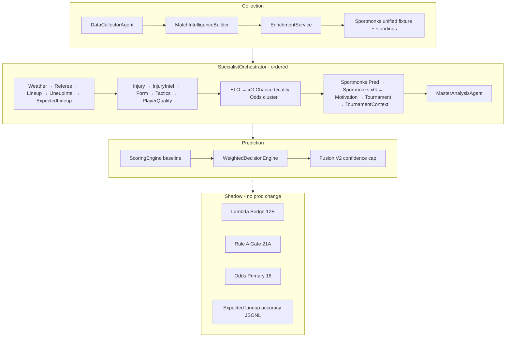

# Phase 23 — Master Decision Audit

**Mode:** Audit only — no code changes, no deploy, no WDE/weight modifications  
**Project:** WorldCup Predictor 2026  
**Date:** 2026-06-17  
**Scope:** Post Phase 22B–22F (Unified Fixture, Sportmonks Odds/Prediction, xG, Tournament Context, Expected Lineups)

---

## Executive Summary

The production prediction path is:

```
DataCollectorAgent → SpecialistOrchestrator (22 agents + MasterAnalysis) → PredictionAgent (ScoringEngine → WDE → Fusion)
```

**What actually moves the published 1X2 / O-U selection:** the **Weighted Decision Engine (WDE)** resolves markets from nine weighted factors built mostly from **internal specialist agents** and **API-Football intelligence**. The **ScoringEngine** sets the baseline probabilities and confidence before WDE adjusts them.

**Phase 22 Sportmonks layers (22C–22D) and new context/lineup agents (22E–22F) are overwhelmingly trace-only.** They enrich reports, MasterAnalysis notes, audit limitations, and shadow JSONL stores — but **do not enter WDE factor math or lambda-bridge production caps**.

**Highest-leverage promotion candidates (future, post-approval):** Expected Lineups → WDE `lineup_strength`; Tournament Context → WDE `motivation_psychology`; calibrated Sportmonks xG → WDE `tactics_matchup`.

---

## 1. Full Architecture Map



### Pipeline agents (outside orchestrator)

| Agent | Role | Provider / cache |
|-------|------|------------------|
| `data_collector_agent` | Builds `MatchIntelligenceReport` | API-Football primary; `SmartPredictionFetcher` local DB first; enrichment via `EnrichmentService` |
| `specialist_orchestrator` | Runs 22 specialists + synthesis | Reads `context.shared.intelligence_reports` |
| `prediction_agent` | `ScoringEngine.predict()` + optional WDE + labels/explanation | OpenAI optional for explanation text only |

---

## 2. Agent Inventory (Active in WC Prediction Path)

Execution order = `SpecialistOrchestrator.AGENT_CLASSES` (indices 1–23).

| # | Agent | Primary inputs | Key outputs | Data provider | Cache source |
|---|-------|--------------|-------------|---------------|--------------|
| 1 | `weather_agent` | `report.weather`, fixture venue | `weather_impact_score`, rain/wind | API-Football / enrichment weather | ApiCache / builder |
| 2 | `referee_agent` | Fixture referee field | `referee_impact_score`, strictness | API-Football fixture | Builder |
| 3 | `lineup_agent` | `report.lineups`, fixture status | `lineup_confidence_score`, official flag | API-Football; Sportmonks gap-fill | `should_fetch_lineups` gate; DB enrichment |
| 4 | `lineup_intelligence_agent` | Lineups, injuries, recent fixtures, optional API previous XI | `home/away` strength, GK, rotation, `prediction_impact` | API-Football + deep squad intel | Same as lineups |
| 5 | `expected_lineup_agent` | Lineups, injuries, Sportmonks, historical XI, lineup_v2 signal | Expected XI, comparison vs confirmed, overlap % | API-Football + Sportmonks supplement | `{api_cache_dir}/lineups/` kickoff TTL |
| 6 | `injury_suspension_agent` | Team injury lists | `key_absence_score` | API-Football; Sportmonks sidelined gap-fill | Injuries TTL 8h |
| 7 | `injury_suspension_intelligence_agent` | Structured injury intel | Impact scores, `prediction_impact`, risk flags | API-Football | Same |
| 8 | `team_form_agent` | Form strings, recent fixtures, stats | `form_score_home/away` | API-Football | Fixtures/stats cache |
| 9 | `tactics_agent` | Team stats, lineups formations, rapid xG, **Sportmonks supplemental xG** | xG attack/defense, O/U tendency, goal pressure | API-Football + optional Rapid + Sportmonks stats | Builder + unified SM fixture |
| 10 | `player_quality_agent` | Player stats, lineups, API deep data | Star ratings, scorer candidates | API-Football | Builder |
| 11 | `elo_team_strength_intelligence_agent` | ELO + form blend | Strength ratings, `prediction_impact` | Internal + API stats | Computed |
| 12 | `xg_chance_quality_intelligence_agent` | xG from stats / API | Goals pressure, chance quality, `prediction_impact` | API-Football statistics | Builder |
| 13 | `odds_market_agent` | `report.odds` | Implied probs, market confidence | API-Football odds | Odds TTL 60m |
| 14 | `odds_control_agent` | Multi-book odds snapshot | Consensus strength, disagreement flags | API-Football + enrichment | ApiCache |
| 15 | `market_consensus_agent` | Odds control + model comparison | Consensus, agreement, implied probs | Derived from odds stack | Same |
| 16 | `odds_movement_agent` | Odds history / snapshots | Steam move, volatility | API-Football / stored snapshots | Odds cache |
| 17 | `sharp_money_intelligence_agent` | Market consensus + movement | Sharp signals, `prediction_impact` | Derived | Same |
| 18 | `sportmonks_prediction_agent` | `supplemental.sportmonks_odds_prediction` | SM probs, conflict vs internal, recommendation | **Sportmonks** (22C includes) | Unified fixture SQLite + ApiCache |
| 19 | `xg_intelligence_agent` | `supplemental.sportmonks_xg_intelligence`, xG v2 ref | SM xG, agreement vs internal | **Sportmonks xGFixture** | Unified fixture cache |
| 20 | `motivation_psychology_agent` | Standings, schedule context, group table | Motivation scores, qualification status | API-Football + schedule service | Daily standings / placeholder groups |
| 21 | `tournament_intelligence_agent` | Tournament context, standings | Pressure, rotation risk, `prediction_impact` | Schedule + API standings | Schedule cache |
| 22 | `tournament_context_agent` | Standings, SM standings, form, motivation ref | Qualification scenarios, comparison vs motivation | API-Football + **Sportmonks standings** (22E) | Daily SM standings cache |
| 23 | `master_analysis_agent` | All prior signals | Aggregated score, conflicts, adjustment **text** | Synthesis only | N/A |

### Enrichment layer (pre-orchestrator, on intelligence report)

| Layer | Endpoint / mechanism | WC 2026 | Cache |
|-------|---------------------|---------|-------|
| API-Football core | fixtures, teams, stats, injuries, lineups, odds, H2H | Primary | SmartPredictionFetcher + SQLite `fixture_enrichment` |
| Sportmonks unified fixture (22B) | `GET /fixtures/{id}` + includes | Complement | `sportmonks_fixture_enrichment` table + ApiCache |
| Sportmonks standings (22E) | `GET /standings/seasons/26618` | Complement | Daily ApiCache |
| Rapid football / xG stats | Optional enrichment providers | Optional | ApiCache |
| Weather enrichment | Optional provider | Optional | 2h TTL |

---

## 3. Decision Influence Audit

Legend: **Direct** = changes 1X2/O-U/confidence/no-bet in production path; **Indirect** = confidence/metadata/explanation only; **Trace** = collected, surfaced in MasterAnalysis/audit/shadow, no factor weight; **Not used** = dead path for predictions.

| Agent | Influence class | Mechanism |
|-------|-----------------|-----------|
| `weather_agent` | **Direct** (minor) | WDE `weather_referee_context` (6%); ScoringEngine goals −0.15 if rain >40% |
| `referee_agent` | **Direct** (minor) | Blended into WDE `weather_referee_context` |
| `lineup_agent` | **Indirect** | WDE fallback for `lineup_strength` if v2 missing; ScoringEngine uses **report.lineups flag only** (not agent) |
| `lineup_intelligence_agent` | **Direct** | WDE `lineup_strength` (12%) + tactics O/U via `prediction_impact`; Lambda bridge shadow (cap 0.10); Fusion |
| `expected_lineup_agent` | **Trace** | MasterAnalysis text; JSONL accuracy store; **not** in WDE/Fusion/Lambda |
| `injury_suspension_agent` | **Indirect** | ScoringEngine confidence delta; WDE fallback if v2 absent |
| `injury_suspension_intelligence_agent` | **Direct** | WDE `injuries_suspensions` + tactics O/U; Lambda shadow (0.12); Fusion |
| `team_form_agent` | **Direct** | WDE `team_form` (15%); ScoringEngine home/away bias; Fusion |
| `tactics_agent` | **Direct** | WDE `tactics_matchup` (12%); ScoringEngine goals adjustment; Fusion |
| `player_quality_agent` | **Direct** | WDE `player_quality` (10%); first-goal scorer candidates; Fusion |
| `elo_team_strength_intelligence_agent` | **Direct** | WDE `team_form` edge/score + `tactics_matchup` O/U; Fusion |
| `xg_chance_quality_intelligence_agent` | **Direct** | WDE `tactics_matchup` score/O/U; Fusion |
| `odds_market_agent` | **Indirect** | WDE fallback if no consensus; MasterAnalysis conflict checks |
| `odds_control_agent` | **Indirect** | WDE fallback odds factor; MasterAnalysis |
| `market_consensus_agent` | **Direct** | WDE `odds_market_signal` (10%) primary path; Lambda shadow (0.10); Fusion |
| `odds_movement_agent` | **Indirect** | Fusion (weight 0.55); MasterAnalysis conflicts — **not** WDE `_build_factors` |
| `sharp_money_intelligence_agent` | **Direct** | WDE odds + tactics O/U; Lambda shadow (0.05); Fusion |
| `sportmonks_prediction_agent` | **Trace** | WDE `audit.limitations` benchmark string only; MasterAnalysis notes |
| `xg_intelligence_agent` | **Trace** | MasterAnalysis notes; **not** WDE (internal xG via tactics/xg_chance_quality) |
| `motivation_psychology_agent` | **Direct** | WDE `motivation_psychology` (8%); ScoringEngine bias; Fusion |
| `tournament_intelligence_agent` | **Direct** | WDE `motivation_psychology` edge/score; Lambda shadow (0.06); Fusion |
| `tournament_context_agent` | **Trace** | MasterAnalysis conflicts/adjustments text; **not** WDE (22E explicit) |
| `master_analysis_agent` | **Indirect** | ScoringEngine parses adjustment **strings** (confidence/goals keywords); aggregated score → confidence delta; Fusion input |

### Post-WDE layers

| Layer | Influence | Notes |
|-------|-----------|-------|
| **Fusion V2** | **Indirect** (confidence only, ±10 cap) | Uses 16 agents; **excludes** all Phase 22 trace agents |
| **Lambda Bridge 12B** | **Shadow only** | 5 agents max; does not change published prediction |
| **Rule A Gate 21A** | **Shadow only** | Records harmonization experiments |
| **Odds Primary 16** | **Shadow only** | Parallel scoreline engine |
| **OpenAI explanation** | **None on markets** | Text only in `PredictionAgent._resolve_explanation` |
| **Tournament context in explanation** | **None on markets** | Prompt addon for narrative |

---

## 4. WDE Audit — Factor Map

Default weights (`config/model_weights.py` / `WeightedDecisionEngine.FACTOR_WEIGHTS`):

| Factor | Weight | Source agent(s) | Calculation path |
|--------|--------|-----------------|------------------|
| `data_quality` | **15%** | None (report) | `report.data_quality.score × 100` → caps confidence & no-bet thresholds |
| `team_form` | **15%** | `team_form_agent`, **`elo_team_strength_intelligence_agent`** | Form scores → factor score; ELO adjusts edge and dampens if low confidence |
| `injuries_suspensions` | **12%** | **`injury_suspension_intelligence_agent`** (preferred), `injury_suspension_agent`, raw injury counts | Impact scores + `prediction_impact` edge; absence >50 triggers strength adj |
| `lineup_strength` | **12%** | **`lineup_intelligence_agent`** (preferred), `lineup_agent` | Lineup strength avg + `prediction_impact` edge; official lineup +0.03 edge |
| `tactics_matchup` | **12%** | **`tactics_agent`**, **`xg_chance_quality_intelligence_agent`**, lineup/injury/sharp/ELO **`prediction_impact.over25`** | Attack xG scores + O/U lean accumulation |
| `player_quality` | **10%** | **`player_quality_agent`** | Star ratings → score and edge |
| `odds_market_signal` | **10%** | **`market_consensus_agent`** (preferred), `odds_control_agent`, `odds_market_agent`, **`sharp_money_intelligence_agent`** | Implied prob edge, agreement penalties |
| `motivation_psychology` | **8%** | **`motivation_psychology_agent`**, **`tournament_intelligence_agent`** | Motivation scores + tournament pressure/impact |
| `weather_referee_context` | **6%** | **`weather_agent`**, **`referee_agent`** | Impact scores averaged |

**Contribution formula:** `contribution = weight × score × home_edge` → summed to `home_edge_total` → `_resolve_1x2()` may flip selection vs baseline.

**Threshold side effects (not weights):** data quality caps, missing lineup first-goal cap (30), specialist conflict penalty, odds disagreement penalty (−5 confidence), severe weather O/U penalty, no-bet gates.

**Market-specific priors** (`MARKET_FACTOR_PRIORITIES`): informational only in config — WDE uses same nine factors for resolution logic with market-specific O/U path.

**Calibrated weights:** Loaded from `reports/calibration/calibrated_weights.json` if present — same nine factors only; Phase 22 agents not included.

---

## 5. Trace-Only Inventory (Phase 22 + related)

### 5.1 `sportmonks_prediction_agent` (22C)

| Collects | Used today | Could promote later |
|----------|------------|----------------------|
| Sportmonks implied 1X2/O-U | Audit `sportmonks_benchmark_trace` limitation | WDE `odds_market_signal` secondary consensus or disagreement veto |
| SM expected score / advice | MasterAnalysis conflict notes | O/U baseline blend (capped) |
| `conflict_level`, `disagreement_vs_internal` | Trace / UI explainability | Auto down-weight when SM+internal diverge (with calibration) |
| `recommendation` (incl. `no_bet_review`) | **Explicitly not** auto no-bet | Calibrated no-bet **suggestion** layer |

### 5.2 `xg_intelligence_agent` (22D)

| Collects | Used today | Could promote later |
|----------|------------|----------------------|
| Sportmonks `xGFixture` home/away xG | MasterAnalysis benchmark note | WDE `tactics_matchup` when plan_support=full |
| Agreement vs `xg_chance_quality_intelligence_agent` | Trace flags | Replace/supplement internal xG when SM validated |
| Plan probe (`full/partial/none`) | Diagnostics | Quota-aware fetch gating |

**Ignored for decisions:** All SM xG numeric outputs in WDE/Fusion/Lambda.

### 5.3 `tournament_context_agent` (22E)

| Collects | Used today | Could promote later |
|----------|------------|----------------------|
| Standings-derived qualification status | MasterAnalysis text | Merge into WDE `motivation_psychology` (replace partial `tournament_intelligence`) |
| Must-win, GD pressure, rotation risk | Trace warnings | Lineup rotation coupling with `expected_lineup_agent` |
| vs motivation `agreement_score` | Conflict list in MasterAnalysis | Confidence dampener when disagreement >35% |

**Overlap:** `tournament_intelligence_agent` already feeds WDE; `tournament_context_agent` duplicates scenario logic in trace mode.

### 5.4 `expected_lineup_agent` (22F)

| Collects | Used today | Could promote later |
|----------|------------|----------------------|
| Expected XI snapshot | Cache + JSONL history | Pre-kickoff WDE `lineup_strength` when official XI missing |
| Confirmed vs expected overlap | Accuracy metrics (benchmark) | Dynamic confidence boost when overlap >80% |
| GK change, star absence, chemistry | MasterAnalysis trace | Direct `lineup_strength` / `injuries_suspensions` factor input |
| `lineup_supports_internal` | Trace vs lineup_v2 | Auto-switch weight to expected layer near kickoff |

**Critical gap:** WDE still reads **`lineup_intelligence_agent` only** — expected lineups do not affect predictions.

### 5.5 Other trace / shadow systems (not agents)

| System | Purpose | Production impact |
|--------|---------|-------------------|
| Lambda Bridge 12B | Shadow λ / scoreline | None |
| Rule A Gate 21A | Shadow 1X2 harmonization | None |
| Odds Primary 16 | Shadow odds-first scoreline | None |
| Expected lineup JSONL | Accuracy history | None |
| Sportmonks consumption gap-fill | Fills lineups/injuries on report | **Indirect** — improves downstream agents that read report |

---

## 6. Data Waste Audit

### 6.1 Collected but unused (for prediction math)

| Data | Where collected | Waste severity |
|------|---------------|----------------|
| Sportmonks prediction probabilities | 22C supplemental | **High** — full model output ignored |
| Sportmonks xGFixture values | 22D supplemental | **High** — pre-match often empty; when present, ignored |
| Tournament context qualification probabilities | 22E agent output | **Medium** — rich scenario math trace-only |
| Expected lineup snapshots + overlap % | 22F store | **Medium** — built for calibration, not fed back |
| Sportmonks odds raw bookmaker rows | Unified fixture | **Medium** — only parsed subset used in 22C |
| Odds movement time series | `odds_movement_agent` | **Low** — Fusion only, weak weight |
| Referee placeholder baselines | `referee_agent` | **Low** — often heuristic |
| Rapid API supplemental stats | Enrichment | **Low–Medium** — tactics uses if present |

### 6.2 Duplicated data / overlapping providers

| Domain | Overlap | Risk |
|--------|---------|------|
| **Lineups** | `lineup_agent` + `lineup_intelligence_agent` + `expected_lineup_agent` + report.lineups flag in ScoringEngine | Redundant signals; only v2 affects WDE |
| **Injuries** | v1 + v2 agents + raw report counts in WDE | v1 mostly legacy fallback |
| **Tournament** | `motivation_psychology` + `tournament_intelligence` (WDE) + `tournament_context` (trace) + schedule explanation | Scenario triple-count in analysis, single-count in WDE |
| **xG** | `tactics_agent` (API/SM stats) + `xg_chance_quality` (WDE) + `xg_intelligence` (SM trace) | Same metric family, one path to WDE |
| **Odds** | 5 agents + Sportmonks odds + ScoringEngine odds bias | Correlated; Fusion dampens cluster |
| **Standings** | API-Football + Sportmonks daily + placeholder schedule | Intentional redundancy for coverage |

### 6.3 Redundant calculations

- **Motivation vs tournament context:** Both compute must-win / pressure — only motivation + tournament_intelligence affect WDE.
- **Lineup strength:** Computed in lineup_v2 and expected_lineup; only v2 wired.
- **O/U adjustments:** Accumulated from tactics, lineup_v2, injury_v2, sharp, ELO, xg_chance in WDE `tactics_matchup` — high correlation (Fusion cluster dampening helps).
- **Aggregated specialist score:** Averages all agent impact scores including trace agents → slight **indirect** confidence inflation from non-decision agents.

---

## 7. World Cup 2026 Readiness Score

Scores reflect **current codebase capability** for `world_cup_2026`, not live tournament data availability today.

| Dimension | Score (0–100) | Rationale |
|-----------|---------------|-----------|
| **Data coverage** | **72** | API-Football pipeline mature; SmartPredictionFetcher + SQLite; placeholder groups when API sparse |
| **Lineup coverage** | **68** | Strong near kickoff; weak >4h; expected lineups trace-only; ScoringEngine binary lineups flag |
| **Injury coverage** | **74** | API injuries + Sportmonks sidelined gap-fill; injury_v2 in WDE |
| **Odds coverage** | **78** | Multi-agent stack + consensus in WDE; movement/sharp supplementary |
| **xG coverage** | **58** | Internal/API xG via tactics + xg_chance_quality; Sportmonks xG partial pre-match (22D finding) |
| **Context coverage** | **70** | Tournament intel in WDE; 22E richer context trace-only; schedule placeholders possible |
| **Prediction coverage** | **75** | Full pipeline WDE + Fusion; no-bet gates; shadow calibration paths exist |

### Composite readiness: **71 / 100**

**Interpretation:** System is **analysis-ready** for WC 2026 with conservative no-bet behavior. **Not calibration-ready** for promoting Phase 22 trace layers without overlap analysis and backtests.

---

## 8. Missing Capabilities (Ranked)

### High value

1. **Unified lineup decision input** — Merge `expected_lineup_agent` + `lineup_intelligence_agent` into WDE with kickoff-aware weighting.
2. **Calibrated trace promotion framework** — Formal gate: overlap accuracy thresholds before any SM/context/xG enters weights.
3. **Pre-match Sportmonks xG availability probe** — Operational dashboard for plan/add-on status across WC fixtures.
4. **Single tournament context authority** — Consolidate `tournament_intelligence` + `tournament_context` to one WDE factor input.
5. **Lineups-aware ScoringEngine baseline** — Replace binary `lineups_available` with strength-weighted baseline (today only in WDE).

### Medium value

6. **Sportmonks odds as consensus validator** — Disagreement penalty already exists for internal odds; extend to SM benchmark.
7. **Expected lineup accuracy feedback loop** — Feed JSONL overlap into confidence (currently stored only).
8. **Live qualification scenario engine** — Real-time group permutations for final matchday (partially in 22E trace).
9. **Player-level xG lineups (`xGLineup` include)** — Not wired; would improve first-goal and O/U.
10. **Reduce odds agent redundancy** — Consolidate 5 agents → 2 for maintainability.

### Low value

11. **Referee live data integration** — Currently placeholder-heavy.
12. **Rapid API enrichment** — Optional; marginal if API-Football complete.
13. **OpenAI explanation coupling to WDE audit** — Narrative only.
14. **Additional shadow engines** — Rule A / Lambda already present; diminishing returns until calibration approved.

---

## 9. Winrate Roadmap (Estimate — No Code Changes)

Qualitative impact on **analytical hit-rate / calibration**, not guaranteed betting ROI. Assumes WC 2026 match mix (group + knockout).

| Scenario | Est. relative uplift vs baseline | Confidence | Notes |
|----------|-----------------------------------|------------|-------|
| **Keep current system** | Baseline (0%) | High | WDE + Fusion stable; trace layers add observability only |
| **Promote lineup intelligence** (expected + v2 → WDE) | **+3% to +7%** | Medium–High | Largest late-stage edge; group stage final hours matter most |
| **Promote context intelligence** (22E → WDE motivation) | **+2% to +5%** | Medium | Strongest on matchday 3 / must-win; less in knockouts |
| **Promote xG intelligence** (22D → WDE tactics) | **+1% to +4%** | Low–Medium | Bounded by SM pre-match availability; better post-live |
| **Full calibration** (weights + thresholds from backtest) | **+4% to +10%** | Medium | Compounds with promotions; requires overlap deduplication |
| **Combined promotions + calibration** | **+8% to +15%** | Low–Medium | Not additive max — correlation caps real gain |

**Recommended sequencing (for future phases, approval required):**

1. Calibration harness using existing shadow stores (lineup JSONL, Rule A, Lambda Bridge).  
2. Promote **Expected Lineups** into WDE (highest marginal gain near kickoff).  
3. Merge **Tournament Context** into motivation factor (group stage).  
4. Conditionally promote **Sportmonks xG** when `plan_support=full`.  
5. Sportmonks prediction as **odds disagreement** input only (not primary picker).

---

## 10. Decision Map (Quick Reference)

```
INTELLIGENCE (API-Football + enrichments)
    │
    ├─► ScoringEngine baseline ──► 1X2/O-U probabilities, confidence, no_bet draft
    │       ↑ indirect: form, motivation, injury v1, weather, master text
    │
    ├─► WDE (9 factors, 100% weight) ──► market selection override, confidence caps
    │       DIRECT agents: form, elo, injury_v2, lineup_v2, tactics, xg_chance,
    │                      player_quality, market_consensus, sharp, motivation,
    │                      tournament_intelligence, weather, referee
    │
    ├─► Fusion V2 ──► confidence refine (±10 cap)
    │
    └─► TRACE ONLY: sportmonks_prediction, xg_intelligence, tournament_context,
                    expected_lineup (+ JSONL), odds_movement (partial)

SHADOW (no published impact): Lambda Bridge, Rule A, Odds Primary
```

---

## 11. Recommended Next Phases (Await Approval)

| Phase | Title | Purpose |
|-------|-------|---------|
| **23B** | Trace promotion design | Spec WDE hooks for 22C–22F without enabling weights |
| **24A** | Lineup WDE integration | Expected + confirmed unified factor |
| **24B** | Context WDE merge | Single tournament motivation input |
| **24C** | Calibration replay | Backtest using shadow JSONL + accuracy stores |
| **24D** | Sportmonks xG conditional weight | Gated on plan_support + overlap with internal |
| **25** | Production calibration deploy | Only after offline uplift validated — **explicitly out of scope now** |

---

## 12. Validation Performed

This audit is **documentation-only**. No validators were run; findings derived from static analysis of:

- `worldcup_predictor/agents/specialists/orchestrator.py`
- `worldcup_predictor/decision/weighted_decision_engine.py`
- `worldcup_predictor/prediction/scoring_engine.py`
- `worldcup_predictor/config/model_weights.py`
- `worldcup_predictor/fusion/final_decision_fusion_engine_v2.py`
- `worldcup_predictor/prediction/lambda_bridge/config.py`
- Phase 22B–22F reports and agent implementations

---

## Stop Boundary

Phase 23 Master Decision Audit **complete**.  
**No code, weights, deployment, or calibration changes made.**  
Await approval before Phase 23B / 24 work.
