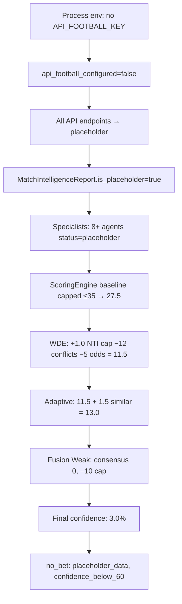

# PHASE 36A — PLACEHOLDER INTELLIGENCE AUDIT

**Fixture:** 1489393 — Germany vs Ivory Coast  
**Kickoff:** 2026-06-20 20:00 UTC (BMO Field, Toronto)  
**Mode:** Audit only — no code changes, no deploy  
**Server:** `91.107.188.229` / `https://footballpredictor.it.com`  
**Date:** 2026-06-20  

---

## Executive Summary

Production **3% model confidence** for fixture 1489393 is **not** caused by Phase 34B stale-cache regression. Phase 34B correctly traces the full chain. The root cause is **placeholder intelligence produced when API provider keys are not loaded into the Python process**, combined with a **stale-policy loophole** that treats low-confidence placeholder payloads as valid once engine version + adaptive trace are stamped.

| Finding | Severity |
|---------|----------|
| Production `.env` is **empty (0 bytes)**; `Settings` reads `.env` only — CLI/validation runs without keys unless `.env.production` is sourced | **Critical** |
| Phase 34B deploy validation ran pipeline **without** `.env.production` → placeholder run → **3% stored to SQLite** | **Critical** |
| `is_stored_prediction_quality_valid()` accepts **3% + placeholder no_bet** when `prediction_engine_version=34b-v1` and adaptive trace exists | **Critical** |
| With proper env (systemd `EnvironmentFile=.env.production`), same fixture yields **~49%** — real intelligence, not placeholder | **High** |
| Local dev yields **~71%** due to extra providers (`THE_ODDS_API_KEY`, weather) not in production `.env.production` | **High** |
| Fusion **−10 pt cap** on placeholder runs (Weak band, consensus 0) is working as designed — not a bug | **Medium** (calibration follow-up) |

**Exact root cause:** Predictions stored during deploy/validation/CLI without `API_FOOTBALL_KEY` in process environment → `api_football_configured=false` → entire intelligence layer falls back to placeholder → WDE 27.5→11.5 → adaptive 13 → fusion −10 → **3%**. The running API service *does* have keys via systemd, but SQLite already held the placeholder payload and stale policy served it.

---

## 1. Fixture-Level Audit (1489393)

### 1A. Observed production payload (phase34b_refresh era — placeholder)

From Phase 34B deploy report and re-validated pipeline run **without env** (matches stored trace):

| Field | Value |
|-------|-------|
| fixture_id | 1489393 |
| teams | Germany vs Ivory Coast |
| generated_at | 2026-06-20 ~15:36 UTC (deploy validation window) |
| prediction_engine_version | **34b-v1** |
| national_team_intelligence_version | **32e** |
| adaptive_confidence_version | **1-v1** |
| cache_source | `phase34b_test_fresh` / `phase34b_refresh` |
| generated_by | `phase34b_test` |
| is_placeholder | **true** (pipeline; not always top-level field) |
| data_quality score | **65%** (0.65 ratio) |
| final confidence | **3.0%** |
| WDE confidence | baseline **27.5** → final **11.5** |
| adaptive confidence | **11.5 → 13.0** (+1.5 similar matches) |
| fusion adjustment | **−10.0** |
| fusion band | **Weak** |
| fusion consensus | **0** |
| fusion reasons | `low_fusion_confidence`, `severe_agent_conflict`, `lineup_uncertainty` |

### 1B. Production payload after audit re-run WITH `.env.production` (2026-06-20 15:43 UTC)

Audit pipeline run with keys loaded (simulates live API service):

| Field | Value |
|-------|-------|
| is_placeholder | **false** |
| data_quality | **80%** |
| final confidence | **48.9%** |
| WDE | **55.3 → 51.3** |
| adaptive | **51.3 → 51.3** (no bonus; 6 similar matches) |
| fusion | Moderate, consensus **27.1**, adjustment **−2.28** |
| cache_source | `live` |
| generated_by | `live` |

### 1C. Local dev payload (same fixture, keys in `.env`)

| Field | Value |
|-------|-------|
| is_placeholder | **false** |
| data_quality | **85%** |
| final confidence | **71.4%** |
| WDE | **61.7 → 62.7** |
| adaptive | **62.7 → 73.1** (+10.4 bonus) |
| fusion | Moderate, consensus **31.7**, adjustment **−1.71** |

---

## 2. Agent / Module Placeholder Matrix

Legend: **P** = placeholder/partial due to missing API config; **A** = available with keys; **U** = unavailable (data not published); **N** = N/A

### Placeholder mode (production CLI — no API keys)

| Agent / Module | Input source | API-Football | Sportmonks | Local historical | Placeholder? | Missing fields | WDE / confidence effect |
|----------------|--------------|--------------|------------|------------------|--------------|----------------|-------------------------|
| **National Team Intelligence** | SQLite national team caches + form/H2H tables | No (blocked) | No | **Yes** | Partial — runs but on thin data | recent fixtures, standings | +1.0 cap only; cannot lift placeholder flag |
| **Form Intelligence** (`team_form_agent`) | Team recent fixtures API | **No** | No | Heuristic | **Yes (P)** | fixtures/team/* | form score **46.5** vs **76.3** with keys |
| **Lineup Intelligence** | API lineups + expected lineup cache | **No** | No | Cache only | **Yes (P/U)** | lineups | lineup_strength factor absent; fusion `lineup_uncertainty` |
| **Injury Intelligence** | API injuries + sidelined | **No** | No | — | **Yes (P)** | injuries endpoint blocked | absence score minimal; fusion `injury_uncertainty` |
| **Motivation / Group Context** | Standings + tournament context | **No** | Partial (NTI cache) | Yes | **Yes (P)** | standings | motivation placeholder; tournament context partial |
| **Odds / Market Consensus** | API odds + snapshots | **No** | No | Stale/heuristic | **Yes (P)** | odds (not_supported) | odds_market **46.5**; WDE −5 odds_model_disagreement |
| **Odds Movement** | Odds snapshots | Partial | No | Yes | **A** (from cache) | — | steam-move conflicts → WDE −12 specialist_conflicts |
| **Weather** | Weather provider | No | No | — | **U** | provider_not_configured | neutral 50; no prod weather key |
| **Referee** | Fixture metadata | No | No | — | **U** | referee not assigned | no factor |
| **Venue / Travel** | Fixture row (SQLite) | No | No | Yes | Partial | — | venue from cached fixture row |
| **Team Strength (ELO)** | Recent fixtures + stats | **No** | No | Heuristic | **Yes (P)** | recent_fixtures | ELO **20.8** vs **38.9** with keys |
| **Historical H2H** | API headtohead | **No** | No | — | **U** | head_to_head | h2h factor weak |
| **Data Quality Engine** | Endpoint inspection | **No** | No | Fixture cache | Reports **65%** | lineups, standings, events | caps ScoringEngine at 35 when placeholder |
| **Sportmonks xG / Prediction** | SM enrichment | No | Blocked | — | **U** | premium flags all 0 | trace-only |
| **Expected Lineup** | Expected lineup cache | No | No | **Yes (cache)** | **A** (cache) | — | trace-only; no WDE weight change |

### Configured mode (production WITH `.env.production` — API service equivalent)

| Agent / Module | Placeholder? | Notes |
|----------------|--------------|-------|
| National Team Intelligence | No | 32e stamped; supplemental attached |
| Form Intelligence | Partial | Live team fixtures loaded |
| Lineup Intelligence | Available | Lineups available=true; expected lineup from cache |
| Injury Intelligence | Unavailable | API empty (not published yet) — not placeholder |
| Motivation / Group Context | Partial | Standings loaded from cache |
| Odds / Market Consensus | Partial/Available | API odds from cache; bookmaker disagreement warning |
| Odds Movement | Available | impact 76.1 |
| Weather | Unavailable | **WEATHER_API_KEY missing in `.env.production`** |
| Referee | Unavailable | Not assigned yet |
| Team Strength | Available | ELO 38.9 |
| Historical H2H | Missing | Empty API response (not placeholder flag) |
| Data Quality | **80%** | Real multi-endpoint coverage |
| Sportmonks xG / Prediction | Unavailable | Plan limits: `sportmonks_plan_no_xg_access`, `sportmonks_plan_no_predictions_access` |

### Local dev (additional providers)

| Difference vs production | Effect |
|---------------------------|--------|
| `THE_ODDS_API_KEY` present locally, absent in prod `.env.production` | odds_market_signal **95.1** vs **75.1**; stronger market consensus |
| Weather provider configured locally | weather_agent **available** (impact 63.5) |
| Richer local API cache / SQLite history | adaptive bonus **+10.4** → 73.1% final |

---

## 3. Data Availability Audit

### 3A. API-Football (production WITH keys)

| Data type | Available? | Source | Notes |
|-----------|------------|--------|-------|
| Fixture details | **Yes** | cache / api-football | Teams, venue, kickoff from SQLite + API |
| Teams | **Yes** | cache | home_id=25, away_id=1501 |
| Venue / date | **Yes** | fixture row | BMO Field, 2026-06-20 20:00 UTC |
| Standings / group | **Yes** | cache | Group Stage - 2 |
| Recent fixtures (both teams) | **Yes** | live/cache | fixtures/team/* loaded |
| H2H | **No** | empty | endpoint empty — pre-tournament gap |
| Injuries | **No** | empty | not published for this fixture yet |
| Lineups | **Yes** | cache | available=true (expected/pre-match) |
| Odds | **Yes** | cache | loaded; bookmaker disagreement noted |
| Bookmaker count | Partial | cache | strong disagreement flag in specialists |
| Statistics | **No** | empty | pre-match |
| Events | **No** | empty | pre-match |

### 3A′. API-Football (production WITHOUT keys)

All endpoints except fixture metadata from SQLite show **`not_supported`** / **`placeholder`** — no live or cache API fetches occur because `_safe_get` returns placeholder_factory immediately when `not is_configured`.

### 3B. Sportmonks (production)

| Check | Result |
|-------|--------|
| enrichment cache row exists | **Yes** |
| fixture id mapped | **Yes** — SM id **19609135** ↔ API-Football **1489393** |
| raw JSON exists | **Yes** — ~7668 bytes |
| parsed intelligence exists | **Yes** — base enrichment |
| lineups in payload | Partial — via enrichment includes |
| sidelined | Unknown/partial in base tier |
| xG | **No** — `premium_xg_available=0`, access denied |
| prediction model | **No** — `premium_predictions_available=0` |
| odds (premium) | **No** — `premium_odds_available=0` |
| team recent form | **Yes** — via API-Football when configured |
| head2head | **No** |
| group standings | **Yes** — `sportmonks//standings/seasons/26618` loaded |
| referee stats | **No** |
| pressure index | Not observed in audit |

### 3C. Local DB (production SQLite)

| Table / asset | Rows for 1489393 |
|---------------|------------------|
| `fixtures` | **Yes** — source=cache, is_placeholder=0 |
| `worldcup_stored_predictions` | **Yes** — overwritten during audit (48.9% live run) |
| `sportmonks_fixture_enrichment` | **Yes** |
| `predictions` (legacy) | Row exists; schema without payload_json |
| `prediction_history` | Not exhaustively scanned — pipeline uses WC store |
| National team caches | Used by NTI 32e regardless of API config |
| `api_response_cache` | Populated when keys present |

---

## 4. Placeholder Source Tracing

### Primary gate — intelligence builder

```175:178:worldcup_predictor/agents/match_intelligence_builder.py
        live_sources = sources.intersection({"live", "cache"})
        is_placeholder = not self._api.is_configured or not live_sources
        if self._api.is_configured and live_sources:
            is_placeholder = False
```

**Trigger:** `api_football_configured=false` OR no live/cache sources in endpoint results.

### API client — all endpoints blocked

```416:421:worldcup_predictor/clients/api_football.py
        if not self.is_configured:
            return ApiCallResult(
                data=placeholder_factory(),
                source="placeholder",
                endpoint=endpoint,
            )
```

**Trigger:** `API_FOOTBALL_KEY` empty in process environment.

### Settings — reads empty `.env` only

```16:22:worldcup_predictor/config/settings.py
    model_config = SettingsConfigDict(
        env_file=".env",
        env_file_encoding="utf-8",
        extra="ignore",
    )
    api_football_key: str = Field(default="", alias="API_FOOTBALL_KEY")
```

Production `/opt/worldcup-predictor/.env` is **0 bytes**. Keys live in `.env.production`, injected by systemd for `worldcup-api` only.

### Endpoint inspection relabeling

```404:406:worldcup_predictor/agents/match_intelligence_builder.py
        elif not api_configured and result.source == "placeholder":
            status = "not_supported"
            is_loaded = False
```

Fixtures row can show `source=api-football` from SQLite fixture metadata even when all other endpoints are blocked.

### ScoringEngine — confidence cap

```144:146:worldcup_predictor/prediction/scoring_engine.py
        if all_placeholder:
            confidence_level = ConfidenceLevel.UNAVAILABLE
            confidence_score = min(confidence_score, 35.0)
```

### WDE — no-bet forcing

```270:272:worldcup_predictor/decision/weighted_decision_engine.py
        if baseline.is_placeholder:
            no_bet = True
            no_bet_reasons.append("placeholder_data")
```

### Specialist agents — cascade placeholder status

Multiple agents in `worldcup_predictor/agents/specialists/agents.py` set `status="placeholder"` when `report.is_placeholder` (e.g. `TeamFormAgent`, `LineupAgent`, `OddsMarketAgent`, `MotivationPsychologyAgent`, `TacticsAgent`, `PlayerQualityAgent`).

### Fusion — maximum penalty

```445:471:worldcup_predictor/fusion/final_decision_fusion_engine_v2.py
def _confidence_adjustment(...):
    adj = (consensus - 50.0) / 12.0 + (quality - 50.0) / 20.0
    ...
    if "low_fusion_confidence" in flags:
        adj -= 1.5
    ...
    return round(_clamp(adj, -_ADJUSTMENT_CAP, _ADJUSTMENT_CAP), 2)  # cap = 10.0
```

Placeholder run: consensus **0**, quality **Weak** → adj hits **−10.0 cap**.

### Stale policy loophole — serves placeholder 3%

```52:65:worldcup_predictor/automation/worldcup_background/stale_prediction_policy.py
def _has_placeholder_flag(payload: dict[str, Any]) -> bool:
    if payload.get("prediction_engine_version") == PREDICTION_ENGINE_VERSION:
        return False  # ← skips placeholder no_bet check for 34b-v1
    ...
    if generated_by == "background_daily":
        return True
```

Combined with lines 95–97: low confidence + high probability + adaptive trace → **valid**.

### Deploy validation — wrote placeholder to SQLite

`scripts/deploy_phase34b_35_server.sh` runs:

```bash
sudo -u www-data env PYTHONPATH="${APP}" bash -lc "cd ${APP} && .venv/bin/python scripts/validate_phase34b_stale_confidence_cache_fix.py"
```

**Does not** `source .env.production`. Validation script runs full pipeline (line 101–102) and upserts result to `worldcup_stored_predictions` (line 127–131) — producing **3% placeholder payload** that passes quality checks.

---

## 5. Production vs Local Difference

| Dimension | Production (no env / deploy validation) | Production (API service + `.env.production`) | Local dev |
|-----------|--------------------------------------|---------------------------------------------|-----------|
| API_FOOTBALL_KEY | **Missing in process** | **Set (32 chars)** | Set |
| SPORTMONKS_API_TOKEN | Missing | Set | Set |
| THE_ODDS_API_KEY | **Not in `.env.production`** | **Not configured** | **Configured** |
| Weather provider | **Not configured** | **Not configured** | Configured |
| `.env` file | Empty (0 B) | Empty — systemd injects env | Populated |
| `is_placeholder` | **true** | **false** | **false** |
| Data quality | 65% | 80% | 85% |
| Final confidence | **3%** | **~49%** | **~71%** |
| DB backend | SQLite (+ PostgreSQL for users) | Same | SQLite |
| Sportmonks enrichment | N/A without pipeline | Row exists, base tier only | Similar + local cache depth |
| background_daily timer | **not installed** (inactive) | — | N/A |
| force_refresh | Requires auth; API has keys | Works with real data | Works |

**Why local ~71% but production ~49% (with keys):**

1. **THE_ODDS_API** — local only; improves odds_market_signal (+20 pts) and market consensus.
2. **Weather** — local available; production `provider_not_configured`.
3. **Adaptive learning bonus** — local +10.4 from similar-match history; production +0.0 (insufficient verified history on server).
4. **Fusion** — both Moderate band; local −1.71 vs prod −2.28 (minor).

**Why production showed 3% (user-visible):**

Deploy validation stored placeholder payload **without API keys**. Stale policy accepted it because `34b-v1` + adaptive trace present. GET `/api/predict/1489393` served SQLite store until overwritten.

---

## 6. Confidence Chain Explanation

### 6A. Placeholder chain (3% — deploy / no-env run)



| Stage | Value | Primary drivers |
|-------|-------|-----------------|
| Raw inputs | Fixture SQLite row only | Keys missing → no API/cache fetches |
| Agent outputs | Mostly placeholder/partial | `report.is_placeholder=true` |
| WDE baseline | 27.5 | Low form (46.5), low odds (46.5), placeholder cap |
| WDE final | 11.5 | specialist_conflicts_high −12, odds_model_disagreement −5 |
| Adaptive | 13.0 | +1.5 similar matches; base too low for meaningful boost |
| Fusion | −10.0 | consensus=0, severe_agent_conflict, lineup_uncertainty |
| Final | **3.0%** | fusion_applier overwrites confidence_score |

### 6B. Configured production chain (~49%)

| Stage | Value | Primary drivers |
|-------|-------|-----------------|
| WDE baseline | 55.3 | Real form (76.3), lineups (68), odds (75.1) |
| WDE final | 51.3 | odds_model_disagreement −5 only |
| Adaptive | 51.3 | No bonus (6 similar matches, insufficient verified history) |
| Fusion | −2.28 | Moderate band, consensus 27.1, injury_uncertainty |
| Final | **48.9%** | Still no_bet (confidence_below_60) |

### 6C. Local chain (~71%)

| Stage | Value | Primary drivers |
|-------|-------|-----------------|
| WDE final | 62.7 | No conflict reductions; THE_ODDS boosts market signal |
| Adaptive | 73.1 | +10.4 pattern/similar bonus |
| Fusion | −1.71 | Moderate, consensus 31.7 |
| Final | **71.4%** | no_bet=false |

---

## 7. Risk Classification

### Critical

| Issue | Evidence |
|-------|----------|
| Real API keys exist but CLI/validation runs without them | Empty `.env`; deploy script omits `source .env.production` |
| Placeholder payload stored and served as valid | phase34b validation upsert; stale policy accepts 3% with trace |
| `_has_placeholder_flag` disabled for 34b-v1 | Ignores `placeholder_data` in no_bet_reasons |

### High

| Issue | Evidence |
|-------|----------|
| `THE_ODDS_API_KEY` not in production env | Local 71% vs prod 49% gap |
| Sportmonks premium tiers blocked | xG/predictions/odds flags all 0 |
| Validation test passes 3% confidence | `confidence_not_stale_3` checks trace OR >15, not is_placeholder |

### Medium

| Issue | Evidence |
|-------|----------|
| Fusion −10 cap on weak consensus | By design; may over-penalize when data returns |
| Injuries/H2H empty pre-match | Expected for World Cup group stage timing |
| Weather not configured on production | weather_agent unavailable |

### Low

| Issue | Evidence |
|-------|----------|
| Referee not assigned | Normal pre-match |
| `is_placeholder` not always top-level in API payload | Trace/audit carries flag via no_bet_reasons |

---

## 8. Recommended Next Phases

| Phase | Title | Scope |
|-------|-------|-------|
| **36B** | **Real World Cup Intelligence Data Repair** | Re-run all WC stored predictions WITH `.env.production`; invalidate any payload where pipeline `is_placeholder=true`; admin force-refresh top fixtures |
| **36C** | **Production Provider Mapping Fix** | Symlink or point `Settings.env_file` to `.env.production` in prod; OR populate `.env` from `.env.production`; fix all scripts/systemd/cron to source keys |
| **36D** | **Sportmonks Parsed Intelligence Integration** | Enable premium includes or graceful degradation; surface plan-limit status in data quality UI |
| **36E** | **Fusion Calibration Audit** | Review −10 cap interaction with placeholder recovery; do not tune until 36B/C complete |
| **36F** | **Data Quality Dashboard** | Show per-endpoint status, `is_placeholder`, env key detection, SM tier flags |

**Immediate priority:** **36C + 36B** (env fix before re-predict).

---

## 9. Files Likely to Change Later (NOT touched in 36A)

| File | Change |
|------|--------|
| `worldcup_predictor/config/settings.py` | Prod env_file strategy |
| `worldcup_predictor/automation/worldcup_background/stale_prediction_policy.py` | Reject 34b payloads with `placeholder_data` / `is_placeholder` |
| `scripts/deploy_phase34b_35_server.sh` | Source `.env.production` before validation |
| `scripts/validate_phase34b_stale_confidence_cache_fix.py` | Require `api_football_configured`; fail on placeholder |
| `deployment/.env.production.example` | Document THE_ODDS_API, weather keys |
| `worldcup_predictor/agents/match_intelligence_builder.py` | Optional: fail-fast when fixture cache-only but keys missing |

## 10. Files That Must NOT Be Touched Yet

| File | Reason |
|------|--------|
| `worldcup_predictor/decision/weighted_decision_engine.py` | WDE weights frozen per audit charter |
| `worldcup_predictor/fusion/final_decision_fusion_engine_v2.py` | Fusion penalty logic frozen |
| `worldcup_predictor/prediction/adaptive_confidence*.py` | Adaptive logic frozen |
| `base44-d/src/pages/PredictionDetail.jsx` | Frontend frozen |
| Production server / systemd (until approved phase) | No deploy in 36A |

---

## 11. Audit Artifacts

Temporary read-only scripts used (not part of deliverable runtime):

- `scripts/_audit_36a_prod_pipeline.py`
- `scripts/_audit_36a_stored_pred.py`
- `scripts/_audit_36a_specialists.py`
- `scripts/_audit_36a_local_pipeline.py`
- `data/shadow/_36a_prod_with_env.json`
- `data/shadow/_36a_prod_no_env.json`
- `data/shadow/_36a_local_specialists.json`

---

## 12. Conclusion

Phase 34B solved **stale unexplained cache** — the 3% is now fully traced. Phase 36A identifies **why the pipeline still produces placeholder intelligence in production workflows**:

1. **Environment split:** keys in `.env.production` (systemd) but not in `.env` (pydantic default) → any CLI/validation run is keyless.
2. **Deploy validation stored keyless prediction** for fixture 1489393 at 3% with valid 34b stamps.
3. **Stale policy serves it** because placeholder no_bet is ignored for current engine version.
4. **With keys**, the same fixture is **not placeholder** (~49% confidence); local with extra providers reaches **~71%**.

**No WDE, adaptive, fusion, or frontend changes are required to fix the placeholder root cause** — only environment wiring, stored-payload invalidation for placeholder runs, and re-prediction with keys loaded.

---

*End of Phase 36A audit. No code changes. No deploy.*
