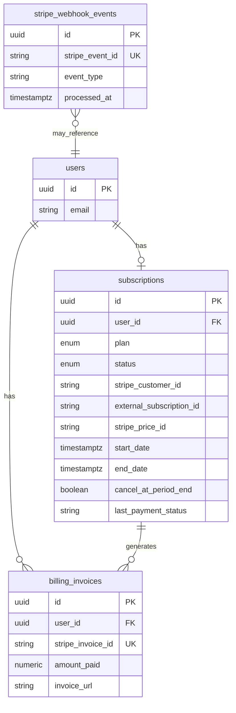
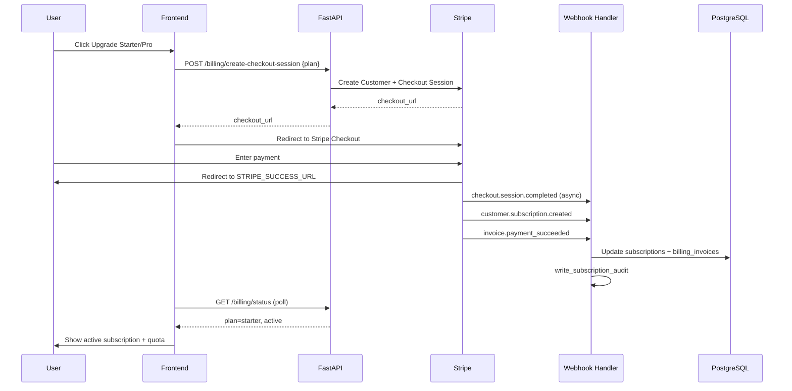
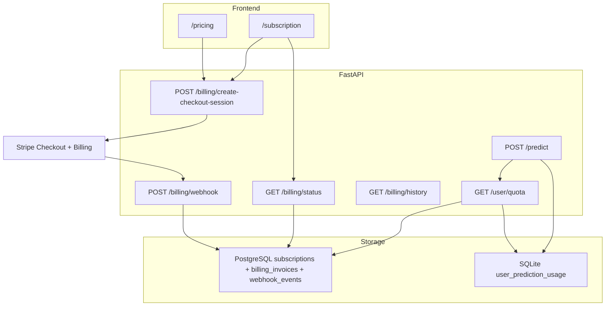

# PHASE 39B — Stripe Subscription Integration Audit & Design

**Date:** 2026-06-20  
**Mode:** ANALYZE ONLY — no code, no deploy  
**Production:** https://footballpredictor.it.com (Phase 39A live)  
**Goal:** Production-grade Stripe subscription architecture before implementation

---

## Executive Summary

WorldCup Predictor already has a **working subscription tier system** (FREE / STARTER / PRO) with monthly quotas, market gating, admin plan overrides, and commercial UX — but **no payment rail**. Plan changes today are manual (Super Admin) or default-to-free on signup.

Stripe integration should **attach to the existing PostgreSQL `subscriptions` row** as the plan authority, add **billing-specific tables** for customers/invoices/webhook idempotency, and drive plan activation **exclusively from verified webhooks**. The existing SQLite usage store and quota service should remain unchanged in Phase 39B; only the **billing anchor dates** (`start_date` / `end_date`) must be kept in sync with Stripe billing periods so quota resets align with paid cycles.

**Critical rule:** Never upgrade a user from a success-page redirect alone. Checkout success is a UX signal; **webhook processing is the source of truth**.

---

## 1. Current Subscription Architecture Audit

### 1.1 Plan storage (authoritative)

| Layer | Location | Details |
|-------|----------|---------|
| **PostgreSQL** | `subscriptions` table | One row per user (`user_id` unique). Fields: `plan`, `billing_cycle`, `status`, `amount`, `external_subscription_id`, `start_date`, `end_date`, `provider`, timestamps. |
| **ORM** | `worldcup_predictor/database/postgres/models.py` → `Subscription` | Enums: `SubscriptionPlan` (free, starter, pro, elite, unlimited), `SubscriptionStatus` (active, cancelled, expired, trial), `BillingCycle` (monthly, yearly). |
| **Repository** | `database/postgres/repositories/subscriptions.py` | `get_or_create_free`, `upsert`, `get_for_user`. |
| **Plan limits (code)** | `subscription/plan_limits.py` | FREE 4/mo, STARTER 28/mo, PRO 60/mo; market sets; `normalize_plan()` maps elite/unlimited → pro. |

**Stripe-ready fields already exist:** `external_subscription_id`, `provider`, `start_date`, `end_date`. Currently unused for Stripe (all users free; `provider` null).

**Gap:** No `stripe_customer_id` column. Customer ID must be stored separately or added via migration.

### 1.2 User subscription fields

| Field | Source | Used by |
|-------|--------|---------|
| `users.id` | PostgreSQL UUID | Auth JWT, quota, billing linkage |
| `users.role` | PostgreSQL | Admin bypass (unlimited quota); not plan tier |
| `subscriptions.plan` | PostgreSQL | Quota limits, market gating, UI |
| `subscriptions.start_date` | PostgreSQL | **Billing period anchor** for quota |
| `subscriptions.status` | PostgreSQL | Display only today; not enforced in quota path |

Registration creates user; first subscription access calls `get_or_create_free()` → plan=`free`, status=`active`.

### 1.3 Quota storage

| Layer | Location | Details |
|-------|----------|---------|
| **SQLite** | `user_prediction_usage` table | PK: `(user_id, billing_period, fixture_id)`. Created by `PredictionUsageStore`. |
| **Logic** | `subscription/quota_service.py` | Reads plan from PostgreSQL; counts usage in SQLite; admin/super_admin bypass. |
| **Enforcement** | `api/routes/predictions.py` | `assert_prediction_allowed` before pipeline; `record_prediction_usage` after success. Cache reuse exempt. |

Billing period key format: `YYYY-MM-DD` (start of anchored month), computed in `subscription/billing_period.py` from `sub.start_date or sub.created_at`.

**Stripe alignment requirement:** On webhook activation, set `subscriptions.start_date` = Stripe `current_period_start` so quota cycles match paid billing periods.

### 1.4 Billing cycle logic

```
anchor = subscription.start_date OR subscription.created_at
period = resolve_billing_period(anchor)  → { key, start, end }
usage  = COUNT(user_prediction_usage WHERE billing_period = period.key)
```

- Monthly rolling window anchored on subscription start, **not** calendar month.
- Quota API exposes `period_start`, `period_end`, `next_reset_date` (= period_end).
- **Not** tied to Stripe today.

### 1.5 Market gating logic

| Component | Path | Behavior |
|-----------|------|----------|
| Rules | `subscription/market_gating.py` | FREE: 1X2 only; STARTER: +BTTS, O/U; PRO: all markets |
| Application | `api/display_helpers.py` | `apply_plan_market_gate(payload, plan)` on prediction responses |
| Plan resolution | PostgreSQL subscription → `normalize_plan()` | Cached predictions gated by viewer plan |

Gating is **read-only filter** on API output; no change needed for Stripe except ensuring plan tier updates propagate immediately after webhook.

### 1.6 Admin / Super Admin tools

| Tool | Endpoint / UI | Capability |
|------|---------------|------------|
| Set plan manually | `PATCH /api/admin/users/{id}/subscription?plan=` | Super Admin + gate; writes PostgreSQL directly |
| View usage | `GET /api/admin/users/{id}/usage` | Admin + gate |
| Reset quota | `POST /api/admin/users/{id}/quota/reset` | Admin + gate; SQLite only |
| Commercial analytics | `GET /api/admin/commercial/analytics` | Super Admin; user counts, usage, messages |
| Super Admin panel | `SuperAdminPanel.jsx` | Roles, plans dropdown, Commercial tab |
| Admin panel | `AdminPanel.jsx` | Usage + quota reset |

**Conflict risk:** Manual admin plan changes vs Stripe subscription state. Design must define precedence (Stripe wins for paid users, or admin override flags).

### 1.7 Current frontend upgrade flow

| Surface | Current behavior |
|---------|------------------|
| `/pricing` | `PricingContent.jsx` — CTAs link to `/register` or static buttons; no checkout |
| `/subscription` | Upgrade buttons → `UpgradeComingSoonDialog` (“Payment system coming soon” + Message Admin) |
| Billing history | Always empty (`billing_history: []` hardcoded in API) |

### 1.8 Current backend subscription endpoints

| Method | Path | Auth | Purpose |
|--------|------|------|---------|
| GET | `/api/user/subscription` | JWT user | Plan, features, empty billing_history |
| GET | `/api/user/quota` | JWT user | Usage, warnings, period dates |
| POST | `/api/user/contact-admin` | JWT user | Message Admin (category, rate limit, audit) |
| PATCH | `/api/admin/users/{id}/subscription` | Super Admin + gate | Manual plan override |
| GET | `/api/admin/users/{id}/usage` | Admin + gate | Usage detail |
| POST | `/api/admin/users/{id}/quota/reset` | Admin + gate | Reset SQLite usage |
| GET | `/api/admin/commercial/analytics` | Super Admin + gate | Read-only metrics |

**No billing routes exist.** `requirements.txt` notes Stripe SDK as optional (`# stripe>=8.0.0`); httpx REST is viable.

### 1.9 Audit & logging (existing)

- `subscription/contact_admin.py` → `write_subscription_audit()` → `data/logs/subscription_audit.jsonl`
- Admin gate audit → `data/logs/admin_audit.jsonl`
- Contact messages → SQLite `admin_contact_messages`

Stripe events should append to `subscription_audit.jsonl` with event type + user_id + stripe ids (never secrets).

---

## 2. Stripe Account & Product Design

### 2.1 Stripe Dashboard setup (manual, pre-implementation)

Create in Stripe Dashboard (Test mode first, then Live):

| Product | Description | Price | Billing |
|---------|-------------|-------|---------|
| **WorldCup Predictor Starter** | 28 predictions/mo, 1X2 + BTTS + O/U | **€5.00** | Recurring monthly |
| **WorldCup Predictor Pro** | 60 predictions/mo, all markets | **€19.00** | Recurring monthly |

FREE tier: **no Stripe product** (app-managed default).

### 2.2 Identifiers (stored in env, never in code)

| Env var | Example pattern | Notes |
|---------|-----------------|-------|
| `STRIPE_STARTER_PRICE_ID` | `price_xxx` (test) / `price_yyy` (live) | Maps to Starter |
| `STRIPE_PRO_PRICE_ID` | `price_xxx` / `price_yyy` | Maps to Pro |
| Product IDs | `prod_xxx` | Optional in env; price IDs sufficient for Checkout |

**Test vs Live:**

| Mode | Secret key prefix | Webhook secret | Price IDs |
|------|-------------------|----------------|-----------|
| Test | `sk_test_...` | `whsec_...` (test endpoint) | Test mode prices |
| Live | `sk_live_...` | `whsec_...` (live endpoint) | Live mode prices |

Use `STRIPE_MODE=test|live` as app guard + validation; reject checkout if mode/keys mismatch.

**Currency:** EUR only (matches `PLAN_PRICES_EUR` in code).

**Recurring interval:** `month` (Stripe interval), aligned with existing `BillingCycle.MONTHLY`.

### 2.3 Price → plan mapping (server-side only)

```python
STRIPE_PRICE_TO_PLAN = {
    settings.stripe_starter_price_id: SubscriptionPlan.STARTER,
    settings.stripe_pro_price_id: SubscriptionPlan.PRO,
}
```

Client sends `plan: "starter" | "pro"`; server resolves to price ID. **Never accept price IDs from client.**

---

## 3. Required Environment Variables

Add to `.env` / `.env.production` (values never logged):

| Variable | Required | Purpose |
|----------|----------|---------|
| `STRIPE_SECRET_KEY` | Yes (for billing) | API calls (Checkout, Customer Portal, retrieve subscription) |
| `STRIPE_WEBHOOK_SECRET` | Yes | Signature verification on webhook endpoint |
| `STRIPE_STARTER_PRICE_ID` | Yes | Checkout line item for Starter |
| `STRIPE_PRO_PRICE_ID` | Yes | Checkout line item for Pro |
| `STRIPE_SUCCESS_URL` | Yes | Redirect after payment, e.g. `https://footballpredictor.it.com/subscription?checkout=success` |
| `STRIPE_CANCEL_URL` | Yes | Redirect on cancel, e.g. `https://footballpredictor.it.com/pricing?checkout=cancelled` |
| `STRIPE_MODE` | Yes | `test` or `live` — validation guard |
| `STRIPE_PUBLISHABLE_KEY` | Optional* | Only if using Stripe.js Elements later; Checkout redirect may omit |

\*Checkout Session redirect flow does not require publishable key on frontend.

**Preserve existing:** `ADMIN_CONTACT_EMAIL`, SMTP, `DATABASE_URL`, admin keys, all prediction/provider keys.

**Missing Stripe env behavior:** Checkout endpoints return `503` or `400` with `"Billing not configured"` — no silent failure.

---

## 4. Database Design

### 4.1 Strategy

- **Keep `subscriptions` as plan authority** (extend, don’t replace).
- **Add auxiliary tables** for Stripe artifacts, idempotency, and invoice history.
- **Alembic migration** `004_stripe_billing.py` (proposed).

### 4.2 Extend `subscriptions` (PostgreSQL)

| New column | Type | Purpose |
|------------|------|---------|
| `stripe_customer_id` | `VARCHAR(255)` nullable, indexed | Stripe Customer |
| `stripe_price_id` | `VARCHAR(255)` nullable | Active price |
| `cancel_at_period_end` | `BOOLEAN` default false | Pending cancellation |
| `last_payment_status` | `VARCHAR(32)` nullable | e.g. paid, failed, open |
| `last_invoice_id` | `VARCHAR(255)` nullable | Latest Stripe invoice |
| `last_invoice_url` | `VARCHAR(512)` nullable | Hosted invoice URL |

Existing columns reused:

| Column | Stripe mapping |
|--------|----------------|
| `external_subscription_id` | `sub_xxx` |
| `provider` | `"stripe"` |
| `start_date` | `current_period_start` |
| `end_date` | `current_period_end` |
| `amount` | Price amount (5.00 / 19.00) |
| `plan` | starter / pro |
| `status` | Map Stripe status → enum |

**Enum extension (recommended):** Add `past_due`, `incomplete` to `subscription_status` or map Stripe `past_due` → keep plan but flag payment issue in billing status API.

### 4.3 New table: `billing_customers` (optional if column on subscriptions suffices)

Prefer **column on subscriptions** for 1:1 user mapping. Use separate table only if multiple customers per user needed (not expected).

### 4.4 New table: `billing_invoices`

| Column | Type | Notes |
|--------|------|-------|
| `id` | UUID PK | Internal |
| `user_id` | UUID FK → users | |
| `stripe_invoice_id` | VARCHAR(255) UNIQUE | |
| `stripe_subscription_id` | VARCHAR(255) | |
| `amount_paid` | NUMERIC(10,2) | EUR |
| `currency` | VARCHAR(3) | `eur` |
| `status` | VARCHAR(32) | paid, open, void, uncollectible |
| `invoice_url` | VARCHAR(512) | hosted_invoice_url |
| `invoice_pdf` | VARCHAR(512) nullable | |
| `period_start` | TIMESTAMPTZ | |
| `period_end` | TIMESTAMPTZ | |
| `created_at` | TIMESTAMPTZ | |

### 4.5 New table: `stripe_webhook_events`

| Column | Type | Notes |
|--------|------|-------|
| `id` | UUID PK | |
| `stripe_event_id` | VARCHAR(255) UNIQUE | Idempotency key |
| `event_type` | VARCHAR(128) | |
| `payload_hash` | VARCHAR(64) nullable | Optional dedup |
| `processed_at` | TIMESTAMPTZ | |
| `status` | VARCHAR(32) | processed, failed, skipped |
| `error_detail` | TEXT nullable | No secrets |
| `user_id` | UUID nullable | Resolved after processing |

Index: `stripe_event_id` UNIQUE, `event_type`, `processed_at`.

### 4.6 Entity relationship (proposed)



SQLite `user_prediction_usage` **unchanged** — quota logic untouched in 39B.

---

## 5. Backend API Design

New router: `worldcup_predictor/api/routes/billing.py`  
Prefix: `/api/billing`  
Register in `api/main.py`.

### 5.1 `POST /api/billing/create-checkout-session`

| Aspect | Design |
|--------|--------|
| **Auth** | JWT required (`get_current_user`) |
| **Rate limit** | 5 sessions / user / hour (in-memory or SQLite counter) |
| **Request** | `{ "plan": "starter" \| "pro" }` |
| **Validation** | Plan must be paid tier; Stripe env configured; price ID resolved server-side |
| **Behavior** | Get or create Stripe Customer (store `stripe_customer_id`); create Checkout Session (`mode=subscription`, single line item); attach `client_reference_id=user_id` and metadata `{ user_id, plan }` |
| **Response** | `{ "status": "ok", "checkout_url": "https://checkout.stripe.com/...", "session_id": "cs_xxx" }` |
| **Failure** | 400 invalid plan; 409 if active paid subscription exists (offer portal/manage instead); 503 Stripe not configured; 502 Stripe API error (logged, generic message) |
| **Security** | Never return secret key; session created server-side only |

**Active subscription conflict:** If user has `status=active` and `plan in (starter, pro)` with valid `external_subscription_id`, return 409 with `{ "code": "already_subscribed", "manage_url": "/subscription" }` and optionally create Customer Portal session instead.

### 5.2 `POST /api/billing/webhook`

| Aspect | Design |
|--------|--------|
| **Auth** | **None** (Stripe signature only) |
| **Body** | Raw request body (required for signature verification) |
| **Header** | `Stripe-Signature` |
| **Behavior** | Verify signature → idempotency check → dispatch handler → 200 quickly |
| **Response** | `{ "received": true }` |
| **Failure** | 400 invalid signature; 500 processing error (Stripe retries) |

**Must bypass JSON body parser** for raw payload or use Stripe SDK `construct_event`.

**nginx:** Route `POST /api/billing/webhook` to API; no auth middleware.

### 5.3 `GET /api/billing/status`

| Aspect | Design |
|--------|--------|
| **Auth** | JWT required |
| **Response** | `{ "status": "ok", "billing": { plan, subscription_status, stripe_status, current_period_start, current_period_end, cancel_at_period_end, last_payment_status, pending_checkout: bool } }` |
| **Purpose** | Success page polling; subscription page refresh |
| **Failure** | 401 unauthenticated |

Include `pending_checkout: true` if recent Checkout Session completed in Stripe but webhook not yet processed (optional Stripe API poll with caution).

### 5.4 `GET /api/billing/history`

| Aspect | Design |
|--------|--------|
| **Auth** | JWT required |
| **Response** | `{ "status": "ok", "invoices": [{ date, amount, currency, status, invoice_url }] }` |
| **Source** | `billing_invoices` table (populated by webhooks) |
| **Failure** | 401; empty list if no invoices |

Wire into existing `GET /api/user/subscription` → populate `billing_history` from this data (backward compatible).

### 5.5 `POST /api/billing/cancel-subscription`

| Aspect | Design |
|--------|--------|
| **Auth** | JWT required |
| **Request** | `{}` or `{ "at_period_end": true }` (default true) |
| **Behavior** | Call Stripe `subscriptions.update(cancel_at_period_end=true)`; update DB; audit log |
| **Response** | `{ "status": "ok", "cancel_at_period_end": true, "current_period_end": "..." }` |
| **Failure** | 404 no active Stripe subscription; 502 Stripe error |

**Do not** immediately downgrade plan — remain on paid tier until `current_period_end` (webhook confirms).

### 5.6 `POST /api/billing/resume-subscription`

| Aspect | Design |
|--------|--------|
| **Auth** | JWT required |
| **Behavior** | Stripe `cancel_at_period_end=false` |
| **When needed** | User cancelled but period not ended |
| **Failure** | 404 / 400 if not in cancelled-pending state |

### 5.7 `POST /api/billing/customer-portal` (recommended addition)

| Aspect | Design |
|--------|--------|
| **Auth** | JWT required |
| **Response** | `{ "portal_url": "https://billing.stripe.com/..." }` |
| **Purpose** | Manage payment method, invoices, cancel — reduces custom UI burden |

---

## 6. Checkout Flow Design



### Step-by-step

1. User clicks **Upgrade** on `/pricing` or `/subscription`.
2. Frontend calls `POST /api/billing/create-checkout-session` with `{ plan: "starter" }`.
3. Frontend redirects to `checkout_url` (full page redirect; no Stripe.js required initially).
4. User pays on Stripe-hosted Checkout.
5. Stripe redirects to `STRIPE_SUCCESS_URL?session_id={CHECKOUT_SESSION_ID}`.
6. Success page shows **“Payment received — activating your plan…”** and polls `GET /api/billing/status` every 2–3s (max 30–60s).
7. **Meanwhile**, Stripe sends webhooks → handler updates PostgreSQL plan + period dates.
8. Poll succeeds → UI shows Starter/Pro, refreshed quota limits.
9. If webhook delayed > 60s → show “Activation in progress — refresh shortly” + Message Admin link.

**Never** call `upsert(plan=starter)` from success page handler.

---

## 7. Webhook Design

### 7.1 Endpoint

`POST https://footballpredictor.it.com/api/billing/webhook`

Configure in Stripe Dashboard (separate test/live endpoints).

### 7.2 Processing pipeline

```
1. Read raw body + Stripe-Signature header
2. stripe.Webhook.construct_event(body, sig, STRIPE_WEBHOOK_SECRET)
3. IF stripe_event_id EXISTS in stripe_webhook_events → return 200 (duplicate)
4. INSERT stripe_webhook_events (status=pending)
5. Dispatch by event.type
6. UPDATE stripe_webhook_events (status=processed|failed)
7. write_subscription_audit(event, user_id, detail)
8. Return 200
```

### 7.3 Event handlers

| Event | Actions |
|-------|---------|
| `checkout.session.completed` | Resolve `client_reference_id` / metadata `user_id`; link `stripe_customer_id`; store session → subscription id if present; **do not** finalize plan if subscription not yet active — defer to subscription events |
| `customer.subscription.created` | Map `items[0].price.id` → plan; set `external_subscription_id`, `provider=stripe`, `start_date`, `end_date`, `status=active`, `plan=starter\|pro`, `amount` |
| `customer.subscription.updated` | Sync plan (upgrade/downgrade price change), period dates, `cancel_at_period_end`, status mapping |
| `customer.subscription.deleted` | Set `plan=free`, `status=cancelled` or `expired`, clear `external_subscription_id` or retain for audit; **downgrade markets/quota immediately** |
| `invoice.payment_succeeded` | Upsert `billing_invoices`; set `last_payment_status=paid`; extend period if renewal |
| `invoice.payment_failed` | Set `last_payment_status=failed`; optionally set status `past_due`; **do not upgrade**; after Stripe retry exhaustion → downgrade via subscription.deleted |

### 7.4 Status mapping (Stripe → app)

| Stripe subscription.status | App plan | App status | Quota |
|----------------------------|----------|--------------|-------|
| `active` | From price ID | active | Full tier limit |
| `trialing` | From price ID | trial | Full tier limit |
| `past_due` | Keep current plan | past_due* | Keep tier (grace) or restrict — **recommend keep 7-day grace** |
| `canceled` / `unpaid` | free | cancelled/expired | FREE limits |
| `incomplete` | free | incomplete | FREE limits |

\*Requires enum migration or store in `last_payment_status`.

### 7.5 Idempotency

- Primary key: `stripe_event_id` (evt_xxx)
- Stripe retries webhooks on non-2xx; duplicates must no-op
- Use DB transaction: insert event → process → commit

### 7.6 Quota / billing cycle on webhook

On `subscription.created` / `updated` / renewal:

```python
subscriptions.start_date = stripe.current_period_start
subscriptions.end_date   = stripe.current_period_end
```

Quota service automatically picks up new anchor on next `get_user_quota_status` call. **Do not reset SQLite usage on upgrade mid-period** unless product decision says otherwise (recommend: keep usage count, higher limit applies immediately).

---

## 8. Failure Scenarios

| Scenario | Risk | Mitigation |
|----------|------|------------|
| **Webhook duplicate** | Double plan activation | `stripe_webhook_events.stripe_event_id` UNIQUE; early return 200 |
| **Webhook delayed** | User sees success but still FREE | Success page polls `/billing/status`; show pending state; webhook eventually syncs |
| **Payment failed** | User expects access | `invoice.payment_failed` → no upgrade; email via Stripe; status `past_due` |
| **Subscription cancelled** | Access after cancel | `cancel_at_period_end=true` → paid until `end_date`; `subscription.deleted` → downgrade to FREE |
| **Checkout abandoned** | None | No webhook; no DB change; user stays FREE |
| **Success page before webhook** | UX confusion | Poll + “activating…” message; never client-side upgrade |
| **Refund** | Over-access | Handle `charge.refunded` / `invoice.voided` — downgrade or admin review; audit log |
| **Card expired** | Renewal fails | Stripe Smart Retries + `invoice.payment_failed`; grace period then downgrade |
| **Upgrade Starter → Pro** | Proration | Stripe handles proration; webhook `subscription.updated` changes price ID → plan=pro |
| **Downgrade Pro → Starter** | Market access | Webhook updates plan; market gating applies on next API response |
| **User already subscribed** | Double checkout | 409 on create-checkout-session; offer Customer Portal |
| **Admin manual plan + Stripe** | Conflicting state | Add `billing_source: manual\|stripe` flag; Stripe webhooks overwrite when `provider=stripe`; admin override requires cancel Stripe first (document ops) |
| **Stripe outage** | Checkout unavailable | 503 from API; Message Admin fallback |
| **Wrong webhook secret** | Forged events | Signature verification rejects; alert in logs |

---

## 9. Security Requirements

| Requirement | Implementation |
|-------------|----------------|
| Webhook signature validation | `stripe.Webhook.construct_event` with `STRIPE_WEBHOOK_SECRET` |
| No secret exposure | Secrets server-only; never in frontend bundle or API responses |
| Idempotency | `stripe_webhook_events` table |
| Audit logs | `write_subscription_audit` for checkout, activation, cancel, payment fail |
| Rate limit checkout | Per-user hourly cap on `create-checkout-session` |
| No client plan spoofing | Client sends plan name only; server maps to price ID |
| Price ID validation | Allowlist exactly two env-configured price IDs |
| HTTPS required | Production webhook + Checkout require TLS (already on footballpredictor.it.com) |
| JWT on user billing routes | All except webhook |
| Webhook raw body | Do not parse JSON before signature verify |
| Admin sees no secrets | Super Admin shows customer/subscription IDs only |
| CSRF | Checkout is redirect-based; webhook is server-to-server |

---

## 10. Frontend Design (future implementation)

### 10.1 Pricing page (`PricingContent.jsx`)

- Logged-out: keep `/register` for Free; Starter/Pro → login then checkout.
- Logged-in: `Choose Starter/Pro` → `createCheckoutSession(plan)` → `window.location.href = checkout_url`.
- Loading spinner on button; disable double-click.
- Remove `UpgradeComingSoonDialog` for paid tiers when Stripe live.

### 10.2 Subscription page (`SubscriptionPage.jsx`)

- Replace coming-soon dialog with checkout redirect.
- Show `billing.status` fields: next billing date, cancel pending badge.
- **Manage subscription** → Customer Portal URL.
- Populate billing history from `GET /api/billing/history`.
- Success query param `?checkout=success` → poll status component.
- Cancel query param `?checkout=cancelled` → toast message.

### 10.3 New API helpers (`saasApi.js`)

```javascript
createCheckoutSession(plan)
fetchBillingStatus()
fetchBillingHistory()
cancelSubscription()
resumeSubscription()
createCustomerPortalSession()
```

### 10.4 UX states

| State | UI |
|-------|-----|
| FREE | Upgrade CTAs |
| Active paid | Plan badge, usage bar, Manage / Cancel |
| Pending activation | Spinner + poll |
| past_due | Warning banner + update payment (portal) |
| Cancel at period end | “Access until {date}” |

---

## 11. Admin Design

### 11.1 Super Admin Commercial tab (extend)

Per user (in Users/Roles tab or billing sub-panel):

| Field | Source |
|-------|--------|
| Stripe customer ID | `subscriptions.stripe_customer_id` |
| Stripe subscription ID | `subscriptions.external_subscription_id` |
| Subscription status | Stripe-synced + app status |
| Current plan | `subscriptions.plan` |
| Current period end | `subscriptions.end_date` |
| Payment status | `last_payment_status` |
| Last invoice | Link from `last_invoice_url` |

### 11.2 Manual sync button (safe)

`POST /api/admin/users/{id}/billing/sync` (Super Admin + gate):

- Fetches subscription from Stripe API by `external_subscription_id`
- Reconciles DB to Stripe truth
- **Does not** create subscriptions or charge cards
- Audit log: `admin_billing_sync`

Use when webhook missed; not a substitute for webhooks.

### 11.3 Admin restrictions

- No `STRIPE_SECRET_KEY` in UI or logs
- Manual plan dropdown should warn if `provider=stripe` active

---

## 12. Implementation Phases

| Phase | Scope | Deliverable | Risk |
|-------|-------|-------------|------|
| **39B-1** | DB migration + Settings + Stripe client module skeleton | Alembic 004, env vars, `billing/stripe_client.py`, feature flag `BILLING_ENABLED=false` | Low |
| **39B-2** | Checkout session creation | `POST create-checkout-session`, customer create, rate limit | Medium — test mode only |
| **39B-3** | Webhook processing | Webhook route, idempotency, event handlers, plan sync | **High** — core correctness |
| **39B-4** | Frontend upgrade flow | Replace coming-soon, redirect, success polling | Medium |
| **39B-5** | Billing status/history + portal | Status/history endpoints, subscription page, cancel/resume | Medium |
| **39B-6** | Validation + test mode | `validate_phase39b_stripe_integration.py`, Stripe CLI webhook forward | Low |
| **39B-7** | Production deploy | Live keys, live webhook endpoint, smoke tests, report | High — go-live |

**Dependency order:** 39B-1 → 39B-2 → 39B-3 → (39B-4 + 39B-5 parallel) → 39B-6 → 39B-7

**Feature flag:** `BILLING_ENABLED` preserves Phase 39A UX when false.

---

## 13. Validation Plan

**Script:** `scripts/validate_phase39b_stripe_integration.py`

| Test | Method |
|------|--------|
| Missing Stripe env blocks checkout | Mock settings empty → POST checkout → 503 |
| Valid plan creates session (test) | Mock Stripe API → session_id returned |
| Invalid plan rejected | `{ plan: "free" }` → 400 |
| Webhook signature required | POST webhook without sig → 400 |
| Invalid signature rejected | Wrong sig → 400 |
| Duplicate webhook ignored | Same `evt_xxx` twice → second no-op, plan unchanged count |
| subscription.created → starter/pro | Inject fixture event → PostgreSQL plan updated |
| payment_failed does not activate | `invoice.payment_failed` only → plan stays free |
| Cancellation timing | `cancel_at_period_end` → plan stays until deleted event |
| Billing history visible | After invoice webhook → GET history returns row |
| No secrets printed | Grep validation output for `sk_`, `whsec_` |
| Quota unchanged logic | Assert `quota_service` not modified (import-only check) |
| Price ID server-side only | Request with client price_id ignored |

**Tools:** Stripe CLI `stripe listen --forward-to localhost:8000/api/billing/webhook` for local integration.

**Regression:** Re-run Phase 39A, 38A, 37A validations after each sub-phase.

---

## 14. Files Likely to Change (implementation reference)

### New files

| Path | Purpose |
|------|---------|
| `worldcup_predictor/billing/__init__.py` | Package |
| `worldcup_predictor/billing/stripe_client.py` | Stripe API wrapper |
| `worldcup_predictor/billing/checkout.py` | Checkout session creation |
| `worldcup_predictor/billing/webhook_handlers.py` | Event dispatch |
| `worldcup_predictor/billing/sync.py` | Admin sync helper |
| `worldcup_predictor/billing/models.py` | Pydantic request/response |
| `worldcup_predictor/api/routes/billing.py` | HTTP routes |
| `alembic/versions/004_stripe_billing.py` | Migration |
| `scripts/validate_phase39b_stripe_integration.py` | Validation |

### Modified files

| Path | Change |
|------|--------|
| `worldcup_predictor/config/settings.py` | Stripe env fields |
| `worldcup_predictor/database/postgres/models.py` | Subscription columns + new tables |
| `worldcup_predictor/database/postgres/repositories/subscriptions.py` | Stripe field upserts |
| `worldcup_predictor/database/postgres/enums.py` | Optional status values |
| `worldcup_predictor/api/main.py` | Include billing router |
| `worldcup_predictor/api/routes/user.py` | Wire billing_history |
| `worldcup_predictor/api/routes/admin.py` | Billing sync endpoint, user billing view |
| `worldcup_predictor/subscription/commercial_analytics.py` | Paid/revenue metrics |
| `base44-d/src/api/saasApi.js` | Billing API functions |
| `base44-d/src/pages/SubscriptionPage.jsx` | Checkout, history, manage |
| `base44-d/src/components/pricing/PricingContent.jsx` | Upgrade → checkout |
| `base44-d/src/pages/SuperAdminPanel.jsx` | Stripe fields per user |
| `requirements.txt` | Uncomment `stripe>=8.0.0` |
| `.env.example` | Stripe var placeholders |

### Explicitly NOT changed (per rules)

- `worldcup_predictor/prediction/*`
- `worldcup_predictor/decision/weighted_decision_engine.py`
- Adaptive/fusion modules
- Sportmonks providers
- `subscription/quota_service.py` logic (only anchor dates fed from webhooks)
- `subscription/market_gating.py`

---

## 15. Security Risks & Mitigations

| Risk | Severity | Mitigation |
|------|----------|------------|
| Webhook forgery | Critical | Signature verification mandatory |
| Client-side plan upgrade | Critical | Server-only plan writes via webhook |
| Secret leak in logs | High | Structured logging; redact keys |
| Replay attacks | Medium | Idempotency table |
| Checkout session spam | Medium | Rate limiting |
| Admin/Stripe state conflict | Medium | `provider` field + ops docs |
| PCI scope | Low | Stripe Checkout = SAQ A (hosted) |
| Webhook endpoint DDoS | Medium | Stripe IP allowlist optional; rate limit nginx |

---

## 16. Production Checklist (pre–39B-7)

- [ ] Stripe Live mode products/prices created (EUR monthly)
- [ ] Live `STRIPE_SECRET_KEY`, `STRIPE_WEBHOOK_SECRET`, price IDs in `.env.production`
- [ ] `STRIPE_MODE=live` verified
- [ ] Webhook endpoint registered in Stripe Live Dashboard
- [ ] `STRIPE_SUCCESS_URL` / `STRIPE_CANCEL_URL` point to production domain
- [ ] `BILLING_ENABLED=true`
- [ ] Alembic `004_stripe_billing` applied
- [ ] Backup before deploy (repo, SQLite, PostgreSQL, frontend dist)
- [ ] Test checkout with real card in live mode (small amount) then refund
- [ ] Verify webhook delivery in Stripe Dashboard
- [ ] Phase 39B validation PASS on server
- [ ] Phase 38A / 37A / 39A regressions PASS
- [ ] Confirm admin email placeholder updated if billing alerts needed
- [ ] Customer Portal configured in Stripe Dashboard
- [ ] Rollback plan documented (disable `BILLING_ENABLED`, restore backup)

---

## 17. Architecture Summary Diagram



---

## 18. Remaining Gaps (pre-implementation)

1. **ADMIN_CONTACT_EMAIL** still placeholder on production — billing alert emails need real inbox or rely on Stripe emails only.
2. **SubscriptionStatus enum** lacks `past_due` — migration decision needed.
3. **Mid-period upgrade usage policy** — product decision: immediate higher limit vs reset usage (recommend immediate).
4. **Manual admin override vs Stripe** — operational policy not codified yet.
5. **Customer Portal branding** — Stripe Dashboard configuration.
6. **Tax/VAT** — not in scope; Stripe Tax optional future phase.
7. **Annual billing** — `BillingCycle.YEARLY` exists in schema but not in Stripe design (monthly only for 39B).

---

## STOP

Phase 39B audit and design complete.  
**No code changes. No deploy. No Stripe integration started.**

**Recommended next step:** Approve design → begin **Phase 39B-1** (DB + config + Stripe client skeleton).
