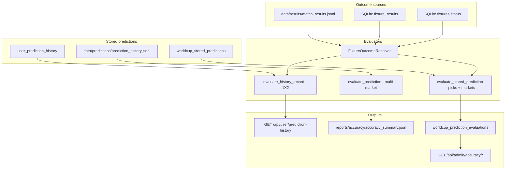

# PHASE 42A — Prediction Archive & Accuracy Center Architecture Report

**Date:** 2026-06-21  
**Mode:** ANALYZE ONLY — no code changes, no deploy  
**Goal:** Design Prediction Archive, Accuracy Dashboard, and Prediction Detail History on top of existing systems

---

## Executive summary

The codebase already has **three parallel prediction/accuracy systems** that are not fully unified for the React SaaS frontend:

| Layer | Storage | Richness | SaaS exposure |
|-------|---------|----------|---------------|
| **A. User view log** | PostgreSQL `user_prediction_history` | 1X2 + confidence only | ✅ Wired (`/history`, dashboard) |
| **B. Learning memory** | JSONL `data/predictions/prediction_history.jsonl` | Full multi-market predictions | ❌ Streamlit/GUI only |
| **C. World Cup background** | SQLite `worldcup_stored_predictions` + `worldcup_prediction_evaluations` | Full payload + multi-market eval | ✅ Admin only (`/admin/accuracy`) |

The React **History** page is real but thin. The React **Accuracy Center** (`/accuracy`) is **mock data**. **Prediction Detail** (`/prediction/:id`) shows live/cached predictions, not post-match historical evaluation.

Phase 42 should **compose existing evaluators and stores** rather than invent a fourth pipeline. Primary work: bridge gaps, expose read APIs, replace mock UI, optionally persist evaluation snapshots in PostgreSQL.

---

## 1. Existing prediction history tables

### 1.1 PostgreSQL — `user_prediction_history` (SaaS per-user log)

**Migration:** `alembic/versions/001_saas_initial.py`  
**Model:** `worldcup_predictor/database/postgres/models.py` → `UserPredictionHistory`  
**Repository:** `worldcup_predictor/database/postgres/repositories/prediction_history.py`

| Column | Type | Notes |
|--------|------|-------|
| `id` | UUID PK | |
| `user_id` | UUID FK → users | CASCADE delete |
| `fixture_id` | bigint | Indexed |
| `prediction_id` | varchar(64) nullable | **Often unset** on auto-record |
| `home_team`, `away_team` | varchar(255) | |
| `league` | varchar(255) nullable | **Often unset** on auto-record |
| `match_date` | timestamptz nullable | **Often unset** on auto-record |
| `prediction_1x2` | enum (`home`/`draw`/`away`) | |
| `confidence` | numeric(5,2) nullable | |
| `result` | enum (`pending`/`correct`/`incorrect`) | **Not updated** after evaluation |
| `viewed_at` | timestamptz | Sort key |

**Indexes:** `(user_id, viewed_at)`, `(fixture_id)`

**Write path:** `POST /api/predictions/run` → `_record_user_history()` in `worldcup_predictor/api/routes/predictions.py` (best-effort, 1X2 + confidence only).

**Read path:** `GET /api/user/prediction-history` — enriches rows at read time via `FixtureOutcomeResolver` (Phase 29). No repository `update()` exists.

---

### 1.2 JSONL — global learning memory

**Store:** `worldcup_predictor/accuracy/history_store.py` → `data/predictions/prediction_history.jsonl`  
**Record model:** `worldcup_predictor/accuracy/models.py` → `PredictionHistoryRecord` (dataclass)

**Fields (rich):** fixture_id, date, teams, predicted_1x2, predicted_over_under_2_5, predicted_halftime_goals, predicted_first_goal_team, predicted_scoreline, predicted_first_goal_scorer, confidence_score, risk_level, no_bet_flag, data_quality_score, source, prediction_id, prediction_version (`early_24h` | `pre_6h` | `final_lineup` | `manual`), refresh lineage, lineups_available, is_preliminary, extended_markets_json.

**Write path:** `AccuracyTrackerService.record_match_prediction()` / predict pipeline / automation.

**Not user-scoped.** Append-only JSONL with `latest_by_fixture()` dedupe semantics.

---

### 1.3 SQLite (football_intelligence.db) — engine + World Cup background

#### Core schema (`worldcup_predictor/database/schema.py`)

| Table | Purpose |
|-------|---------|
| `fixtures` | Schedule metadata, status |
| `fixture_results` | Final/halftime goals, winner, O/U |
| `predictions` | Engine prediction header (quality, confidence, version) |
| `prediction_markets` | Per-market predicted values |
| `verification_results` | Per-market verification rows |

#### Phase 33 extensions (`worldcup_predictor/database/migrations.py`)

| Table | Purpose |
|-------|---------|
| `worldcup_stored_predictions` | Background/API prediction JSON payload per fixture |
| `worldcup_prediction_evaluations` | Multi-market evaluation status per fixture |
| `worldcup_accuracy_summary` | Aggregated JSON summary per competition |
| `learning_reports` | Advisory learning reports |
| `user_daily_prediction_usage` | Quota tracking |

**Repository:** `FootballIntelligenceRepository` — list/upsert evaluations, filtered admin queries.

---

### 1.4 JSONL — finished match results

**Store:** `worldcup_predictor/results/match_results_store.py` → `data/results/match_results.jsonl`  
Used by `FixtureOutcomeResolver` as first outcome source before SQLite fallback.

---

## 2. Existing accuracy tracker

### 2.1 JSONL learning-memory tracker (Streamlit / developer)

**Service:** `worldcup_predictor/accuracy/service.py` → `AccuracyTrackerService`

Flow:
1. Load latest prediction per fixture from JSONL store
2. Load finished fixtures from schedule / match center
3. `save_finished_fixtures()` → results JSONL
4. `evaluate_all()` → `EvaluatedPrediction` list (1X2, O/U, HT bucket, scoreline, first goal)
5. `compute_accuracy_metrics()` → `AccuracySummaryMetrics`
6. Write `reports/accuracy/accuracy_summary.json` + `.md`

**UI consumers:** Streamlit `page_accuracy_tracker()`, `build_accuracy_dashboard()` in `accuracy/dashboard_metrics.py`.

**Not exposed** to React SaaS users via REST.

---

### 2.2 Per-user SaaS evaluation (PostgreSQL history)

**Module:** `worldcup_predictor/api/prediction_history_evaluation.py`

- `FixtureOutcomeResolver` — resolves finished state from JSONL → SQLite `fixture_results` → fixture row
- `evaluate_history_record()` — **1X2 only** for user rows
- Returns: `result_status`, `is_correct`, `actual_result`, `final_score`, cache metadata (`data_quality`, `agent_count`)

**Used by:**
- `GET /api/user/prediction-history`
- `GET /api/user/dashboard` (stats, trend, recent 5)

**Limitation:** Evaluation is **computed on every read**, not persisted to PostgreSQL. `result` column remains `pending`.

---

### 2.3 World Cup background evaluation (admin)

**Job:** `worldcup_predictor/automation/worldcup_background/result_evaluation_job.py`

Flow:
1. List finished fixtures from SQLite
2. Load stored prediction payload (`WorldcupPredictionStore` / `worldcup_stored_predictions`)
3. `evaluate_stored_prediction()` in `pick_evaluator.py` — safe/value/aggressive/caution picks + 1X2/O/U/BTTS/DC markets
4. `upsert_worldcup_prediction_evaluation()` → SQLite
5. `rebuild_accuracy_summary()` → `worldcup_accuracy_summary`

**Admin API:** `worldcup_predictor/api/routes/admin_accuracy.py`
- `GET /api/admin/accuracy/summary`
- `GET /api/admin/accuracy/evaluations`
- `GET /api/admin/accuracy/fixtures/{fixture_id}`
- `POST /api/admin/accuracy/rebuild`
- `GET /api/admin/accuracy/audit`

**Frontend:** `AdminAccuracyCenter.jsx` — **fully wired**, admin-gated.

---

## 3. Finished fixture evaluation pipeline



**Key insight:** All three evaluators share **`FixtureOutcomeResolver`** for actual results. Divergence is in **prediction payload richness** and **markets evaluated**.

---

## 4. Reusable components

| Component | Path | Reuse for Phase 42 |
|-----------|------|-------------------|
| Outcome resolution | `api/prediction_history_evaluation.py` | All user-facing result display |
| Multi-market evaluation | `accuracy/evaluator.py` | Platform accuracy if JSONL linked |
| Pick/market evaluation | `automation/worldcup_background/pick_evaluator.py` | Official World Cup accuracy dashboard |
| Accuracy metrics | `accuracy/metrics.py`, `accuracy/models.py` | Summary cards, buckets, grades |
| Dashboard metrics builder | `accuracy/dashboard_metrics.py` | Accuracy Dashboard charts |
| Admin row assembly | `admin/accuracy_center.py` | Pattern for public read-only API |
| Accuracy summary rebuild | `automation/worldcup_background/accuracy_summary.py` | Platform-wide aggregates |
| Report writer | `accuracy/report_writer.py` | Export / audit artifacts |
| User history repo | `database/postgres/repositories/prediction_history.py` | Archive list (extend) |
| Cached prediction lookup | `quota/prediction_cache.py` | Detail page enrichment |
| SaaS API client | `base44-d/src/api/saasApi.js` | `fetchPredictionHistoryPage` exists |
| History UI | `base44-d/src/pages/PredictionHistoryPage.jsx` | Archive v1 base |
| Admin accuracy UI | `AdminAccuracyCenter.jsx` | Reference layout for platform dashboard |
| Streamlit accuracy page | `ui/gui_app.py` `page_accuracy_tracker()` | UX/metrics reference |

**Do not duplicate:** prediction engine, WDE, or evaluation math — wire and expose.

---

## 5. Current frontend state

| Route | Page | Data source | Phase 42 role |
|-------|------|-------------|---------------|
| `/history` | `PredictionHistoryPage.jsx` | ✅ Real API | **Prediction Archive** (enhance) |
| `/accuracy` | `AccuracyCenter.jsx` | ❌ Hardcoded mock | **Accuracy Dashboard** (replace) |
| `/prediction/:id` | `PredictionDetail.jsx` | Live/cache predict API | **Not** history detail today |
| `/admin/accuracy` | `AdminAccuracyCenter.jsx` | ✅ Admin API | Reference only (keep admin) |
| `/dashboard` | `Dashboard.jsx` | ✅ Partial real stats | Feeds accuracy widgets |

**Nav:** DashboardLayout lists "Accuracy" → `/accuracy` and "History" → `/history`.

---

## 6. Missing fields & gaps

### 6.1 PostgreSQL `user_prediction_history`

| Gap | Impact |
|-----|--------|
| No O/U, HT, scoreline, BTTS, picks | User archive cannot show multi-market accuracy |
| No `prediction_snapshot_json` or FK to cache | Detail page cannot replay full prediction |
| `prediction_id`, `league`, `match_date` often null | Weak linking and filtering |
| `result` never updated | DB out of sync with live evaluation |
| No `evaluated_at`, `actual_result`, `final_score` columns | Must re-resolve fixtures on every read |
| No `competition_key` | Cannot filter World Cup vs other comps |
| No `no_bet`, `pick_tier`, `data_quality` | Cannot segment accuracy |
| No unique `(user_id, fixture_id)` | Duplicate rows on re-run/re-view |
| No pagination total count | Archive UX limited |

### 6.2 API gaps

| Missing endpoint | Purpose |
|------------------|---------|
| `GET /api/user/prediction-history/{id}` | Single archive row + evaluation |
| `GET /api/user/prediction-history/fixture/{fixture_id}` | All user views + link to detail |
| `GET /api/user/accuracy/summary` | Personal accuracy dashboard |
| `GET /api/accuracy/platform` (or `/public/accuracy`) | Official model accuracy (read-only, no admin gate) |
| `GET /api/user/prediction-history/{id}/detail` | Full snapshot + post-match eval |

Existing admin endpoints must **not** be exposed to normal users.

### 6.3 Frontend gaps

- `/accuracy` mock data misrepresents product (FAQ claims ~73% — not wired)
- No dedicated **Prediction Detail History** route (history cards link to live `/prediction/:id`)
- No version timeline (early_24h → final_lineup) for users
- No export (CSV/JSON) for archive

---

## 7. Target page designs

### 7.1 Prediction Archive page

**Recommendation:** Evolve `/history` (rename label to "Prediction Archive" optional).

**Features:**
- Paginated table/cards with filters: result status, date range, competition, confidence band
- Columns: match, date, pick (1X2), confidence, result badge, final score
- Stats bar: total / correct / wrong / pending / accuracy% (already from API)
- Search by team name
- Row click → Prediction Detail History (not live predict page)

**Data source (phased):**
- **42B:** Existing `GET /api/user/prediction-history` + pagination metadata
- **42C+:** Enriched rows with O/U, pick tier, persisted evaluation

---

### 7.2 Accuracy Dashboard page

**Recommendation:** Replace mock `/accuracy` with two tabs:

1. **Your accuracy** — from `GET /api/user/accuracy/summary` (PostgreSQL history + resolver)
2. **Platform accuracy** — from read-only aggregate of `worldcup_accuracy_summary` or JSONL tracker (official World Cup model, disclaimer)

**Widgets (reuse metrics models):**
- Overall 1X2 / O/U win rates
- Confidence buckets
- No-bet vs non-no-bet split
- Monthly trend (dashboard already computes similar)
- Recent evaluated results list
- Model grade + data limitations disclaimer (from `AccuracySummaryMetrics`)

**Do not** copy admin rebuild controls to user UI.

---

### 7.3 Prediction Detail History page

**Recommendation:** New route `/history/:entryId` or `/archive/:fixtureId`.

**Sections:**
1. **Match header** — teams, kickoff, final score, result badge
2. **Your prediction** — 1X2 pick, confidence, viewed_at
3. **Evaluation** — predicted vs actual (1X2; later O/U, scoreline)
4. **Full prediction snapshot** (when available) — from cache / `worldcup_stored_predictions` / extended markets
5. **Link** — "View live prediction" → `/prediction/:fixtureId` (optional)

**Different from** `/prediction/:id` which runs/quota-bounded live pipeline.

---

## 8. Required backend endpoints

### Phase 42B (minimal, no migration)

| Method | Path | Auth | Description |
|--------|------|------|-------------|
| GET | `/api/user/accuracy/summary` | User | Personal stats + trend + recent evaluated |
| GET | `/api/accuracy/platform` | Optional/public | Read `worldcup_accuracy_summary` + disclaimer |
| GET | `/api/user/prediction-history/{entry_id}` | User | Single evaluated row |

Extend existing:
- `GET /api/user/prediction-history` — add `total_count`, `has_more`, date filters

### Phase 42C (enriched capture)

| Method | Path | Auth | Description |
|--------|------|------|-------------|
| GET | `/api/user/prediction-history/fixture/{fixture_id}` | User | User rows + evaluation for fixture |
| GET | `/api/user/prediction-history/{entry_id}/snapshot` | User | Join cache/SQLite payload by prediction_id |

Modify write path:
- `_record_user_history()` — store prediction_id, league, match_date, competition_key, optional snapshot ref

### Phase 42D (optional persistence)

| Method | Path | Auth | Description |
|--------|------|------|-------------|
| POST | `/api/internal/evaluation/sync` | Cron/admin | Batch persist evaluation to PG |
| GET | `/api/user/prediction-history/export` | User | CSV export |

---

## 9. Required frontend pages

| Page | Route | Action |
|------|-------|--------|
| Prediction Archive | `/history` (enhance) | Wire pagination, rename, row → detail |
| Accuracy Dashboard | `/accuracy` (replace mock) | New API hooks in `saasApi.js` |
| Prediction Detail History | `/history/:entryId` **new** | New page component |
| Dashboard widgets | `/dashboard` | Optional: link to real accuracy |

**Keep unchanged:** `/admin/accuracy`, `/prediction/:id` (live predict), prediction engine UI flow.

---

## 10. Migration requirements

### 10.1 Required for basic dashboard (42B)

**None.** Use existing tables + live evaluation + SQLite summary read-only.

### 10.2 Recommended for production-grade archive (42C)

**Alembic migration** — extend `user_prediction_history`:

```text
competition_key          VARCHAR(64)   DEFAULT 'world_cup_2026'
prediction_snapshot_ref  VARCHAR(128)  NULL   -- cache key or stored pred id
over_under_pick          VARCHAR(32)   NULL
no_bet                   BOOLEAN       DEFAULT false
pick_tier                VARCHAR(32)   NULL
data_quality             NUMERIC(5,2)  NULL
actual_result            VARCHAR(32)   NULL   -- home_win|draw|away_win
final_score              VARCHAR(16)   NULL
is_correct               BOOLEAN       NULL
evaluated_at             TIMESTAMPTZ   NULL
```

**Indexes:** `(user_id, match_date DESC)`, `(user_id, fixture_id)`

**Optional:** Unique partial index on `(user_id, fixture_id)` where latest view only — or separate `user_prediction_views` vs `user_prediction_evaluations`.

### 10.3 Optional platform table (42E)

If JSONL learning memory must be queryable in PostgreSQL:

- `platform_prediction_records` mirroring JSONL schema, or
- Periodic ETL from JSONL → PG (read-heavy analytics)

**Not required** if platform dashboard reads SQLite `worldcup_accuracy_summary` only.

### 10.4 SQLite

No migration needed — Phase 33 tables already exist on production SQLite.

---

## 11. Estimated implementation phases

| Phase | Scope | Effort | Migration |
|-------|--------|--------|-----------|
| **42B — Accuracy Dashboard live** | Replace mock `/accuracy`; add `/api/user/accuracy/summary` + `/api/accuracy/platform`; reuse dashboard stats logic | 2–3 days | None |
| **42C — Archive enrichment** | Fix `_record_user_history` fields; pagination/filters on history API; basic `/history/:entryId` | 3–4 days | Optional light (nullable columns) |
| **42D — Detail snapshot** | Link user rows to cache/SQLite payload; multi-market display on detail page | 3–5 days | Snapshot ref column |
| **42E — Persisted evaluation** | Background job to write `is_correct`, `final_score` to PG; stop redundant resolver work | 2–3 days | Yes |
| **42F — Platform parity** | Expose JSONL/multi-market user metrics; align with Streamlit accuracy center | 4–6 days | Optional platform PG table |
| **42G — Export & polish** | CSV export, search, admin audit alignment, validation scripts | 2 days | None |

**Suggested MVP for approval:** **42B + 42C** (real accuracy UI + usable archive with detail route, no engine changes).

---

## 12. Constraints preserved

- Prediction engine / WDE — **read-only consumption**
- Subscription / quota — unchanged; history recording stays post-success predict
- Admin accuracy — remains gated; public platform stats are read-only aggregates
- No mass user data reset

---

## 13. Risks & decisions needed

1. **Personal vs platform accuracy** — Users may confuse "your 1X2 track record" with "model official accuracy." UI must label clearly.
2. **Mock FAQ (73%)** — Must be replaced with real platform stats or qualified language before marketing use.
3. **Duplicate history rows** — Product decision: one row per fixture per user vs audit trail of every view.
4. **1X2-only user eval vs multi-market admin eval** — Phase 42C+ should declare which markets appear for users.
5. **Outcome source reliability** — `FixtureOutcomeResolver` depends on JSONL/SQLite freshness; finished World Cup jobs must stay scheduled.

---

## 14. Files inspected (reference)

**PostgreSQL / SaaS**
- `worldcup_predictor/database/postgres/models.py`
- `worldcup_predictor/database/postgres/repositories/prediction_history.py`
- `worldcup_predictor/api/routes/user.py`
- `worldcup_predictor/api/routes/predictions.py`
- `worldcup_predictor/api/prediction_history_evaluation.py`

**Learning memory / accuracy**
- `worldcup_predictor/accuracy/history_store.py`
- `worldcup_predictor/accuracy/service.py`
- `worldcup_predictor/accuracy/evaluator.py`
- `worldcup_predictor/accuracy/metrics.py`
- `worldcup_predictor/accuracy/models.py`
- `worldcup_predictor/accuracy/dashboard_metrics.py`

**Background / admin**
- `worldcup_predictor/automation/worldcup_background/result_evaluation_job.py`
- `worldcup_predictor/automation/worldcup_background/pick_evaluator.py`
- `worldcup_predictor/automation/worldcup_background/accuracy_summary.py`
- `worldcup_predictor/admin/accuracy_center.py`
- `worldcup_predictor/api/routes/admin_accuracy.py`

**SQLite schema**
- `worldcup_predictor/database/schema.py`
- `worldcup_predictor/database/migrations.py`

**Frontend**
- `base44-d/src/pages/PredictionHistoryPage.jsx`
- `base44-d/src/pages/AccuracyCenter.jsx`
- `base44-d/src/pages/AdminAccuracyCenter.jsx`
- `base44-d/src/pages/PredictionDetail.jsx`
- `base44-d/src/api/saasApi.js`

---

**Phase 42A complete. STOP — awaiting approval to implement 42B+.**
