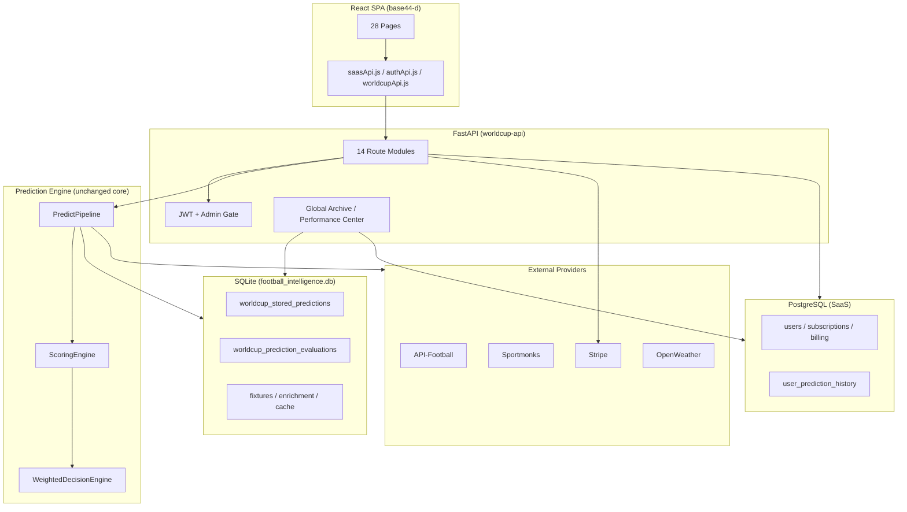

# PHASE 43 — FULL PROJECT AUDIT

**Project:** World Cup Predictor  
**Host:** https://footballpredictor.it.com (`91.107.188.229`)  
**Audit date:** 2026-06-21  
**Mode:** READ-ONLY — no code, deploy, or database changes  
**Auditor scope:** Local codebase + production phase reports + deployed endpoint behavior

---

## Executive Summary

The World Cup Predictor is a **mature, production-active SaaS** with a dual-database architecture: **PostgreSQL** for users/subscriptions/history views and **SQLite** for football intelligence, global prediction archive, and accuracy evaluation. The React frontend (`base44-d`) exposes 28 routed pages behind JWT auth, with admin/super-admin gate layers.

**Production-active major phases (confirmed in deploy reports):**
- Auth & user management (40A, 41A–41D)
- Subscription & Stripe billing (38A, 39A–39B5)
- Admin security (37A)
- Global archive + Best Tips + Performance Center (42D)
- Prediction archive detail (42C)
- Weather intelligence (43)
- Live accuracy dashboard (42B)

**Overall health:** Functional and deployable. No critical production blockers found. Primary risks are **architectural duplication** (three prediction-history stores, overlapping accuracy endpoints), **silent enrichment failures** in the pipeline, **incomplete commercial UX** (contact form stub, favorites add unwired, API settings stub), and **repository clutter** (deploy staging/pack folders mirroring source).

**Recommendation:** Prioritize consolidation of history/accuracy data paths, wire incomplete user-facing flows, and reduce deploy artifact noise before adding new intelligence layers.

---

## Architecture Map

### High-level system diagram



### Backend structure (`worldcup_predictor/`)

| Layer | Key modules | Role |
|-------|-------------|------|
| **API** | `api/main.py`, `api/routes/*`, `api/deps.py`, `api/web_auth.py` | HTTP surface, JWT, admin gate |
| **Orchestration** | `orchestration/predict_pipeline.py` | End-to-end predict flow |
| **Prediction** | `prediction/scoring_engine.py`, `decision/weighted_decision_engine.py` | Core probabilities + WDE |
| **Intelligence** | `intelligence/*`, `agents/specialists/*`, `providers/*` | Data enrichment (xG, weather, lineups, odds) |
| **Archive & trust** | `api/global_prediction_archive.py`, `api/performance_center.py`, `api/prediction_archive_detail.py` | Phase 42C/42D public archive |
| **SaaS** | `database/postgres/*`, `subscription/*`, `billing/*`, `auth/*` | Users, plans, Stripe |
| **Automation** | `automation/worldcup_background/*` | Background daily predictions + evaluation |
| **Legacy GUI** | `ui/*` (~80 files) | Desktop Tk app — **not used by FastAPI** |
| **Legacy access** | `access/*` | SQLite GUI-era auth — **parallel to JWT** |

### Frontend structure (`base44-d/src/`)

| Area | Path | Notes |
|------|------|-------|
| Pages | `pages/` (28 components) | All routed in `App.jsx` |
| API clients | `api/saasApi.js`, `api/authApi.js`, `api/worldcupApi.js` | 47+ exported functions |
| Layout | `components/dashboard/DashboardLayout.jsx` | Custom sidebar (not shadcn sidebar) |
| Auth guards | `lib/ProtectedRoute`, `AdminRoute`, `SuperAdminRoute` | Role-based |
| UI primitives | `components/ui/` | ~30 shadcn components unused (scaffold) |

### Module dependencies (critical path)

```
POST /api/predict/{fixture_id}
  → quota_guard / prediction_cache
  → PredictPipeline.run()
      → DataCollectorAgent
      → SpecialistOrchestrator
      → PredictionAgent → ScoringEngine.predict()
          → WeightedDecisionEngine.decide() + apply_decision()
      → post-enrichment (first_goal, extended_markets, fusion, xG, weather)
      → accuracy JSONL + SQLite stored predictions
  → build_prediction_output() → enrich_prediction_payload()
  → optional user_prediction_history write (PostgreSQL)
```

### Duplicate / overlapping modules

| Overlap | Locations | Risk |
|---------|-----------|------|
| **History list** | `/api/history`, `/api/user/prediction-history`, `/api/user/prediction-history/results` | Maintenance drift; frontend mostly uses `/api/history` now |
| **History detail** | `/api/history/{id}`, `/api/user/prediction-history/{id}` | Same builder; two URLs |
| **Accuracy metrics** | `/api/accuracy/summary`, `/api/performance/summary`, `/api/admin/accuracy/*` | Different data sources; user confusion possible |
| **Prediction storage** | JSONL, SQLite `worldcup_stored_predictions`, PG `user_prediction_history` | Consistency / dedupe complexity |
| **Auth** | PostgreSQL JWT vs SQLite `access/repository.py` | GUI-only legacy; safe if unused in API |
| **Billing checkout** | `/api/billing/create-checkout-session` + 3 legacy placeholder routes | Legacy routes unauthenticated |
| **Deploy copies** | `_pack_phase*`, `deploy_staging_*`, `dist_*` at repo root | Stale mirrors; not runtime but audit noise |

### Dead code candidates

| Candidate | Path | Confidence |
|-----------|------|------------|
| Desktop GUI | `worldcup_predictor/ui/` | High — no FastAPI imports |
| GUI auth | `access/unified_auth.py`, `access/prediction_gate.py` | High — GUI-only |
| Unused frontend components | `GoogleIcon.jsx`, `UserNotRegisteredError.jsx` | High |
| Unused saasApi exports | 7 functions (see Feature Inventory) | High |
| Unused shadcn UI | ~30 files under `components/ui/` | Medium — scaffold |
| Duplicate DDL | `database/schema.py` `PHASE40_DDDL` | Medium |

---

## Feature Inventory

Status key: **Active** = implemented and wired | **Partial** = UI or API incomplete | **Legacy** = superseded but kept | **Admin** = role-gated

| Feature | Status | Production | Page / Route | API Endpoint(s) |
|---------|--------|------------|--------------|-----------------|
| Landing / marketing | Active | Yes | `/` | — |
| Login | Active | Yes | `/login` | `POST /api/auth/login` |
| Register | Active | Yes | `/register` | `POST /api/auth/register` |
| Email verification | Active | Yes | `/verify-email` | `GET /api/auth/verify-email`, resend endpoints |
| Forgot password | Active | Yes | `/forgot-password` | `POST /api/auth/forgot-password` |
| Reset password | Active | Yes | `/reset-password` | `POST /api/auth/reset-password` |
| Change password | Active | Yes | `/settings` | `POST /api/auth/change-password` |
| JWT session / me | Active | Yes | all protected | `GET /api/auth/me`, `POST /api/auth/logout` |
| Dashboard | Active | Yes | `/dashboard` | `GET /api/user/dashboard` |
| Match Center | Active | Yes | `/matches` | `GET /api/matches/upcoming` |
| Run prediction | Active | Yes | `/prediction/:id` | `POST /api/predict/{id}` (auth required) |
| View cached prediction | Active | Yes | `/prediction/:id` | `GET /api/predict/{id}` (optional auth) |
| Prediction detail UI | Active | Yes | `/prediction/:id` | enriched payload + weather (Phase 43) |
| **History — All / My / Global** | Active | Yes | `/history` | `GET /api/history?scope=all\|my\|global` |
| History detail | Active | Yes | `/history/:entryId` | `GET /api/history/{entryId}` |
| Global archive detail | Active | Yes | `/history/global-{fixtureId}` | same |
| Legacy user history | Legacy | Yes | — (superseded) | `GET /api/user/prediction-history` |
| **Performance Center** | Active | Yes | `/accuracy` | `GET /api/performance/summary` |
| **Best Tips** | Active | Yes | `/accuracy` (section) | `GET /api/best-tips` |
| Public accuracy summary | Active | Yes | — (API only) | `GET /api/accuracy/summary` |
| Favorites (view/remove) | Partial | Yes | `/favorites` | GET/DELETE favorites; **add not wired** |
| Alerts | Active | Yes | `/alerts` | `/api/user/alerts/*` |
| Notifications | Active | Yes | `/notifications` | `/api/user/notifications/*` |
| User settings | Active | Yes | `/settings` | `GET/PATCH /api/user/settings` |
| Subscription & quota | Active | Yes | `/subscription` | `GET /api/user/subscription`, `/api/user/quota` |
| Stripe checkout | Active | Yes | `/subscription`, `/billing/success` | `POST /api/billing/create-checkout-session` |
| Stripe portal | Active | Yes | `/subscription` | `POST /api/billing/customer-portal` |
| Billing history | Active | Yes | `/subscription` | `GET /api/billing/history` |
| Pricing | Partial | Yes | `/pricing` (orphaned nav) | plan data local; landing uses `#pricing` |
| Contact admin (in-app) | Active | Yes | `/subscription` | `POST /api/user/contact-admin` |
| Public contact form | Partial | Yes | `/contact` | **UI-only — no API call** |
| Legal pages | Active | Yes | `/privacy`, `/terms`, etc. | — |
| Admin panel | Active | Yes | `/admin` | `/api/admin/*` + gate token |
| Admin accuracy center | Active | Yes | `/admin/accuracy` | `/api/admin/accuracy/*` |
| Admin learning dashboard | Active | Yes | `/admin/learning` | `/api/admin/learning/*` |
| Super admin panel | Active | Yes | `/super-admin` | ban/role/plan/commercial |
| API settings | Partial | Yes | `/api-settings` | **stub — "sync coming later"** |
| Admin gate | Active | Yes | — | `/api/admin/gate/*` |
| Cookie consent | Active | Yes | global | links to `/privacy` |
| WDE / scoring engine | Active | Yes | internal | via `POST /api/predict` |
| Weather intelligence | Active | Yes | prediction detail | pipeline enrichment |
| Background daily predictions | Active | Yes | global archive source | automation runner |
| Market consistency guard | Active | Yes | prediction output | scoring/post-process |
| Rule A gate (shadow/live) | Active | Shadow/live | internal | shadow stores |
| Lambda bridge (shadow) | Active | Shadow | internal | shadow replay |
| Promotion adapters (xG, lineups, etc.) | Active | Shadow/promotion | internal | promotion shadow JSONL |
| Desktop GUI | Legacy | No | — | CLI/local only |

---

## Bug List

No `TODO`, `FIXME`, or `HACK` markers found in `worldcup_predictor/` or `base44-d/src/`. Issues below come from structural review, exception patterns, and incomplete wiring.

### Critical

| ID | Issue | Location | Notes |
|----|-------|----------|-------|
| — | *None identified* | — | Production smoke tests pass for core flows |

### High

| ID | Issue | Location | Notes |
|----|-------|----------|-------|
| H1 | **Triple prediction storage** without single source of truth | JSONL + SQLite `worldcup_stored_predictions` + PG `user_prediction_history` | Dedupe logic in 42D mitigates UI; backend sync gaps possible |
| H2 | **Silent post-enrichment failures** | `predict_pipeline.py` lines 77–122 — bare `except Exception: pass` on first_goal, extended_markets, fusion, xG, weather | Failures invisible to user; partial predictions |
| H3 | **Public contact form is fake** | `ContactPage.jsx` — sets `sent=true` locally, no API | Trust/compliance gap vs in-app `contact-admin` |
| H4 | **Favorites add flow unwired** | `addFavorite` exported but never imported | Users can remove favorites only |
| H5 | **Global archive list loads all rows then slices** | `global_prediction_archive.py` — fetches `limit+offset` from DB with `offset=0` always for global | Will degrade as archive grows |
| H6 | **Production validation false-fails on frontend source checks** | `validate_phase42d_*.py` etc. | Expected on prod (no `base44-d/src`); deploy scripts exit non-zero unless smoke-only |

### Medium

| ID | Issue | Location | Notes |
|----|-------|----------|-------|
| M1 | Duplicate history endpoints | `user.py` `/prediction-history/results` delegates to same handler | Confusing API surface |
| M2 | Duplicate resend verification routes | `auth.py` two aliases | Harmless but redundant |
| M3 | Legacy unauthenticated billing placeholders | `/api/billing/checkout`, `/subscription/checkout`, `/stripe/create-checkout-session` | Expose readiness JSON without auth |
| M4 | `GET /api/predict/{id}` allows unauthenticated cache read | `predictions.py` | Cached predictions viewable without login |
| M5 | `GET /api/matches/upcoming` unauthenticated | `matches.py` | Likely intentional; fixture data exposed |
| M6 | Performance summary may trigger `rebuild_accuracy_summary` on cold cache | `performance_center.py` | Extra SQLite work on first request |
| M7 | AccuracyCenter DEV demo fallback | `AccuracyCenter.jsx` — `DEV_ACCURACY_DEMO` on empty/error in DEV only | Production safe; dev could mislead testers |
| M8 | ApiSettings page stub | `ApiSettingsPage.jsx` | Ad/admin-facing; save is toast only |
| M9 | `/pricing` route not linked in nav | `App.jsx` vs `LandingNav.jsx` | Reachable by URL only |
| M10 | Broad `except Exception` in API layer | `public_accuracy_summary.py`, `admin.py`, `display_helpers.py` | May hide data errors |

### Low

| ID | Issue | Location | Notes |
|----|-------|----------|-------|
| L1 | 7 unused `saasApi` exports | `saasApi.js` | Dead client code |
| L2 | ~30 unused shadcn UI components | `components/ui/` | Bundle bloat potential |
| L3 | Unused components | `GoogleIcon.jsx`, `UserNotRegisteredError.jsx` | — |
| L4 | Desktop GUI tree unmaintained for SaaS | `worldcup_predictor/ui/` | Large dead subtree |
| L5 | Deploy pack folders in repo root | `_pack_phase*`, `deploy_staging_*` | Stale copies; confusion risk |
| L6 | Premium placeholders in archive detail | `prediction_archive_detail.py` | "Coming soon" sections |
| L7 | Lambda bridge marked "Temporary" in docstring | `lambda_bridge/calibration.py` | Shadow-only; document intent |
| L8 | Small production evaluation sample | prod: 2 evaluated predictions | Honest metrics; low reliability badges |

---

## API Audit

### Endpoint inventory: 60+ routes across 14 modules

All mounted under `/api` via `main.py`.

### Auth protection summary

| Protection | Endpoints |
|------------|-----------|
| **Public (no JWT)** | `/health`, `/version`, `/accuracy/summary`, `/performance/summary`, `/best-tips`, `/matches/upcoming`, legacy billing placeholders, Stripe webhook |
| **Optional JWT** | `GET /api/predict/{id}` |
| **JWT required** | `/auth/me`, `/auth/change-password`, `/user/*`, `/history/*`, `/billing/readiness|status|history`, checkout (verified user) |
| **JWT + admin role + gate** | `/admin/*` (except gate routes), `/admin/accuracy/*`, `/admin/learning/*` |
| **JWT + super_admin + gate** | role/plan/ban/kick, commercial analytics |
| **POST predict** | JWT required for new runs; cache reuse allowed when authenticated |

### Orphan / unused endpoints (backend exists; frontend unused)

| Endpoint | Notes |
|----------|-------|
| `GET /api/user/prediction-history/results` | Duplicate of `/prediction-history` |
| `GET /api/accuracy/summary` | No frontend import (`fetchAccuracySummary` unused) |
| `GET /api/admin/learning/optimization` | `fetchAdminLearningOptimization` unused |
| `GET /api/admin/accuracy/audit` | `fetchAdminAccuracyAudit` unused |
| Legacy checkout GET/POST trio | Placeholder only |

### Inconsistent response formats

| Pattern | Examples |
|---------|----------|
| `{ status: "ok", ... }` | history, performance, user routes |
| `{ status: "error", code, message }` | predict quota errors |
| HTTPException `detail` string vs dict | mixed across routes |
| Archive detail | rich nested object (Phase 42C) vs list row summaries |

### Duplicated routes

- History list: `/api/history` vs `/api/user/prediction-history`
- History detail: `/api/history/{id}` vs `/api/user/prediction-history/{id}`
- Checkout: 4 paths (1 real + 3 legacy placeholders)
- Resend verification: 2 paths

---

## Database Audit

### PostgreSQL (SaaS) — 11 tables

`users`, `email_verification_tokens`, `password_reset_tokens`, `user_settings`, `user_favorites`, `user_alerts`, `user_notifications`, `subscriptions`, `billing_invoices`, `stripe_webhook_events`, `user_prediction_history`

**Usage:** All appear referenced by repositories and routes. No obvious orphan tables.

### SQLite intelligence — 17+ base tables + migration tables

Core: `fixtures`, `predictions`, `prediction_markets`, `worldcup_stored_predictions`, `worldcup_prediction_evaluations`, `worldcup_accuracy_summary`, enrichment/cache tables, `learning_records_v2`, etc.

### Legacy access SQLite (GUI)

`app_users`, `user_usage_limits`, `user_entitlements` — **parallel to PostgreSQL users**; not used by FastAPI SaaS path.

### PostgreSQL vs SQLite overlap

| Concern | PG | SQLite | Risk |
|---------|----|--------|------|
| User identity | `users` | `app_users` (GUI) | Low if GUI unused |
| Prediction history view | `user_prediction_history` | `worldcup_stored_predictions` | **Medium** — merge/dedupe required |
| Accuracy / evaluation | — | `worldcup_prediction_evaluations` | Global metrics source of truth |
| Usage / quota | subscription period in PG | `user_daily_prediction_usage` | Dual tracking; quota_service bridges |
| Engine predictions | — | `predictions` + JSONL | Older table vs stored_predictions |

### Data consistency risks

1. User runs predict → may write PG history + SQLite stored prediction + JSONL — not always atomic across stores.
2. Global archive status derived from SQLite evaluations + live `FixtureOutcomeResolver` — can disagree with PG `result` enum if not synced.
3. `rebuild_accuracy_summary` on demand can race with background evaluator.
4. Production evaluated count very small (2) — metrics statistically unreliable until World Cup matches accumulate.

### Unused / low-use columns

Not fully schema-audited column-by-column; `user_prediction_history` retains Phase 29 evaluation fields alongside archive detail snapshot logic. Recommend Alembic inventory pass before next migration.

---

## Security Findings

| Severity | Finding | Detail |
|----------|---------|--------|
| **Low** | Legacy billing routes unauthenticated | Return readiness JSON only; no Stripe session created |
| **Low** | Public performance/best-tips/accuracy | Intentional trust feature (42D); no PII |
| **Medium** | Unauthenticated cached predict GET | Anyone with fixture ID can read cache if warm |
| **Good** | JWT + token_version invalidation | `web_auth.resolve_bearer_token` checks PG user |
| **Good** | Admin double gate | Role + `X-Admin-Gate-Token` / super-admin variant |
| **Good** | Production guard | `production_guard.py` blocks weak JWT, missing PG, etc. |
| **Good** | Stripe webhook | Signature verification via `STRIPE_WEBHOOK_SECRET` |
| **Good** | Password hashing | bcrypt/argon via `auth/passwords.py` |
| **Good** | Rate limiting | `auth_rate_limit.py` on auth endpoints |
| **Good** | Banned/disabled user checks | `assert_prediction_access`, checkout guards |
| **Info** | CORS production | Only `CORS_ALLOWED_ORIGINS` env list |
| **Info** | No debug routes exposed | No `/docs` disable noted; FastAPI default may expose OpenAPI in prod — verify nginx |

### Sensitive logging

Pipeline and providers use structured logging; no obvious password/token logging found in API routes. Recommend periodic grep for `logger.*password|token` in production logs policy.

---

## Frontend Audit

### Routing

- **28/28 pages routed** — no orphan page components.
- **404 handler** — `PageNotFound.jsx` on `*`.

### Navigation gaps

| Issue | Detail |
|-------|--------|
| `/pricing` orphaned | Route exists; landing uses `#pricing` anchor only |
| `/prediction/:id` | No sidebar label (by design — reached from matches) |
| Admin sections | Properly role-gated in sidebar |

### Broken links

- No broken internal `<Link to="...">` targets found.
- External links in legal/footer not validated in this audit.

### Duplicate UI

- Pricing: `PricingContent.jsx` shared by landing section and `/pricing` page (intentional).
- History: consolidated into single page with tabs (42D); legacy `fetchPredictionHistoryPage` unused.

### Trust UI (42D)

- Green/red/yellow status badges on history — implemented.
- Performance Center sample sizes + reliability badges — implemented.
- Production uses real API data (no DEV demo).

---

## Prediction Integrity Audit

| Check | Status | Evidence |
|-------|--------|----------|
| WDE unchanged as decision core | **Pass** | `scoring_engine.py` default `use_weighted_decision=True` → `WeightedDecisionEngine` |
| Scoring engine drives probabilities | **Pass** | `PredictionAgent` → `ScoringEngine.predict()` in pipeline |
| No API-layer probability override | **Pass** | Routes delegate to pipeline; output builders format only |
| Confidence flow | **Pass** | WDE → adaptive confidence → display helpers; consistency guard applied |
| History evaluation consistency | **Partial** | PG records use `prediction_history_evaluation.py`; global uses SQLite evaluations + resolver — merge prefers user row |
| Shadow systems isolated | **Pass** | lambda_bridge, rule_a_gate, odds_primary, promotion adapters write shadow JSONL |
| Weather (Phase 43) | **Pass** | Enrichment only; scoring adjustment documented as minor goals risk factor |
| Placeholder predictions blocked from matches list | **Pass** | `matches.py` filters `is_placeholder` |

**Accidental override risk:** Post-enrichment `try/except: pass` blocks could produce predictions missing markets silently — integrity of *displayed* output may diverge from engine core 1X2 without failing the request.

---

## Performance Audit

| Area | Observation | Severity |
|------|-------------|------------|
| Global archive fetch | Loads up to `limit+offset` rows, filters in Python | Medium at scale |
| Performance summary | May call `rebuild_accuracy_summary` when cache empty | Medium on cold start |
| Upcoming matches | Cached via `fixtures_list_cache` | Good |
| Predict cache | SQLite/file cache reuse | Good |
| Archive detail | Multiple SQLite reads + snapshot load per request | Acceptable now |
| Admin accuracy rebuild | POST rebuild can be heavy | Admin-only |
| Frontend bundle | Single Vite chunk; unused shadcn not tree-shaken if imported elsewhere | Low |

### Cache opportunities

1. Cache `GET /api/performance/summary` with TTL (evaluations change slowly).
2. Paginate global archive at SQL level (`LIMIT/OFFSET` in query).
3. Memoize `FixtureOutcomeResolver` results per fixture in archive list.

---

## SaaS Readiness Audit

| Area | Score | Notes |
|------|-------|-------|
| **Onboarding** | Good | Register → verify (configurable) → dashboard |
| **Subscription flow** | Good | Stripe checkout + portal + webhooks deployed (39B5) |
| **Upgrade flow** | Good | Quota 402 → `/subscription` upgrade URL in API errors |
| **Retention** | Partial | Favorites/alerts/notifications exist; favorites add broken; no email digests |
| **Trust signals** | Good | Global archive, performance center, evaluated badges (42D) |
| **Commercial gaps** | Medium | Public contact form fake; API settings stub; small eval sample |
| **Admin operations** | Strong | User ban/kick/plan, quota reset, accuracy rebuild, commercial analytics |
| **Legal** | Good | Privacy, terms, disclaimer, imprint pages |
| **Registration gate** | Configurable | `PUBLIC_ACCESS_CODE` recommended in production guard |

### Missing commercial features (not bugs)

- Specialist votes / agent explanations in archive (premium placeholders)
- Odds movement history in archive
- Public API keys for third parties (ApiSettings stub)
- Email notification digests for predictions/results
- Referral / affiliate system

---

## Technical Debt

1. **Consolidate prediction history** into documented single write path with PG as view layer and SQLite as system archive.
2. **Remove or quarantine** `_pack_phase*` / `deploy_staging_*` folders from main branch (or `.gitignore`).
3. **Replace bare `except Exception: pass`** in pipeline enrichments with logged warnings + degraded flags in metadata.
4. **Wire favorites add** from Match Center / Prediction Detail.
5. **Wire contact form** to email or `contact-admin` backend.
6. **Deprecate** `/api/user/prediction-history/results` and unused saasApi exports.
7. **SQL-level pagination** for global archive.
8. **Document or remove** desktop GUI subtree.
9. **Align validation scripts** for production (runtime smoke vs source checks).
10. **OpenAPI exposure** — confirm nginx blocks `/docs` in production.

---

## Top 20 Recommended Fixes

| # | Fix | Severity | Effort |
|---|-----|----------|--------|
| 1 | Log enrichment failures in `predict_pipeline.py` instead of silent pass | High | Low |
| 2 | SQL paginate global archive list | High | Low |
| 3 | Wire `ContactPage` to backend email or contact-admin | High | Medium |
| 4 | Wire favorites `addFavorite` in Match/Prediction UI | High | Low |
| 5 | Document canonical history data flow (PG vs SQLite vs JSONL) | High | Low |
| 6 | Cache `/api/performance/summary` with short TTL | Medium | Low |
| 7 | Deprecate duplicate `/api/user/prediction-history/results` | Medium | Low |
| 8 | Require auth for `GET /api/predict/{id}` or rate-limit | Medium | Medium |
| 9 | Remove quarantine deploy pack folders from repo | Medium | Low |
| 10 | Complete ApiSettings or hide route until ready | Medium | Low |
| 11 | Link `/pricing` in nav or redirect to `/#pricing` | Low | Low |
| 12 | Prune unused saasApi exports and shadcn components | Low | Medium |
| 13 | Unify accuracy vs performance dashboard copy for users | Medium | Low |
| 14 | Add atomic write helper for predict → PG + SQLite | High | High |
| 15 | Production validation: skip frontend source checks | Medium | Low |
| 16 | Confirm `/docs` disabled in production nginx | Medium | Low |
| 17 | Grow evaluated prediction sample (background evaluator cadence) | High | Ops |
| 18 | Archive GUI code to separate branch/archive folder | Low | Medium |
| 19 | Standardize HTTPException detail shape `{ message, code }` | Low | Medium |
| 20 | Add integration test for history merge dedupe + global detail | Medium | Medium |

---

## Appendix: Production Endpoint Smoke Reference (2026-06-21)

From Phase 42D/43 deploy reports — all passed at deploy time:

- `GET /api/health` → 200
- `GET /api/performance/summary` → 200 (2 evaluated)
- `GET /api/best-tips` → 200
- `GET /api/history?scope=all|global` → 401 without auth (correct)
- Frontend bundle contains global archive + performance center strings
- Weather provider active (Phase 43)

---

*End of audit — read-only, no changes applied.*
