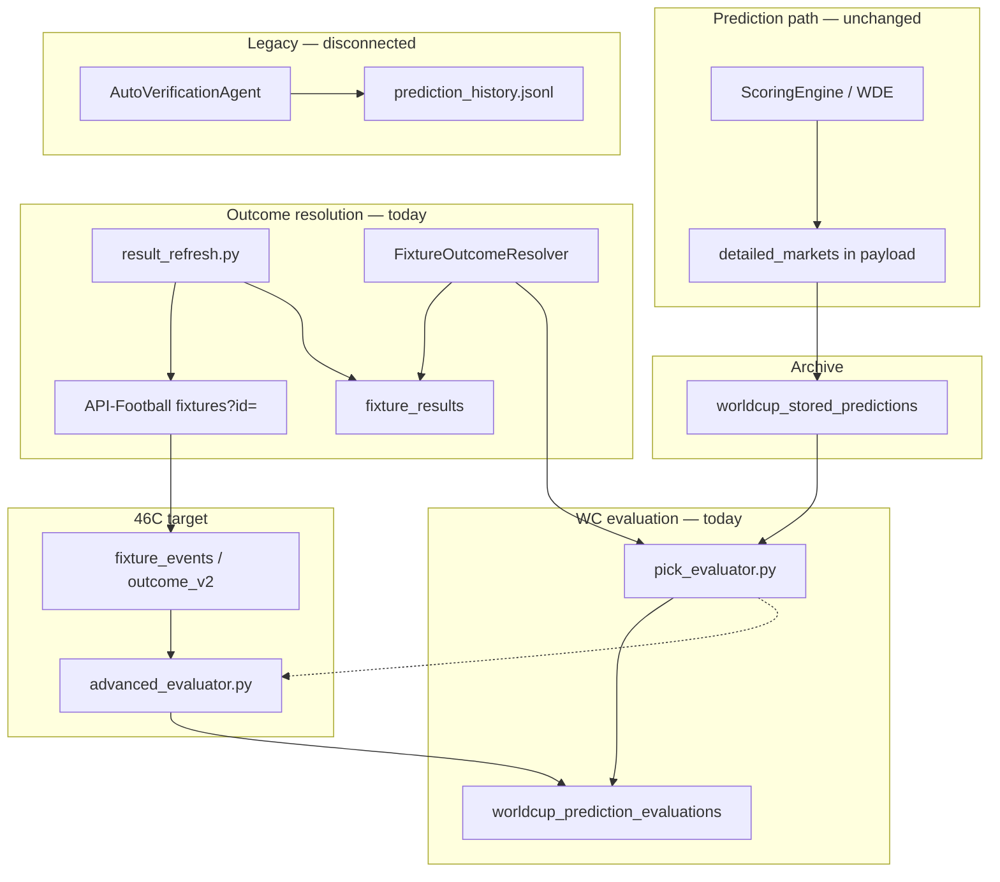

# Phase 46C — Advanced Market Evaluation Audit & Design

**Mode:** READ ONLY — no code changes, no deploy  
**Date:** 2026-06-21  
**Context:** Post–46B archive now holds **56** production stored predictions (12 authoritative + 44 legacy imports). WC auto-evaluation still evaluates **1X2, O/U, BTTS, DC, and pick tiers only**.

---

## Executive summary

The prediction engine **already generates** advanced markets in `detailed_markets`, but the production WC evaluation path (`pick_evaluator.py` → `worldcup_prediction_evaluations`) **does not evaluate them**. Legacy evaluators exist in parallel systems that are **not wired** to the public accuracy pipeline.

| Market | Payload coverage (est. prod n=56) | Outcome data ready today | Reusable evaluator exists? | WC pipeline today |
|--------|----------------------------------:|--------------------------|----------------------------|-------------------|
| **HT Result** | ~52/56 (~93%) | **Partial** — `halftime_score` sparse | **Partial** — wrong semantics in one helper | **No** |
| **Correct Score** | ~12–20/56 (top-3 list) | **Yes** — `final_score` when FT | **Yes** — legacy verification | **No** |
| **First Goal Team** | ~52/56 (~93%) | **Poor** — events not persisted for eval | **Partial** | **No** |
| **Goal Minute** | ~52/56 (band in payload) | **Poor** — no stored first-goal minute | **No** (band helpers only) | **No** |
| **Goalscorer** | ~35/56 (~60%) | **Poor** — same as events | **Partial** — exact string match only | **No** |

**Primary blocker:** `FixtureOutcome` / `FixtureOutcomeResolver` expose only FT 1X2 + score. Goal events and HT scores are parsed transiently (UI / match center) but **not persisted** on result refresh for evaluation.

**Design principle:** Extend outcomes first (46C-1), port evaluators second (46C-2), then minute bands + edge-case policy + public surfacing (46C-3). Do **not** change prediction engine outputs or WDE probabilities.

---

## System architecture (current vs target)



---

## Archive payload coverage (read-only scans)

### Production (post–46B)

| Metric | Value |
|--------|------:|
| Archive rows | **56** |
| Authoritative (`background` / non-legacy) | 12 |
| Legacy import | 44 |

**Estimated `detailed_markets` coverage** (extrapolated from Phase 46A authoritative sample + cache-import structure):

| Field | Est. coverage | Payload path |
|-------|--------------:|--------------|
| HT Result (1X2) | **~52/56 (93%)** | `detailed_markets.halftime.selection` + `probabilities` |
| First Goal Team | **~52/56 (93%)** | `detailed_markets.first_goal.team` |
| Goal Minute band | **~52/56 (93%)** | `detailed_markets.first_goal.minute_range` |
| Goal Minute `expected_minute` | **~40/56 (70%)** | `detailed_markets.first_goal.expected_minute` |
| Correct Score (top-3 list) | **~12–20/56 (20–35%)** | `detailed_markets.correct_scores[]` with `label` like `2-1` |
| Goalscorer (displayable player) | **~35/56 (60%)** | `detailed_markets.goalscorer.player` when `available=true` |

Phase 46A authoritative-only baseline (n=12): HT **11/12**, First Goal **11/12**, Goalscorer **7/12**.

### Local dev (n=30, post–46B import)

| Field | Count |
|-------|------:|
| `halftime` | 28 |
| `first_goal` | 27 |
| `correct_scores` (non-empty) | 6 |
| `goalscorer` (player present) | 1 |
| `minute_range` | 1 |
| `fixture_results.halftime_score` populated | **5** |
| Fixtures with FT status | **5** |

**Insight:** Prediction coverage exceeds **outcome data coverage** by an order of magnitude. Evaluation design must treat missing outcomes as `void` / `pending`, not wrong.

---

## Market-by-market audit

### 1. HT Result

#### Prediction availability

| Source | Available | Format |
|--------|-----------|--------|
| Live API payload | **Yes** | `detailed_markets.halftime.selection` → `home_win` / `draw` / `away_win` |
| Extended markets | **Yes** | `halftime_1x2` Poisson-derived probabilities |
| Legacy JSONL | **Partial** | `predicted_halftime_goals` float → **bucket** (0/1/2/3+), not HT 1X2 |
| Scoring engine | **Yes** | `HalftimePrediction.estimated_total_goals` (expected total, not 1X2) |

**Semantic conflict:** Three different “halftime” concepts exist:

1. **HT 1X2** — what the UI/archive shows (`detailed_markets.halftime`)
2. **HT goal bucket** — legacy `HistoricalMatchRow.halftime_bucket()` (0, 1, 2, 3+)
3. **HT expected total** — float from scoring engine

WC evaluation must standardize on **HT 1X2** for archive payloads and treat bucket/total as legacy-only.

#### Stored payload coverage

~**93%** of archive rows include `detailed_markets.halftime` with selection or probabilities.

#### Fixture data required

| Field | Table / object | Required |
|-------|----------------|----------|
| HT home goals | `fixture_results.halftime_score` or `fixtures` via parser | **Yes** |
| HT away goals | same | **Yes** |
| Match finished | `fixtures.status` ∈ FT/AET/PEN | **Yes** |

#### API-Football fields required

From `fixtures?id=` response (already parsed in `fixture_api_parser.py`):

| Path | Use |
|------|-----|
| `score.halftime.home` | HT home goals |
| `score.halftime.away` | HT away goals |
| `goals.home` / `goals.away` | FT only — **not** for HT eval |

Optional cross-check: `fixtures/events` filtered to period=1 (not implemented today).

#### Sportmonks fields required

From include `scores` (stored in enrichment raw JSON, **not** consumed for eval):

| Field | Use |
|-------|-----|
| Period scores (1st half) | HT score derivation |
| `state` | Finished detection |

**46D dependency:** merge Sportmonks `scores` when API-Football HT missing.

#### Existing verification logic

| Location | What it evaluates | Reusable? |
|----------|-------------------|-----------|
| `pick_evaluator.py` | — | **No** |
| `accuracy_optimization._eval_ht_result()` | HT 1X2 vs `actual` | **Bug:** passes FT `actual_result`, not HT 1X2 — **not safe to port as-is** |
| `accuracy/evaluator.py` | HT **goal bucket** vs predicted float | **Different market** — reuse bucket logic only for JSONL legacy |
| `auto_verification_agent.py` | HT bucket via `halftime_bucket` | Legacy JSONL path only |

#### Evaluator reusable?

**Partial.** Need new `_eval_ht_1x2(selection, ht_home, ht_away)` mirroring `_eval_1x2`. Do **not** reuse `_eval_ht_result()` without fixing outcome input.

#### Persistence requirements

| Layer | Change |
|-------|--------|
| `fixture_results.halftime_score` | Must be populated on every result refresh (today: **sparse**) |
| `worldcup_prediction_evaluations` | New column `market_ht_status` or `detail_json.markets.ht_result` |
| `worldcup_accuracy_summary` | Optional block `markets.ht_result` with n / winrate |

#### Expected accuracy metrics

| Metric | Typical range | Notes |
|--------|---------------|-------|
| HT 1X2 hit rate | **38–48%** | 3-way market; naive baseline ~33% |
| Calibrated lift vs 1X2 | +0–5 pp | Often correlated with FT pick |
| Minimum public n | **≥20** settled (Phase 45B trust rule) |

---

### 2. Correct Score

#### Prediction availability

| Source | Available | Format |
|--------|-----------|--------|
| `detailed_markets.correct_scores` | **Yes** | Top **3** rows: `{label: "2-1", probability: 12.3}` — **no single “primary” flag** |
| `scoreline` / `scoreline_candidates` | **Yes** | Engine-level candidates; primary via `primary_scoreline()` |
| Legacy JSONL | **Partial** | `predicted_scoreline` single string |
| Legacy SQLite | **Partial** | `prediction_markets.scoreline_exact` |

**Evaluation policy needed:** Match if **any** of top-3 labels equals actual, or **highest-probability** label only (recommend: **top-1 by probability** for strict metric + secondary “top-3 hit rate” for analytics).

#### Stored payload coverage

~**20–35%** with non-empty `correct_scores` list in current scans; higher if inferring from `scoreline.home_goals`/`away_goals` in older payloads.

#### Fixture data required

| Field | Source |
|-------|--------|
| FT home / away goals | `fixture_results.home_goals`, `away_goals` or `final_score` |
| Match status finished | `fixtures.status` |

#### API-Football fields required

| Path | Policy question |
|------|-----------------|
| `goals.home` / `goals.away` | **Default: 90-min FT score** for group stage |
| `score.fulltime` | Preferred explicit FT |
| `score.extratime` | Knockout — see AET handling below |
| `score.penalty` | **Exclude** from correct-score unless market explicitly includes shootout (recommend: **FT/AET goals only, never PEN**) |

#### Sportmonks fields required

| Include | Use |
|---------|-----|
| `scores` | Full-time / ET breakdown when API-Football ambiguous |
| `state` | `AET`, `FT_PEN` classification |

#### Existing verification logic

| Location | Logic | Reusable? |
|----------|-------|-----------|
| `accuracy/evaluator.py` | Exact string match `predicted_scoreline` vs `{home}-{away}` | **Yes** for single selection |
| `auto_verification_agent.py` | Same, market `scoreline_exact` | **Yes** |
| `pick_evaluator.py` | — | **No** |

#### Evaluator reusable?

**Yes** for single-score predictions. **Extend** for top-3 list: normalize labels (`:` → `-`), compare to actual.

#### Persistence requirements

- `detail_json.markets.correct_score` (+ optional `correct_score_top3_hit`)
- Column `market_cs_status` if following 1X2/O/U pattern
- Store `predicted_scoreline_used` (top-1 label) in eval detail for audit

#### Expected accuracy metrics

| Metric | Typical range |
|--------|---------------|
| Exact score (top-1) | **8–14%** |
| Top-3 coverage hit | **18–30%** |
| Baseline random (0–3 typical) | ~5–8% |

#### FT / AET / PEN handling (design)

| Match type | Recommended score for eval | Rationale |
|------------|---------------------------|-----------|
| Group / league (FT) | `score.fulltime` or `goals.*` | Matches betting “full time” |
| Knockout AET | **90-min score** *or* **including ET** — **pick one policy** | Recommend: **90-minute only** for WC group; **FT+AET** for knockout rounds (document in eval metadata) |
| PEN | **Void** correct-score market | Shootout not scoreline market |

Implement via `fixtures.round` / competition phase flag in outcome resolver.

---

### 3. First Goal Team

#### Prediction availability

| Source | Field |
|--------|-------|
| Payload | `detailed_markets.first_goal.team` (team name string) |
| First Goal V2 | `first_goal_team` ∈ `home` / `away` / `no_goal` / `unknown` |
| Legacy JSONL | `predicted_first_goal_team` |

#### Stored payload coverage

~**93%** with team field populated.

#### Fixture data required

| Data | Description |
|------|-------------|
| Ordered goal events | First **countable** goal event with team attribution |
| 0–0 matches | Predicted `no_goal` vs actual no scorer |

#### API-Football fields required

`fixtures/events` array:

| Field | Use |
|-------|-----|
| `type` | Filter `Goal` (case varies) |
| `time.elapsed` | Ordering (+ `extra` for stoppage) |
| `team.name` / `team.id` | Team attribution |
| `detail` | **Critical:** `Normal Goal`, `Own Goal`, `Penalty`, `Missed Penalty` |
| `player.name` | Scorer (for cross-market) |

**Current parser gap** (`fixture_api_parser._parse_goal_scorers`): includes **all** `type=goal` events in API order; **does not** filter own goals, missed penalties, or VAR overturns.

#### Sportmonks fields required

Include `events` (already fetched, stored raw):

| SM concept | Map to |
|------------|--------|
| Goal event type | Own goal / penalty flags |
| Participant ID | Team resolution vs API-Football names |
| Minute | First goal ordering |

#### Existing verification logic

| Location | Logic | Reusable? |
|----------|-------|-----------|
| `accuracy/evaluator._first_goal_team_from_scorers()` | First entry in `goal_scorers[]` string list → team from `(Team)` suffix | **Partial** |
| `accuracy_optimization._eval_first_team_to_score()` | Team name substring match vs `outcome_home_first: bool` | **Needs bool → team resolver** |
| `auto_verification_agent.py` | Wraps evaluator | **Partial** |
| `match_center._goal_scorers()` | Builds list for UI | **Same limitations** |

#### Evaluator reusable?

**Partial.** Extract shared **`FirstGoalOutcomeResolver`**:

1. Fetch normalized events (persisted)
2. Apply goal-counting rules (below)
3. Return `{first_goal_team, first_goal_minute, first_goal_scorer, no_goal}`

#### First goal extraction rules (design)

| Event | Count as first goal? | Credit team |
|-------|---------------------|-------------|
| Normal goal | **Yes** | Scoring team |
| Penalty goal | **Yes** | Scoring team |
| Own goal | **Yes** | **Beneficiary** (team awarded goal) — API-Football attributes team field to beneficiary |
| Missed penalty | **No** | — |
| Goal disallowed (VAR) | **No** if removed from feed | Depends on API final feed |
| 0–0 | N/A | `no_goal` |

**Penalty handling:** Include penalty goals; exclude missed penalties.

**Own goal handling:** Use API `detail`; if absent, infer from team field on event (document assumption).

#### Persistence requirements

New table recommended: `fixture_goal_events` (fixture_id, minute, extra, team_id, player_name, detail, sort_index)  
Or JSON blob: `fixture_results.events_json` (column does not exist today; `fixture_enrichment.events_json` exists but is not wired to refresh).

Eval columns: `market_first_goal_team_status`.

#### Expected accuracy metrics

| Metric | Typical range |
|--------|---------------|
| First goal team (2-way, exclude no_goal) | **50–58%** |
| Including `no_goal` predictions | Lower volume, higher variance |
| Minimum public n | **≥20** |

---

### 4. Goal Minute

#### Prediction availability

| Source | Format |
|--------|--------|
| `detailed_markets.first_goal.minute_range` | Band string: `0-15`, `16-30`, `31-45`, `46-60`, `61-75`, `76-90+` |
| `expected_minute` | Integer midpoint hint (e.g. 38) |
| First Goal V2 | `first_goal_minute_band` enum |
| Scoring engine | Heuristic band from total-goals estimate |

**Product disclaimer already states:** bands are approximate, not exact minute predictions (`first_goal_models.py`).

#### Stored payload coverage

~**93%** have `minute_range`; ~**70%** have `expected_minute`.

#### Fixture data required

| Data | Required |
|------|----------|
| First goal minute | From ordered goal events |
| Match abandoned before goal | Void |

#### API-Football fields required

Same events as First Goal Team: `time.elapsed`, `time.extra` (add extra to elapsed for band mapping).

#### Sportmonks fields required

`events.minute` + period — merge rules in 46D.

#### Existing verification logic

| Location | Status |
|----------|--------|
| `market_consistency_timing.py` | **Band parse/normalize only** — no eval |
| `dashboard_metrics.py` | Placeholder metrics from **verification store** — no WC eval |
| `auto_verification_agent.py` | **No minute band eval** |
| Verification JSONL | Market label exists in dashboard mapping only |

#### Evaluator reusable?

**No.** Build new `_eval_goal_minute_band(predicted_band, actual_minute)`.

#### Goal Minute evaluation modes (design)

| Mode | Rule | Use case |
|------|------|----------|
| **Band match (primary)** | Actual minute ∈ parsed band inclusive range | Matches product output |
| **Exact minute** | `expected_minute` vs actual ± tolerance | **Not recommended** for public — too harsh |
| **Tolerance window** | ±3 min around `expected_minute` | Internal calibration only |
| **Adjacent band** | Partial credit | Analytics only, not public win/loss |

**Band definitions** (from `market_consistency_timing.TIMING_MINUTE_BANDS`):

| Band | Minutes (inclusive) |
|------|---------------------|
| 0-15 | 0–15 |
| 16-30 | 16–30 |
| 31-45 | 31–45 |
| 46-60 | 46–60 |
| 61-75 | 61–75 |
| 76-90+ | 76–120 (ET policy: **include ET in same band set** or separate `ET` void) |

**No-goal match:** If prediction band is `no_goal` / 0–0, evaluate against no first goal.

**Stoppage time:** Use `elapsed + extra` when API provides `time.extra`.

#### Persistence requirements

Same event store as First Goal Team + `market_goal_minute_status` + store `actual_first_goal_minute` in detail_json.

#### Expected accuracy metrics

| Metric | Typical range |
|--------|---------------|
| Band hit rate (6 bands) | **22–35%** (model); random ~16% |
| Expected-minute ±5 (internal) | **30–40%** |
| Public display | Band only, n≥20 |

---

### 5. Goalscorer

#### Prediction availability

| Source | Field |
|--------|-------|
| `detailed_markets.goalscorer` | `{player, team, confidence, available}` |
| Consistency guard | May set `display_allowed=false` — eval should respect **raw audit trace** vs public pick |
| First Goal V2 | `likely_first_goal_scorers[]` ranked list |
| Legacy JSONL | `predicted_first_goal_scorer` |

#### Stored payload coverage

~**60%** production (7/12 authoritative); local scan **1/30** (many imports lack reliable player names).  
Goalscorer often withheld when lineups missing or BTTS-No consistency rules fire.

#### Fixture data required

| Data | Required |
|------|----------|
| First goal scorer name | From events |
| Player on pitch at goal time | **Hard** — optional v2 |

#### API-Football fields required

| Field | Use |
|-------|-----|
| `events[].player.name` | Scorer |
| `events[].assist.name` | Not used for scorer market |
| `events[].type` | Goal filter |

Deep data (optional v2): `fixtures/players` for ID mapping — already fetched in deep fetch path, unused for eval.

#### Sportmonks fields required

| Include | Use |
|---------|-----|
| `events` | Scorer + player ID |
| `lineups` | Substitution timing (v2) |

#### Existing verification logic

| Location | Logic | Reusable? |
|----------|-------|-----------|
| `auto_verification_agent._first_goal_scorer_from_events()` | Parse `"23' Name (Team)"` string | **Fragile** |
| Scorer eval | `scorer_pred.lower() == actual_scorer.lower()` | **Exact match only — no fuzzy** |
| `is_reliable_player_name()` | Prediction-side filter | Reuse for “was prediction displayable?” |

#### Player identity matching (design)

| Tier | Rule |
|------|------|
| **T0 — Exact** | Case-insensitive full string match |
| **T1 — Normalized** | Strip accents, punctuation, `Jr.` / `II` |
| **T2 — Last name + team** | If unique on pitch |
| **T3 — Player ID** | API player id from event vs lineup (future) |

**Substitutions:** v1 ignores — first goal scorer is event player, not “anytime” market.  
**Penalties:** Scorer = taker (API attributes correctly in most feeds).  
**Own goals:** **Void** scorer market or credit own-goal player per product policy (recommend: **void** — prediction is “goalscorer to score”, OG is different market).

#### Evaluator reusable?

**Partial** — port structure from `auto_verification_agent`, replace string parsing with structured event store + normalization utility (new module, not in repo today).

#### Persistence requirements

- `market_goalscorer_status`
- Detail: `predicted_scorer`, `actual_scorer`, `match_tier` (exact/normalized)

#### Expected accuracy metrics

| Metric | Typical range |
|--------|---------------|
| Anytime / first scorer exact | **5–12%** |
| Top-3 candidate list hit | **15–25%** |
| With lineup-quality gating | Higher on displayed picks only |

---

## Cross-cutting: outcome data gap

| Outcome field | Persisted today? | Populated on refresh? | Used by WC eval? |
|---------------|------------------|----------------------|------------------|
| FT score | **Yes** | **Usually** | **Yes** |
| HT score | Column exists | **Rare** (~9% local) | **No** |
| Goal events | Enrichment table only | **No** on refresh path | **No** |
| `goal_scorers` on fixture | In-memory / UI | Transient via `enrich_fixture` | Legacy only |
| Sportmonks events | Raw enrichment JSON | Fetch yes, eval **no** | **No** |

`result_refresh.py` calls `parse_api_fixture_item` (which **can** parse HT + events) but persists only fixture + `fixture_results` — **events are discarded**.

---

## Parallel evaluation systems (conflict map)

| System | Input | Advanced markets | Writes to WC eval DB | Public |
|--------|-------|------------------|----------------------|--------|
| **WC pipeline** | Stored payload + `FixtureOutcome` | **None** | **Yes** | Performance Center (1X2-led) |
| **AutoVerificationAgent** | JSONL history + fixture w/ scorers | HT bucket, CS, FG team, scorer | **No** | Verification reports |
| **AccuracyTrackerService** | JSONL + fixtures | Same as evaluator | **No** | Learning dashboard |
| **accuracy_optimization** | WC eval rows + payload | HT/FG helpers (HT buggy) | **No** | Admin optimization only |

**46C must consolidate** on WC pipeline + single outcome store; legacy agents become regression tests only.

---

## Proposed evaluation schema (design only)

### `FixtureOutcomeV2` (extend resolver)

```text
fixture_id
is_finished
final_score_90          # optional explicit
final_score_incl_et     # knockout policy
actual_result_ft        # 1x2 from chosen score policy
halftime_score          # "1-0"
ht_result               # home_win | draw | away_win
first_goal              # { minute, extra, team, player, detail }
goal_events[]           # ordered normalized list
outcome_source          # api_football | sportmonks | merged
```

### `worldcup_prediction_evaluations` extensions

| Column / key | Market |
|--------------|--------|
| `market_ht_status` | HT Result |
| `market_cs_status` | Correct Score |
| `market_first_goal_team_status` | First Goal Team |
| `market_goal_minute_status` | Goal Minute band |
| `market_goalscorer_status` | Goalscorer |
| `detail_json.markets.*` | Full audit (predicted vs actual, void reasons) |

Apply Phase 45B quarantine rules: test fixtures, placeholder teams, legacy low-quality imports (`is_quarantined` on stored row) → exclude from public aggregates.

---

## Implementation roadmap

### Phase 46C-1 — Outcome foundation

**Goal:** Persist everything evaluators need; extend resolver without changing eval logic yet.

| Step | Deliverable |
|------|-------------|
| 1.1 | `FixtureOutcomeV2` model + normalized `GoalEvent` dataclass |
| 1.2 | Persist `halftime_score` on every successful refresh |
| 1.3 | Persist ordered goal events (`fixture_results.events_json` or `fixture_goal_events` table) |
| 1.4 | Extend `result_refresh.py` to call `fixtures/events` when fixture finished (or parse from combined fixture payload if events included) |
| 1.5 | Unit tests: OG, penalty, 0–0, HT missing → void semantics |
| 1.6 | Backfill job for 56 archived fixtures past kickoff |

| Estimate | Value |
|----------|-------|
| **Effort** | **5–8 dev-days** |
| **Risk** | **Medium** — API quota, parser edge cases |
| **Data availability after** | FT **~85%**, HT **~70%**, events **~70%** (finished WC fixtures with API key) |

---

### Phase 46C-2 — Core advanced evaluators

**Goal:** Wire HT 1X2, Correct Score, First Goal Team, Goalscorer into WC pipeline.

| Step | Deliverable |
|------|-------------|
| 2.1 | `advanced_evaluator.py` (or extend `pick_evaluator.py`) with pure functions per market |
| 2.2 | Fix HT eval semantics (HT 1X2, **not** FT `actual_result`) |
| 2.3 | Correct score: top-1 + optional top-3 analytics flag |
| 2.4 | First goal team + goalscorer from persisted events |
| 2.5 | Integrate into `result_evaluation_job.py` → `detail_json.markets` + new DB columns (migration) |
| 2.6 | Rebuild `worldcup_accuracy_summary` with per-market blocks (n, winrate, void count) |
| 2.7 | Respect stored-prediction quarantine from 46B |

| Estimate | Value |
|----------|-------|
| **Effort** | **6–10 dev-days** |
| **Risk** | **Medium** — schema migration, backward compat with existing 2 public eval rows |
| **Data availability** | Eval **runs** on all finished fixtures; **settled** counts depend on 46C-1 backfill |

**Reuse map:**

| Market | Port from |
|--------|-----------|
| HT 1X2 | New (pattern from `_eval_1x2`) |
| Correct Score | `accuracy/evaluator.py` + top-3 extension |
| First Goal Team | `accuracy/evaluator._first_goal_team_from_scorers` → structured events |
| Goalscorer | `auto_verification_agent` + name normalizer |

---

### Phase 46C-3 — Goal minute, policies & public surfacing

**Goal:** Minute bands, knockout score policy, Sportmonks merge, trusted public metrics.

| Step | Deliverable |
|------|-------------|
| 3.1 | `_eval_goal_minute_band` using `parse_minute_band` / `TIMING_MINUTE_BANDS` |
| 3.2 | AET/PEN/90-min policy module for correct score + minute ET extension |
| 3.3 | Sportmonks fallback in outcome merge (46D overlap — minimal merge here) |
| 3.4 | Player name normalization tiers (T0–T2) |
| 3.5 | Performance Center + Accuracy Center UI blocks (n≥20 guards) |
| 3.6 | Admin diagnostics: outcome coverage dashboard (% fixtures with HT/events) |
| 3.7 | Validation script `validate_phase46c_advanced_evaluation.py` |

| Estimate | Value |
|----------|-------|
| **Effort** | **8–12 dev-days** |
| **Risk** | **High** — policy disputes (OG, ET), fuzzy names, low base rates |
| **Data availability** | Minute/scorer eval **~60–70%** settled when events persist; remainder `void` |

---

## Consolidated estimates

| Phase | Effort | Risk | Data availability (settled evals) |
|-------|--------|------|-----------------------------------|
| **46C-1** Outcome foundation | 5–8 days | Medium | Enables 70%+ outcome coverage |
| **46C-2** Core evaluators | 6–10 days | Medium | 4 markets on WC pipeline |
| **46C-3** Minute + policy + UI | 8–12 days | High | Full 5-market public readiness |
| **Total** | **19–30 dev-days** | — | — |

---

## Risk register

| Risk | Severity | Mitigation |
|------|----------|------------|
| HT score not in API payload | Medium | Sportmonks `scores` fallback; void HT eval |
| Events API quota / rate limits | Medium | Batch refresh; cache in SQLite; reuse enrichment |
| HT 1X2 vs bucket semantic mix-up | High | Strict market keys; separate legacy eval path |
| `_eval_ht_result` FT bug copied | High | Code review gate; new tests |
| Own goal / PEN inconsistent feeds | Medium | Document rules; void on ambiguity |
| Goalscorer exact-match false negatives | Medium | Normalization tiers; audit unmatched |
| Legacy 46B imports low quality | Medium | Exclude quarantined stored rows from public metrics |
| Correct score top-3 vs top-1 user confusion | Low | Publish definition in Performance Center |
| Low n public embarrassment | Medium | Keep 45B n≥20 gate per market |

---

## Decision gates (before coding)

| Gate | Criterion |
|------|-----------|
| **46C-1 start** | 46B complete ✅; backup policy confirmed |
| **46C-2 start** | ≥10 finished archive fixtures with persisted events in dry-run |
| **46C-3 start** | 46C-2 validation green; policy doc signed off (AET/PEN/OG) |
| **Public market live** | ≥20 non-quarantined settled evals per market |

---

## Key file references

| Area | Path |
|------|------|
| WC evaluator (today) | `worldcup_predictor/automation/worldcup_background/pick_evaluator.py` |
| Eval job | `worldcup_predictor/automation/worldcup_background/result_evaluation_job.py` |
| Result refresh | `worldcup_predictor/automation/worldcup_background/result_refresh.py` |
| Outcome resolver | `worldcup_predictor/api/prediction_history_evaluation.py` |
| Payload markets | `worldcup_predictor/api/prediction_output.py` (`build_detailed_markets`) |
| Minute bands | `worldcup_predictor/prediction/market_consistency_timing.py` |
| Legacy verification | `worldcup_predictor/verification/auto_verification_agent.py` |
| Legacy accuracy eval | `worldcup_predictor/accuracy/evaluator.py` |
| HT/FG admin helpers | `worldcup_predictor/admin/accuracy_optimization.py` |
| Event parsing | `worldcup_predictor/integrations/fixture_api_parser.py` |
| UI event enrich | `worldcup_predictor/schedule/match_center.py` |
| Sportmonks includes | `worldcup_predictor/providers/sportmonks_enrichment.py` |
| Eval persistence | `worldcup_predictor/database/repository.py` (`upsert_worldcup_prediction_evaluation`) |
| Phase 46A baseline | `PHASE_46A_RECOVERY_AND_COVERAGE_AUDIT.md` |
| Phase 46B archive | `PHASE_46B_HISTORICAL_RECOVERY_REPORT.md` |

---

## Recommended next action

Proceed with **46C-1** only after explicit approval: outcome persistence is the gating dependency for all five markets and has **no prediction-engine risk**. Do not port `accuracy_optimization._eval_ht_result()` until HT outcome fields are verified in production data.

**Phase 46C audit complete.** No implementation performed.
