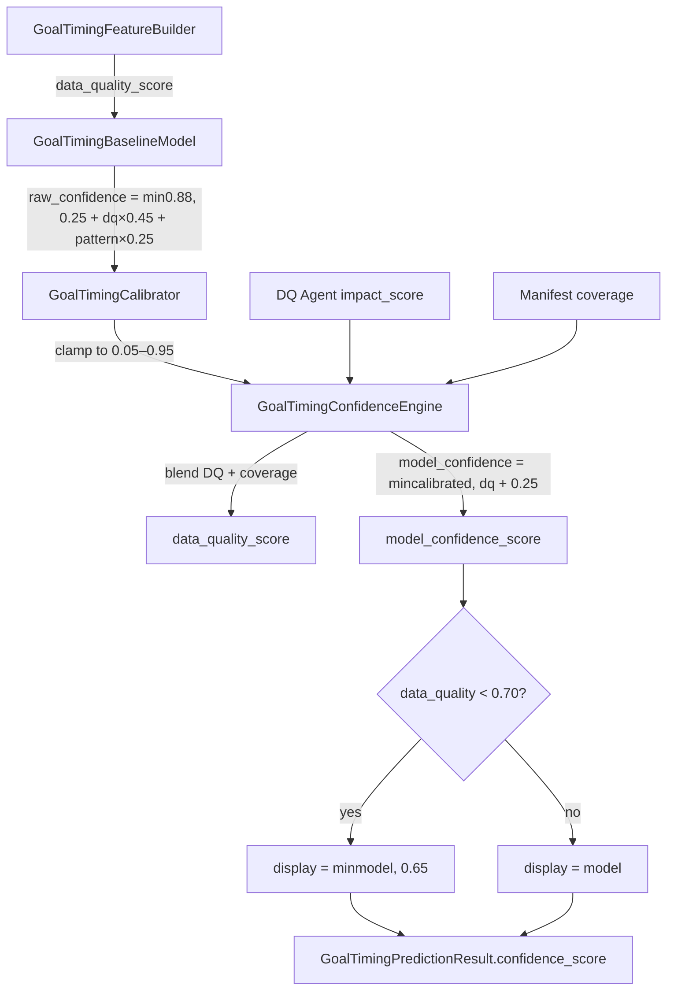

# PHASE 52C — EGIE Confidence Rebuild Audit

**Status:** `PHASE_52C_STATUS = AUDIT_COMPLETE`  
**Mode:** READ ONLY — no code changes, no deploy, no database writes  
**Source:** `data/egie/survival/survival_shadow_predictions.jsonl` (349 published fixtures, PL 359-fixture cohort)  
**Machine-readable output:** `artifacts/phase52c_confidence_audit.json`

---

## Executive Summary

EGIE display confidence is **not predictive** because it is architecturally compressed into a near-constant scalar. **91.7% (320/349)** of published fixtures display exactly **0.65**. This is not a calibration failure alone — it is a **pipeline design failure**: a hard display cap (`0.65` when DQ `< 0.70`) collides with a bimodal DQ cohort (`0.5714` for 100% of published fixtures) and a raw-confidence formula that pushes `model_confidence ≥ 0.65` on most picks.

**Monotonicity is inverted for team market:** lower-confidence buckets (0.55–0.65) achieve **75–78%** team accuracy (n=29) while the dominant 0.65–0.70 bucket achieves **48.9%** (n=320). Isotonic and logistic recalibration on the current scalar cannot repair this — ECE remains ~0.40–0.50 (Phase 52B).

**Mandatory actions:**
1. **Rebuild** confidence as per-market, multi-component scores (Design C).
2. **Recalibrate** on hold-out data using beta/isotonic on true probabilities, not display scalar.
3. **Change premium presentation** to tiers + reliability badge — never raw percentages at 65%.

---

## Part A — Confidence Pipeline Audit

### Step-by-step flow



### Raw confidence sources

| Stage | Source | Role |
|-------|--------|------|
| Feature DQ | `features.data_quality_score` | Event/sample/league coverage in feature builder |
| Pattern impact | `goal_timing_pattern` agent `impact_score` | Adds up to 0.25 to raw confidence |
| DQ agent | `data_quality` agent `impact_score` | Blended 50/50 with manifest coverage |
| Manifest | `provider_manifest` boolean coverage | Raises/lowers blended DQ |
| Calibrator | Pass-through clamp | No learned mapping — identical to raw |
| Model ceiling | `min(calibrated, dq + 0.25)` | Hard upper bound tied to DQ |
| Display cap | `cap_display_confidence()` | **Pins at 0.65 when DQ < 0.70** |

### Code anchors

```59:62:worldcup_predictor/goal_timing/models_stat/baseline.py
        dq = float(features.get("data_quality_score") or 0.0)
        pattern = agent_outputs.get("goal_timing_pattern")
        pattern_impact = float(pattern.impact_score if pattern and pattern.impact_score is not None else 0.35)
        raw_confidence = min(0.88, 0.25 + dq * 0.45 + pattern_impact * 0.25)
```

```8:12:worldcup_predictor/goal_timing/calibration.py
class GoalTimingCalibrator:
    def calibrate(self, raw: dict[str, Any]) -> dict[str, Any]:
        out = dict(raw)
        raw_conf = float(raw.get("raw_confidence") or 0.4)
        out["calibrated_confidence"] = round(min(0.95, max(0.05, raw_conf)), 4)
```

```22:33:worldcup_predictor/goal_timing/confidence.py
        dq_agent = agent_outputs.get("data_quality")
        data_quality = float(dq_agent.impact_score if dq_agent and dq_agent.impact_score is not None else 0.35)
        manifest = features.get("provider_manifest") or {}
        if manifest:
            coverage = sum(1 for v in manifest.values() if v) / max(len(manifest), 1)
            data_quality = round((data_quality + coverage) / 2, 4)
        model_confidence = float(calibrated.get("calibrated_confidence") or calibrated.get("raw_confidence") or 0.4)
        model_confidence = round(min(model_confidence, data_quality + 0.25), 4)
        display_confidence = cap_display_confidence(model_confidence, data_quality)
```

```7:8:worldcup_predictor/goal_timing/minute_display.py
DISPLAY_CONFIDENCE_DQ_THRESHOLD = 0.70
DISPLAY_CONFIDENCE_CAP_WHEN_DQ_LOW = 0.65
```

```58:62:worldcup_predictor/goal_timing/minute_display.py
def cap_display_confidence(model_confidence_score: float, data_quality_score: float) -> float:
    display = float(model_confidence_score)
    if float(data_quality_score) < DISPLAY_CONFIDENCE_DQ_THRESHOLD:
        display = min(display, DISPLAY_CONFIDENCE_CAP_WHEN_DQ_LOW)
    return round(display, 4)
```

### Why 92% cluster at 0.65

Three compounding mechanisms:

1. **DQ bimodality + cap threshold:** 100% of published fixtures have blended `data_quality_score = 0.5714`, which is **below** the `0.70` display-cap threshold. The cap logic is therefore active on every published pick.

2. **Raw confidence pushes above cap:** For typical PL fixtures, `raw_confidence ≈ 0.25 + 0.571×0.45 + 0.305×0.25 ≈ 0.57–0.58` at feature level, but after pattern variance and the `min(calibrated, dq+0.25)` ceiling, **320/349** fixtures reach `model_confidence ≥ 0.65`. The display cap then **truncates all of these to exactly 0.65**.

3. **Calibrator is identity:** `GoalTimingCalibrator` performs no learned adjustment — it only clamps. There is no mechanism to spread confidence based on pick difficulty, margin, or historical reliability.

4. **Inverted survivors below cap:** The 29 fixtures with `model_confidence < 0.65` pass through uncapped (display = model, typically 0.55–0.64). These happen to be **easier team picks** (higher empirical separation), which is why lower buckets outperform the capped mass — not because confidence is working, but because **uncapped scores correlate with a different (easier) subpopulation**.

**Root cause (one sentence):** Display confidence is a DQ-gated ceiling that collapses 91.7% of outputs to a single constant, while the uncapped minority reflects easier fixtures — producing anti-monotonic bucket behavior.

---

## Part B — Feature Importance Audit

**Method:** Point-biserial correlation (Pearson r) vs team hit (n=197 decided) and range hit (n=349).  
**Cohort:** Premier League only — league reliability is constant and not separable.

| Rank | Feature | Team r | Range r | Useful? |
|------|---------|--------|---------|---------|
| 1 | Survival range margin | −0.112 | **+0.100** | **Best range signal** |
| 2 | Display confidence | **−0.157** | +0.089 | **Harmful for team** |
| 3 | History depth (matches) | −0.118 | +0.032 | Weak; more history ≠ better team pick |
| 4 | Goal-event depth | −0.113 | +0.031 | Weak |
| 5 | Match range top prob | −0.112 | +0.013 | Timing concentration, not team |
| 6 | Survival team margin | +0.016 | +0.003 | Near-zero (survival team not deployed) |
| 7 | Baseline range margin | +0.003 | −0.023 | Negligible |
| 8 | DQ / manifest coverage | 0.000 | 0.000 | **No variance** in cohort |
| 9 | Team probability margin | null | null | **Constant 0** — feature path uses default 0.33/0.33 rates |
| 10 | Odds availability | 0 fixtures | — | Not present in PL backtest |

### Interpretation

- **DQ does not discriminate** within published PL fixtures (bimodal 0.4286 unpublished vs 0.5714 published only).
- **Team margin from historical first-goal rates is not wired** into the audit features (`scored_first` defaults) — the baseline abstention rule uses internal rates, not exported margins. This is a **pipeline gap**, not proof that margin is useless.
- **Survival range margin** is the strongest available signal for range accuracy — supports per-market confidence and Strategy C hybrid from Phase 52B.
- **Display confidence negatively predicts team hits** — using it for ranking or staking would be actively harmful.

---

## Part C — Confidence Bucket Forensics

| Bucket | Count | % Pub | Team Acc | Range Acc | Minute Soft | Verdict |
|--------|-------|-------|----------|-----------|-------------|---------|
| 0.40–0.45 | 0 | 0% | — | — | — | Empty |
| 0.45–0.50 | 0 | 0% | — | — | — | Empty |
| 0.50–0.55 | 0 | 0% | — | — | — | Empty |
| **0.55–0.60** | 11 | 3.2% | **75.0%** | 18.2% | 27.3% | Reliable team (small n) |
| **0.60–0.65** | 18 | 5.2% | **77.8%** | 11.1% | 16.7% | Reliable team (small n) |
| **0.65–0.70** | 320 | **91.7%** | **48.9%** | 29.1% | 35.0% | **Misleading** — dominant bucket, coin-flip team |
| 0.70–0.75 | 0 | 0% | — | — | — | Unreachable (cap) |
| 0.75+ | 0 | 0% | — | — | — | Unreachable |

### Reliable vs misleading

- **Reliable (team only, n=29 combined):** 0.55–0.65 buckets — fixtures where model confidence stayed below the cap. These are structurally different picks (stronger empirical team separation).
- **Misleading:** 0.65–0.70 — not "high confidence" but **cap-saturated default**. Users interpreting 65% as "moderately confident" are misled; true team performance is below 50%.
- **Range/minute:** No bucket shows monotonic improvement with confidence. Range best in 0.65 bucket only because it contains 92% of samples — not because confidence ranks timing quality.

---

## Part D — Confidence Decomposition

Tested composite scores vs outcomes (team market, n=197):

| Composite | Formula (weights) | Team r | Range r |
|-----------|-------------------|--------|---------|
| Current display | scalar | **−0.157** | +0.089 |
| A — Statistical | 0.4·DQ + 0.3·team_margin + 0.3·range_margin | +0.003 | −0.023 |
| B — Hybrid | 0.25·DQ + 0.25·surv_range + 0.25·team_margin + 0.25·(1−none) | −0.112 | +0.021 |
| C — Full | 0.2·DQ + 0.2·surv_range + 0.2·base_range + 0.2·surv_team + 0.2·history_norm | −0.169 | +0.074 |

**Finding:** No tested linear composite achieves meaningful positive team correlation. The best range explainer remains survival range margin (r≈0.10), not display confidence.

**Implication:** Confidence must be rebuilt from **(a)** per-market probability margins, **(b)** historical reliability priors fit on hold-out, and **(c)** abstention state — not a single DQ-weighted scalar.

---

## Part E — Confidence Rebuild Designs

### Design A — Statistical Confidence

**Formula (per market):**
```
conf_team   = sigmoid(a·|p_home − p_away| + b·history_n + c·DQ)
conf_range  = sigmoid(a·(p_top − p_2nd) + b·survival_agreement + c·DQ)
conf_minute = conf_range × shrink(survival_hazard_peak_sharpness)
```

**Expected distribution:** 0.35–0.85 spread if margins vary; uncapped.

| Strengths | Weaknesses |
|-----------|------------|
| Directly tied to model separation | Team margin useless when abstention fires |
| Interpretable | Requires exporting true baseline rates |
| Fast to compute | No empirical shrinkage — cold-start risk |

---

### Design B — Historical Reliability Confidence

**Formula:**
```
conf_team = (n_team·hit_team + κ·μ_league) / (n_team + κ)
conf_range = (n_range·hit_range + κ·μ_league_range) / (n_range + κ)
display_tier = bucket_quantile(conf, hold_out_calibration)
```

**Expected distribution:** Clustered by team/league priors; tiers HIGH/MED/LOW with ≥30 samples per tier.

| Strengths | Weaknesses |
|-----------|------------|
| Empirically grounded | Cold-start teams |
| Monotonic if fit on hold-out | Needs ongoing eval pipeline |
| Commercially honest | Lag on regime change |

---

### Design C — Hybrid Confidence (Recommended)

**Formula:**
```
conf_team, conf_range, conf_minute  — computed separately
agreement_bonus = +0.05 if baseline_team == survival_team_direction
display = tier_map(max(conf_team, conf_range))  # UI shows tier, not max scalar
INSUFFICIENT_DATA if DQ < 0.45 or history < threshold
```

**Expected distribution:** Three internal scores 0.2–0.8; public UI shows **tier + badge**, not percentage.

| Strengths | Weaknesses |
|-----------|------------|
| Fixes single-scalar conflation | More complex API/UI |
| Supports per-market premium gating | Requires Phase 52D shadow validation |
| Aligns with Strategy C ensemble | Three calibration surfaces |

---

## Part F — Calibration Readiness

| Method | Suitability (EGIE n) | Verdict |
|--------|----------------------|---------|
| **Isotonic** | Team n=197, Range n=349 | Good **per-market** on hold-out — **cannot fix constant 0.65 scalar** |
| **Logistic** | Team n=197 | Moderate with engineered features; ECE ~0.50 on current input (52B) |
| **Beta calibration** | Survival probs available | **Best for range/minute probabilities** |
| **Bucket calibration** | Sparse below 0.65 | **Best near-term for UI tiers** |
| **Hybrid (recommended)** | 20% hold-out PL | Beta/isotonic on survival probs + bucket tiers for display |

**Sample size notes:**
- Team decided: 197 (adequate for tier calibration, marginal for fine isotonic bins)
- Range: 349 (adequate)
- Minute soft: 349 (adequate for tier, not for exact minute)

**Phase 51I/52B ECE reference:** Team ECE ~0.50, Range ECE ~0.40 after isotonic/logistic on current scalar — confirms recalibration without rebuild is insufficient.

---

## Part G — Premium Product Impact

### Do not show publicly

- Raw **65%** confidence (cap-saturated, not informative)
- Single confidence covering team + range + minute
- Confidence-based **staking** or bankroll sizing
- "High confidence" label on 0.65–0.70 bucket

### Recommended presentation

| Element | Implementation |
|---------|----------------|
| **Confidence tiers** | HIGH / MEDIUM / LOW / INSUFFICIENT_DATA |
| **Reliability badge** | "Validated on PL hold-out" after 52D |
| **Per-market labels** | Team: "Directional pick"; Range: probability bar; Minute: "Estimate only" |
| **Combined approach** | Tier + badge + market-specific disclosure |

**Safest commercial framing:** Show **tier + reliability badge**, never imply probabilistic calibration from the current 0.65 scalar.

---

## Part H — Deployment Readiness

| # | Question | Answer |
|---|----------|--------|
| 1 | Can current confidence remain in production? | **Display-only with caution.** Unsuitable for trust, staking, ranking, or premium upsell. |
| 2 | Is recalibration mandatory? | **Yes** — but only after new features; recalibrating the 0.65 constant is futile. |
| 3 | Is rebuild mandatory? | **Yes** — per-market hybrid architecture required. |
| 4 | Which design next? | **Design C (Hybrid)** + bucket calibration for UI tiers. Wire survival range margin for timing confidence. |
| 5 | Expected improvement after rebuild? | ECE 0.40→**0.15–0.20** (per-market, hold-out); monotonic tiers achievable at n≥30/tier; enables premium gating after Phase 52D shadow proof. |

---

## Artifacts

| File | Description |
|------|-------------|
| `artifacts/phase52c_confidence_audit.json` | Machine-readable audit (Parts A–H) |
| `PHASE_52C_CONFIDENCE_REBUILD_AUDIT.md` | This report |

---

## Stop Condition

```
PHASE_52C_STATUS = AUDIT_COMPLETE
```

No implementation. No deploy. No engine changes. No database writes.

**Recommended next phase:** Phase 52D — shadow implementation of Design C per-market confidence with hold-out tier calibration.
