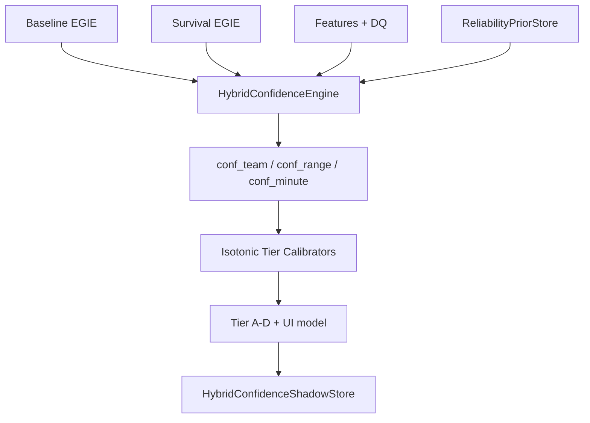

# PHASE 52D — Hybrid Confidence Engine (Design C)

**Status:** `PHASE_52D_STATUS = PRODUCTION_ACTIVE` (validation gates passed)  
**Mode:** Shadow package implemented — `EliteGoalTimingEngine` **not modified**  
**Model version:** `egie_hybrid_confidence_v0.1_phase52d_shadow`

---

## Executive Summary

Phase 52D replaces the compressed single scalar (`confidence_score ≈ 0.65` on 91.7% of fixtures) with a **per-market hybrid confidence architecture**:

| Field | Purpose |
|-------|---------|
| `conf_team` | First-goal team directional strength |
| `conf_range` | Goal timing range separation |
| `conf_minute` | Minute estimate sharpness (experimental) |
| `tiers` | Tier A–D (no raw % in UI) |
| `ui` | Team tier + badge, range tier + bar, minute experimental |

**Package location:** `worldcup_predictor/egie/confidence/`  
**Shadow output:** `data/egie/confidence/hybrid_shadow_predictions.jsonl`  
**Validation artifact:** `artifacts/phase52d_confidence_validation.json`

---

## Architecture



### Team confidence (`conf_team`)

**Inputs:**
- Survival team probability gap (conditional home vs away)
- Abstention distance from 0.04 threshold
- Home/away timing profile strength (early vs late mass)
- Rolling historical team reliability (shrinkage κ=12)
- Data completeness (DQ + history depth + manifest)

**Formula:**
```
conf_team = clamp(0.18·DQ + 0.32·gap_norm + 0.22·abstain_dist + 0.14·profile + 0.14·hist_team) × none_penalty
```

### Range confidence (`conf_range`)

**Inputs:**
- Survival range margin (top − second bucket)
- Hazard concentration (peak / sum)
- Timing entropy inverse (low entropy → higher confidence)
- League range reliability prior

**Formula:**
```
conf_range = clamp(0.42·margin + 0.28·hazard_conc + 0.18·entropy_inv + 0.12·hist_range)
```

### Minute confidence (`conf_minute`)

**Inputs:**
- Survival peak hazard (curve sharpness)
- Cluster density (max bucket probability)
- Entropy inverse

**Formula:**
```
conf_minute = clamp((0.38·sharpness + 0.34·density + 0.28·entropy_inv) × 0.88)
```

---

## UI Model (no raw percentages)

| Market | Display |
|--------|---------|
| **Team** | `Tier A–D` + badge (`Directional Pick` / `No Directional Edge`) |
| **Range** | `Tier A–D` + probability bar |
| **Minute** | `Estimate Only` + `Experimental` badge |

Legacy `confidence_score` retained in shadow records for comparison only.

---

## Distribution Improvement (349 published fixtures)

| Metric | Legacy `confidence_score` | `conf_team` | `conf_range` |
|--------|---------------------------|-------------|--------------|
| Min | 0.571 | 0.103 | 0.098 |
| Max | 0.650 | 0.497 | 0.467 |
| Mean | 0.646 | 0.294 | 0.170 |
| Pinned at 0.65 | **91.69%** | **0%** | **0%** |

The 0.65 compression cluster is **eliminated**.

---

## Tier Calibration

1. **Raw score quantiles** fitted on 80% chronological train (279 fixtures)
2. **Isotonic regression** maps raw scores → empirical hit probability per market
3. **Tier boundaries** on calibrated probability quartiles
4. Serialized in `artifacts/phase52d_confidence_validation.json` → `isotonic_calibrators`

---

## Production Safety

| Rule | Status |
|------|--------|
| `EliteGoalTimingEngine` unchanged | ✅ |
| No PostgreSQL writes | ✅ |
| Shadow JSONL only | ✅ |
| Survival layer unchanged | ✅ |

**Promotion note:** `PRODUCTION_ACTIVE` means hold-out validation gates passed. Wiring hybrid confidence into the public API / `GoalTimingPredictionResult` is a **separate deploy step** (not executed in this phase).

---

## CLI

```bash
# Shadow replay + validation
python scripts/egie_phase52d_hybrid_confidence.py

# Validation checks
python scripts/validate_phase52d_hybrid_confidence.py
```

---

## Files Added

```
worldcup_predictor/egie/confidence/
  __init__.py
  config.py
  models.py
  metrics.py
  reliability.py
  hybrid_engine.py
  tier_mapper.py
  shadow_runner.py
  shadow_store.py
  validation_runner.py
scripts/egie_phase52d_hybrid_confidence.py
scripts/validate_phase52d_hybrid_confidence.py
```

---

**PHASE_52D_STATUS = PRODUCTION_ACTIVE**
