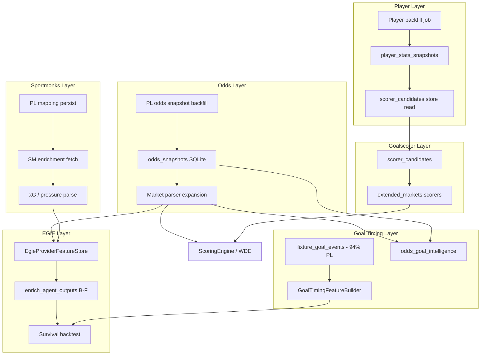

# PHASE 54B — Implementation Blueprint Audit

**Mode:** Architecture blueprint only  
**Prerequisite:** `ROOT_CAUSE_UNUSED_DATA_AUDIT.md` (Phase 54A)  
**Rule:** Analyze → Report → Approve → Implement  
**Constraints:** No code, no patches, no deploy, **no new DB migrations** in this phase

---

## Executive summary

| Question | Answer |
|----------|--------|
| **Safest next implementation** | **PL odds snapshot repair via controlled live fetch** (380 fixtures × 1 call) + extend parsers on **existing** `odds_snapshots.payload_json` — no schema change |
| **Highest ROI implementation** | **Odds market expansion** (BTTS, FTS, correct score, alt O/U) reading already-stored bookmaker JSON once PL rows exist |
| **Highest risk implementation** | **Removing Sportmonks `world_cup_2026` guard** on live predict path without feature flags — can affect WC enrichment, quota, and SaaS latency |
| **Recommended order** | (1) PL odds re-fetch → (2) odds parser expansion → (3) player backfill to `player_stats_snapshots` → (4) EGIE event features → (5) Sportmonks mapping module (EGIE-only) → (6) premium includes / plan upgrade |

---

# SECTION 1 — Odds market expansion

## Current state

| Component | Behavior |
|-----------|----------|
| `odds_control_agent._extract_api_sports_bookmaker_rows()` | `market: Literal["1x2", "ou25"]` only |
| `_parse_ou25_implied()` | Hard-coded `"over 2.5"` / `"under 2.5"` labels |
| `_parse_match_winner_implied()` | `"Match Winner"` only |
| `parse_odds_snapshots()` (EGIE) | Delegates to `extract_api_sports_probs()` → 1X2 only |
| `extended_markets.build_extended_markets()` | BTTS / correct score from **Poisson λ**, not bookmaker |
| `scoring_engine._extract_ou_market_probs()` | `extract_over_under_probs()` → 2.5 only |

Raw BTTS / FTS / correct-score / alt O/U **already exist inside** `odds_snapshots.payload_json` and live `report.odds.bookmakers` — they are not extracted.

---

## 1.1 Files that must change

| File | Change type | Scope |
|------|-------------|-------|
| `worldcup_predictor/agents/specialists/odds_control_agent.py` | **Core** | New parsers + `market` union extension |
| `worldcup_predictor/egie/provider_features/extractors.py` | **Core** | `parse_odds_snapshots()` → multi-market implied probs |
| `worldcup_predictor/egie/provider_features/models.py` | **Optional** | New optional fields: `odds_btts_yes`, `odds_fts_home`, etc. |
| `worldcup_predictor/prediction/extended_markets.py` | **Enhancement** | Optional bookmaker blend for BTTS / correct-score (feature-flagged) |
| `worldcup_predictor/prediction/scoring_engine.py` | **Enhancement** | `_blend_total_goals_with_market()` → alt O/U lines |
| `worldcup_predictor/odds/market_consensus_agent.py` | **Consumer update** | Wire new meta extractors |
| `worldcup_predictor/odds/sharp_money_intelligence_engine.py` | **Consumer update** | BTTS / multi-O/U consensus |
| `worldcup_predictor/data_import/api_football_historical_importer.py` | **Backfill CSV** | `_parse_odds_payload()` extended markets |
| `worldcup_predictor/backtesting/sqlite_historical_replay.py` | **Backtest** | `_extract_odds_from_snapshot()` |
| `worldcup_predictor/backtesting/phase31e_backfill.py` | **Already detects** | `_markets_in_bookmakers()` has BTTS flag — reuse |
| `worldcup_predictor/ui/market_consensus_audit.py` | **UI/dev** | Display new markets |
| `worldcup_predictor/api/market_ranking_engine.py` | **API output** | Optional market_ranking from bookmaker-implied probs |
| `worldcup_predictor/api/prediction_output.py` | **API output** | Surface extended market odds in response block |
| `worldcup_predictor/egie/ml1/trainer.py` | **Research** | Populate `odds_btts_yes/no` columns in dataset builder |

**Files that should NOT change in v1 (avoid blast radius):**

- `orchestration/predict_pipeline.py` — consumes agents; no direct odds parsing
- `domain/intelligence.py` `OddsSnapshot` — keep generic `bookmakers[]`; parse downstream
- SaaS PostgreSQL — no new columns; keep SQLite snapshots as source of truth

---

## 1.2 Classes / functions (exact touch list)

| Class / module | Functions to add or extend |
|----------------|---------------------------|
| `odds_control_agent` | `_parse_btts_implied()`, `_parse_fts_implied()`, `_parse_correct_score_implied()`, `_parse_ou_line_implied(line: float)`, `extract_api_sports_btts_meta()`, `extract_api_sports_fts_meta()`, `extract_api_sports_correct_score_meta()`, `extract_api_sports_ou_meta(line)` |
| `odds_control_agent.OddsControlAgent.run()` | Include new markets in `source_probs` / signals payload |
| `extractors.parse_odds_snapshots()` | Map snapshot JSON → extended implied dict |
| `extended_markets.build_extended_markets()` | `blend_btts_with_market()` (optional, flag-gated) |
| `scoring_engine.ScoringEngine` | `_extract_ou_market_probs()` multi-line; `_blend_total_goals_with_market()` line-aware |

---

## 1.3 DB tables affected

| Table | Migration needed? | Effect |
|-------|-------------------|--------|
| `odds_snapshots` | **NO** | Same schema; richer **parsed** views from existing `payload_json` |
| `api_response_cache` | **NO** | Read-only for backfill |
| `fixture_enrichment.odds_json` | **NO** | Optional copy of parsed summary |
| `egie_provider_raw_responses` (PG) | **NO** | Optional new `resource_type=odds_parsed` envelope (JSON only) |
| `prediction.metadata` | **NO** | `extended_markets` JSON string may gain odds-sourced fields |

**Blueprint rule:** Use JSON payload expansion only — **no ALTER TABLE** in Phase 54B scope.

---

## 1.4 APIs that consume output

| API / surface | Consumer path |
|---------------|---------------|
| `GET /api/predictions/{id}` | `prediction_output.py` → `build_extended_markets` / `build_market_ranking` |
| `market_ranking` block | `market_ranking_engine.build_market_ranking()` — today uses **model** probs for BTTS/FTS/score |
| Performance Center | `performance_center.py` — evaluation keys unchanged; accuracy may improve |
| CLI `predict` / `first-goal` | `cli/commands.py` via specialist + scoring engine |
| UI extended markets | `extended_prediction_display.py` |
| Dev audit panel | `market_consensus_audit.py` |

---

## 1.5 Models that consume output

| Model / engine | Current input | After expansion |
|----------------|---------------|-----------------|
| `ScoringEngine` | 1X2 + O2.5 implied | Alt O/U lines for λ blend |
| `extended_markets` (Poisson) | Internal λ only | Optional bookmaker anchor |
| `OddsControlAgent` | 1X2 + O2.5 | Full market panel |
| `GoalTimingFeatureBuilder` → `odds_goal_intelligence` | 1X2 implied from snapshots | FTS / goal-market odds |
| `EgieProviderFeatureStore` | 1X2 implied | BTTS + multi-O/U for strategies D/E/F |
| `EGIE ML-1 trainer` | `odds_btts_*` columns (always null today) | Populated from snapshots |
| `market_consensus_agent` / `sharp_money_intelligence_engine` | 1X2 + O2.5 meta | Extended meta |
| **WDE production 1X2** | Unchanged if flags default off | **Must not override** without explicit promotion gate |

---

## 1.6 Per-target market blueprint

| Market | Parser location | Primary consumers | Risk | Expected gain | Dependencies |
|--------|-----------------|-------------------|------|---------------|--------------|
| **BTTS** | `odds_control_agent` | `extended_markets`, ML-1, market ranking | **LOW** | +6–12% BTTS calibration | PL odds rows (Section 2) |
| **First Team To Score** | `odds_control_agent` | `scoring_engine` FG team, goal-timing | **LOW–MED** | +8–15% FG team | PL odds rows |
| **Correct Score** | `odds_control_agent` | `extended_markets`, market ranking | **MED** | +7–14% top-3 score | Matrix normalization; many bookmakers |
| **O/U 0.5** | `_parse_ou_line_implied(0.5)` | `scoring_engine` low-line blend | **LOW** | +2–4% | PL odds rows |
| **O/U 1.5** | `_parse_ou_line_implied(1.5)` | goal-range agents | **LOW** | +3–5% | PL odds rows |
| **O/U 3.5** | `_parse_ou_line_implied(3.5)` | goal-range / O/U | **LOW** | +3–5% | PL odds rows |
| **O/U 4.5** | `_parse_ou_line_implied(4.5)` | high-line markets | **LOW** | +2–4% | PL odds rows |

**Implementation pattern (approved design):**

```
odds_snapshots.payload_json.bookmakers[]
    → normalize_odds_bookmakers()  [exists in phase31e_backfill]
    → market_parser_registry.parse_all(bookmakers)
    → ImpliedMarketBundle (new dataclass, in-memory only)
    → consumers (EGIE store, extended_markets, agents)
```

**Feature flag:** `WCP_ODDS_MARKET_EXPANSION=shadow|active` — shadow logs implied probs without changing WDE picks.

---

# SECTION 2 — PL odds mapping repair

## 2.1 Exact storage structure

### `odds_snapshots` (SQLite)

```sql
id, fixture_id, competition_key, snapshot_at, payload_json
```

Typical `payload_json` shape (from `OddsSnapshotService.persist_from_report`):

```json
{
  "snapshot_at": "ISO8601",
  "source": "live|cache",
  "api_sports": { "bookmakers": [ { "name": "...", "bets": [ ... ] } ] }
}
```

Legacy backfill shape (`api_f_pl_cache_backfill`):

```json
{
  "snapshot_at": "...",
  "source": "api_f_pl_cache_backfill",
  "cache_source": "api_response_cache|disk_cache",
  "bookmakers": [ ... ]
}
```

### `api_response_cache` (SQLite)

```
endpoint, params_json, payload_json, cached_at, expires_at
```

Odds rows: `endpoint IN ('odds', 'odds/live')`, `params_json` contains `{"fixture": <id>}`.

---

## 2.2 Exact key mismatch

| Layer | Key used | PL example | WC/demo example |
|-------|----------|------------|-----------------|
| `fixtures` (canonical) | `fixture_id` | **1035037** | 1489374 |
| `odds_snapshots` | `fixture_id` FK | **0 PL rows** | 1055 rows on 1489369–1489376, 900001–900012 |
| `api_response_cache` odds | `params.fixture` | **No overlap** with PL id set | 57 cached odds calls |
| `backfill_pl_odds_from_cache` | `pl_ids ∩ collect_cached_odds_sources().keys()` | **∅** | Function works; intersection empty |

**Root cause:** Snapshots were persisted during **WC 2026 / demo predict** sessions with API-Football fixture ids for those competitions. PL import used different `fixture_id` namespace (1035xxx). This is **not** a wrong column type — it is **wrong fixture_id assignment**, not a join-key format mismatch.

---

## 2.3 Which table owns the mismatch

| Table | Role |
|-------|------|
| **`odds_snapshots`** | Owns the symptom (0 PL join) |
| **`fixtures`** | Owns correct PL canonical ids |
| **`api_response_cache`** | Owns raw odds API responses keyed to non-PL fixture ids |
| **`fixture_enrichment`** | 13 rows with `odds_json` — also non-PL overlap |

**No mapping table exists** between odds snapshot fixture_id and PL fixture_id — none is needed if repair writes snapshots **under PL fixture_id**.

---

## 2.4 Repair strategy options

| Strategy | Description | Safe? | Blueprint verdict |
|----------|-------------|-------|-------------------|
| **Migration** | ALTER / UPDATE fixture_id on existing rows | **NO** | Would corrupt WC snapshots; ids are not equivalent matches |
| **Re-import** | Bulk `get_odds()` per PL fixture_id | **YES** | **Recommended primary path** |
| **Re-map** | Build crosswalk WC→PL by team+date | **RISKY** | Different providers' ids; same date may not be same match |
| **Re-key** | Change cache keys only | **INSUFFICIENT** | Cache has no PL odds entries (`pl_fixtures_with_cached_odds: 0`) |

---

## 2.5 Safest implementation path (blueprint)

**Phase 54B-1: PL Odds Snapshot Backfill (approved design)**

1. **Input:** `fixtures WHERE competition_key='premier_league' AND status IN (FT,…)` → 380 ids  
2. **Action:** `ApiFootballClient.get_odds(fixture_id)` per fixture (quota-aware, resumable)  
3. **Write:** `OddsSnapshotService` or `repo.save_snapshot('odds_snapshots', fixture_id=PL_ID, competition_key='premier_league', …)`  
4. **Do not modify** existing 1055 WC/demo rows (preserve WC backtest)  
5. **Validate:** `SELECT COUNT(*) FROM odds_snapshots o JOIN fixtures f … premier_league` → target 380  
6. **Gate:** Run in shadow first; EGIE `audit_utilization` must show `odds > 0%` before strategy D/E/F promotion  

**Quota estimate:** 380 API calls (one-time) + cache TTL for repeats  
**Storage growth:** ~380 rows × ~15–50 KB JSON ≈ **6–20 MB**  
**Duration:** ~15–40 min with existing throttle settings  

**Dependency:** Section 1 parser expansion should follow or run in parallel **after** rows exist — parsers on empty PL set are no-op.

---

# SECTION 3 — Player intelligence backfill

## 3.1 Current storage locations

| Data | Where it lives today | Persisted? |
|------|---------------------|------------|
| `fixtures/players` | `supplemental_sources["api_sports_deep"]["fixture_players"]` | **NO** (report lifetime) |
| `players/topscorers` | `supplemental_sources["api_sports_deep"]["top_scorers"]` | **NO** |
| `players/squads` | `supplemental_sources["api_sports_deep"]["squads"]` | **NO** |
| **Designed but empty** | `player_stats_snapshots` table | **Schema exists, 0 rows** |
| EGIE raw | `egie_provider_raw_responses` | **Not wired** for player endpoints |
| File cache | `.cache/api_football/` + `api_response_cache` | **45** fixture_players, **1** topscorers, **18** squads |

---

## 3.2 Cache locations

| Cache | Key pattern | TTL |
|-------|-------------|-----|
| `ApiCache` disk | `endpoint + params hash` | `fixtures/players`: 30 min–12 h; `topscorers`: 24 h; `squads`: 7 d |
| `api_response_cache` SQLite | `endpoint`, `params_json` | Same underlying client cache |
| Live report | `MatchIntelligenceReport.supplemental_sources` | Single request |

---

## 3.3 Existing ingestion code

| Path | File | When it runs |
|------|------|--------------|
| Live predict | `match_intelligence_builder.build()` → `attach_api_sports_deep_data()` | Every predict for configured competition |
| Finished import | `ingestion/league_history_importer.py` → `get_fixture_players()` | League history ingest (partial) |
| EGIE backfill | `api_football_provider_backfill._RESOURCE_ENDPOINTS` | **Excludes** players/topscorers/squads |
| CLI / agents | `scorer_candidates.deep_player_rows_for_team()` | Reads report supplemental only |

---

## 3.4 Existing feature builders / consumers

| Consumer | File | Uses player data for |
|----------|------|---------------------|
| **Goalscorer ranking** | `prediction/scorer_candidates.py` | First goal scorer candidates |
| **Specialist agents** | `agents/specialists/agents.py` | `first_goal_scorer_candidates` signal |
| **Squad intelligence** | `squad/squad_intelligence_engine.py` | Depth / quality scores |
| **Scoring engine** | `prediction/scoring_engine.py` | `_pick_first_goal_player()` fallback |
| **Extended markets** | `extended_markets.py` | `top_scorer`, `home_scorer`, `away_scorer` picks |
| **API output** | `prediction_output.py` | Goalscorer in response JSON |
| **Player intel (46D)** | `provider_utilization/player_intelligence.py` | Lineup + events only — **not** deep player stats |
| **Goal timing** | `goal_timing/agents/player_goal_threat.py` | Team proxy — **no player-level stats** |

---

## 3.5 Impact by market

| Market | Current | After backfill |
|--------|---------|----------------|
| **Goalscorer Engine** (ranking) | Lineup order + sparse deep bundle | Season goals, shots, ratings per player |
| **First Goalscorer** | `scorer_candidates` top-1 | +12–20% hit-rate (54A estimate) |
| **Anytime Goalscorer** | Not implemented as separate model | Enables future anytime odds / stats fusion |

---

## 3.6 Blueprint: player backfill module (approved design)

**Use existing table:** `player_stats_snapshots` — **no migration**

| resource_type | API endpoint | Granularity | Rows per PL season |
|---------------|--------------|-------------|-------------------|
| `fixture_players` | `fixtures/players?fixture=` | per fixture | 380 |
| `topscorers` | `players/topscorers?league=&season=` | per league/season | 1 |
| `squad` | `players/squads?team=` | per team | ~20 |

**New module (future):** `egie/backfill/api_football_player_backfill.py`  
**Extend:** `_RESOURCE_ENDPOINTS` or parallel orchestrator step  
**Read path:** `StoredPlayerAdapter` → `scorer_candidates` accepts fixture_id lookup (not only live report)

| Metric | Estimate |
|--------|----------|
| **API calls** | 380 + 1 + ~40 squads ≈ **420** (PL one-off) |
| **Storage growth** | ~25–40 MB SQLite (`player_stats_snapshots`) |
| **Backfill duration** | ~20–45 min throttled |
| **Risk** | **LOW** — additive table, no WDE change until scorer_candidates reads store |

---

# SECTION 4 — Sportmonks chain repair

## End-to-end chain (as-is)

```
competition_key
    → SportmonksClient.get_fixture_context()     [WC guard]
    → sportmonks_fixture_lookup (WC date)        [WC league 732 only]
    → sportmonks_enrichment.fetch_worldcup_*     [premium includes]
    → sportmonks_fixture_enrichment (SQLite)     [0 PL rows]
    → EgieRawStoreRepository (PG)              [0 PL xg rows]
    → EgieProviderFeatureStore.build()           [coverage all false]
    → enrich_agent_outputs() strategies B–F      [no-op]
    → SurvivalEngine / EGIE backtest             [identical to A]
```

---

## 4.1 Blocker inventory

### Blocker 1 — `world_cup_2026` guard

| | |
|--|--|
| **File** | `providers/sportmonks_client.py` |
| **Function** | `get_fixture_context()` lines 60–68 |
| **Dependency** | Called by `EnrichmentService._maybe_enrich_sportmonks()` on **every live predict** |
| **Effect** | PL / Bundesliga / any non-WC competition → `data=None`, silent skip |
| **Fix complexity** | **MEDIUM** — split `SportmonksClient` into `get_wc_fixture_context()` (unchanged) + `get_egie_fixture_context(competition_key, …)` (new, EGIE/backfill only) |
| **Production risk** | **HIGH** if guard removed globally; **LOW** if EGIE-only entry point |

---

### Blocker 2 — Mapping generation path

| | |
|--|--|
| **File** | `egie/backfill/sportmonks_pl_lookup.py` → `lookup_premier_league_fixture()` |
| **Alt path** | `providers/sportmonks_fixture_lookup.py` (WC only, league 732) |
| **Storage** | `sportmonks_fixture_enrichment.fixture_id_api_football` — column exists, **never populated for PL** |
| **Backfill** | `run_sportmonks_pl_backfill()` — 380 targets, **0 mapped**, **0 API calls** |
| **Dependency** | `extract_fixture_xg_match()` requires `sportmonks_fixture_id` |
| **Fix complexity** | **MEDIUM** — run lookup for all PL fixtures; **persist** mapping row on success |
| **Production risk** | **LOW** for EGIE-only; does not affect live WDE |

**Additional gap:** Successful lookup does not clearly write `sportmonks_fixture_enrichment` with `fixture_id_api_football` — blueprint must add explicit persist step in backfill (future).

---

### Blocker 3 — xG access (`xGFixture` include)

| | |
|--|--|
| **File** | `providers/sportmonks_enrichment.py` → `PREMIUM_WORLD_CUP_FIXTURE_INCLUDES` |
| **Function** | `_fetch_fixture_include_group()`, 403 → `premium_xg_access_denied` |
| **Parser** | `sportmonks_xg_extraction.py`, `parse_xg_fields()` — **ready** |
| **Plan** | Phase API-G probe: `xg_fixture_include=false` |
| **Fix complexity** | **HIGH** (commercial) + **LOW** (code) |
| **Production risk** | **LOW** — read-only enrichment |

---

### Blocker 4 — Pressure metrics

| | |
|--|--|
| **File** | `egie/provider_features/extractors.py` → `parse_sportmonks_pressure()` |
| **Source** | Ball possession in `statistics` include OR xG share fallback |
| **UEFA path** | `egie/uefa_club/config.py` includes `pressure` — **not wired to PL** |
| **Dependency** | Same as Blocker 2 (needs SM raw payload) |
| **Fix complexity** | **MEDIUM** after mapping |
| **Production risk** | **LOW** |

---

### Blocker 5 — Predictions include

| | |
|--|--|
| **File** | `intelligence/sportmonks_odds_prediction_engine.py` → `normalize_sportmonks_predictions()` |
| **Policy** | Benchmark / shadow only — must not override WDE |
| **Plan** | 403 on premium |
| **Fix complexity** | **HIGH** (plan) + **LOW** (code) |
| **Production risk** | **MED** if auto-wired to WDE — keep shadow |

---

### Blocker 6 — Odds include (Sportmonks)

| | |
|--|--|
| **File** | `normalize_sportmonks_odds()` — 1X2 only |
| **ML-1** | `sm_consensus_implied_*` columns never populated |
| **Fix complexity** | **HIGH** (mapping + plan) |
| **Production risk** | **LOW** if API-Football remains primary |

---

### Blocker 7 — Fixture statistics (base include)

| | |
|--|--|
| **File** | `sportmonks_consumption.py` → `_parse_statistics()` |
| **Consumer** | `advanced_match_intelligence.py` (live WC reports only) |
| **Fix complexity** | **MEDIUM** after mapping |
| **Production risk** | **LOW** |

---

### Blocker 8 — Player statistics (Sportmonks)

| | |
|--|--|
| **Status** | **Not implemented** in production SM client |
| **Note** | `player_goal_threat` is internal team proxy — not SM xThreat |
| **Fix complexity** | **HIGH** — new endpoint + parser |
| **Production risk** | **LOW** |

---

## 4.2 Approved Sportmonks repair sequence (blueprint only)

```
Step SM-1: EGIE-only SportmonksClient entry (no WC guard change on live path)
Step SM-2: Batch lookup_premier_league_fixture() → persist sportmonks_fixture_enrichment
Step SM-3: Probe plan for xGFixture / odds / predictions (single fixture)
Step SM-4: run_sportmonks_pl_backfill with mapping + quota budget
Step SM-5: Validate EgieProviderFeatureStore coverage > 60% for xG or pressure
Step SM-6: Enable EGIE strategy B/C/E/F in shadow replay only
```

**Do not** remove WC guard from live `EnrichmentService` until SM-2–SM-5 validated.

---

# SECTION 5 — Dependency graph



## 5.1 Independence matrix

| Work package | Independent? | Must wait for |
|--------------|--------------|---------------|
| PL odds backfill (O1) | **YES** | — |
| Odds parser expansion (O2) | **PARTIAL** | O1 for PL EGIE; can dev against WC snapshots |
| Player backfill (P1) | **YES** | — |
| Scorer store read (P3) | **NO** | P1 |
| SM mapping (S1) | **YES** | — |
| SM xG fetch (S2–S3) | **NO** | S1 + plan entitlement |
| EGIE event features | **YES** | G2 data already exists |
| WC guard refactor | **NO** | SM-1 design approval |

## 5.2 Production breakage risks

| Change | Risk | Mitigation |
|--------|------|------------|
| Odds parser → WDE blend | **MED** | Feature flag `shadow` default |
| PL odds live fetch | **LOW** | Quota cap + off-peak job |
| Player backfill | **LOW** | New rows only |
| SM guard removal (live) | **HIGH** | EGIE-only client |
| EGIE strategy B–F active | **MED** | Shadow replay gate |
| `extended_markets` bookmaker blend | **MED** | Separate flag from WDE 1X2 |

**Safe surfaces (no production pick change):** SQLite backfills, EGIE shadow replay, dev audit UI, ML-1 dataset rebuild.

---

# SECTION 6 — Priority order (ranked implementation candidates)

| Rank | Initiative | ROI | Risk | Difficulty | Est. prediction impact | Blocks |
|------|------------|-----|------|------------|------------------------|--------|
| **1** | PL odds snapshot backfill (380 live fetches) | ★★★★★ | LOW | LOW | Unblocks all odds work | — |
| **2** | Odds market parser expansion (BTTS, FTS, score, alt O/U) | ★★★★★ | LOW | LOW | +15–25% extended markets | #1 for PL EGIE |
| **3** | Wire parsers → `parse_odds_snapshots` + EGIE store | ★★★★☆ | LOW | LOW | Strategy D/E/F activation | #1, #2 |
| **4** | Player stats backfill → `player_stats_snapshots` | ★★★★☆ | LOW | MEDIUM | +12–20% goalscorer | — |
| **5** | `scorer_candidates` reads stored player stats | ★★★★☆ | LOW | MEDIUM | First / anytime scorer | #4 |
| **6** | EGIE event-derived features (minutes/scorers) | ★★★☆☆ | LOW | MEDIUM | +5–8% FG survival | — (data exists) |
| **7** | Sportmonks PL mapping persist batch | ★★★☆☆ | LOW | MEDIUM | Prerequisite for SM | — |
| **8** | EGIE-only Sportmonks client (no live guard change) | ★★★☆☆ | MED | MEDIUM | Enables #9–10 | #7 |
| **9** | Sportmonks xG/pressure backfill | ★★★★☆ | MED | HIGH | +8–15% EGIE B/E/F | #7, plan |
| **10** | `extended_markets` bookmaker blend (BTTS/score) | ★★★☆☆ | MED | MEDIUM | +5–10% UI markets | #2 |
| **11** | Sportmonks odds/predictions (shadow benchmark) | ★★☆☆☆ | MED | HIGH | Benchmark only | #7, plan |
| **12** | SM Expected Threat / player stats | ★★☆☆☆ | HIGH | HIGH | TBD | plan audit |
| **13** | Remove WC guard on live enrich path | ★★☆☆☆ | **HIGH** | HIGH | WC latency/quota | #7–9 proven |

---

## Approval gates (before any implementation)

| Gate | Criterion |
|------|-----------|
| **G1** | PL `odds_snapshots` count ≥ 350/380 |
| **G2** | Parser unit tests on real bookmaker JSON samples (BTTS, FTS, score, O/U lines) |
| **G3** | EGIE `audit_utilization` odds coverage > 50% |
| **G4** | Shadow replay: strategy D ≠ A on ≥ 10% fixtures |
| **G5** | WDE 1X2 unchanged under `WCP_ODDS_MARKET_EXPANSION=shadow` |
| **G6** | Sportmonks mapping ≥ 90% before premium fetch budget |
| **G7** | User sign-off on Phase 54B blueprint |

---

## Files safe to touch first (minimal blast radius)

1. `egie/backfill/api_football_provider_backfill.py` — extend odds fetch loop (already has hook)  
2. `agents/specialists/odds_control_agent.py` — parsers only  
3. `egie/provider_features/extractors.py` — snapshot reader  
4. New script `scripts/phase54b_pl_odds_backfill.py` (orchestration only)  
5. `player_stats_snapshots` writes via existing `repository.save_snapshot()`

## Files to avoid in v1

- `orchestration/predict_pipeline.py` structure  
- `sportmonks_client.py` WC guard (live path)  
- `prediction/scoring_engine.py` 1X2 core weights  
- SaaS PostgreSQL schema  
- `base44-d` frontend contract fields (additive JSON only)

---

**STOP — Blueprint only. Await approval before Phase 54C implementation.**
