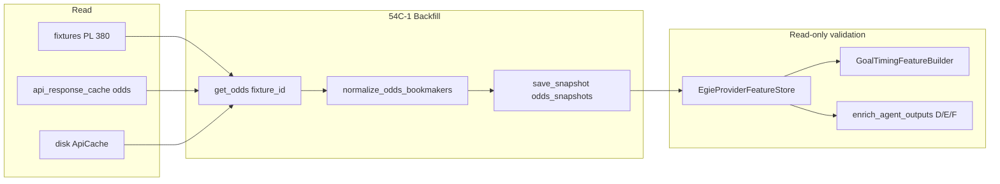

# PHASE 54C-1 — PL Odds Backfill Implementation Plan

**Mode:** Implementation plan only  
**Prerequisite:** `PHASE_54B_IMPLEMENTATION_BLUEPRINT.md` (Priority #1)  
**Rule:** Analyze → Report → Approve → Implement  
**Constraints:** No code, no patches, no deploy, **no production logic changes**, **no DB migrations**

---

## Executive summary

| Dimension | Current | Target (54C-1) |
|-----------|---------|----------------|
| PL fixtures (finished cohort) | **380** | **380** (unchanged) |
| PL-aligned `odds_snapshots` | **0** | **≥ 350** distinct fixtures |
| EGIE `coverage_pct.odds` | **0.0%** | **> 50%** |
| Goal Timing `has_reliable_goal_odds` | **0%** (sample) | **> 50%** (sample) |
| Strategies D / E / F (odds arm) | **Inactive** (same as A) | **Activates** where 1X2 implied parses |

**Root cause (confirmed Phase 54A):** 1,055 `odds_snapshots` rows exist but are keyed to **World Cup / demo fixture ids** (e.g. `1489369–1489376`, `900001+`). PL fixture ids (`1035037+`) have **zero** aligned rows. Cache intersection is empty (`pl_fixtures_with_cached_odds: 0`).

**Repair strategy:** Controlled **live re-fetch** of `GET odds?fixture={pl_fixture_id}` per finished PL fixture. **Do not** re-key WC snapshot rows.

---

## Current state

### SQLite measurements (Phase 54A baseline)

| Metric | Value |
|--------|-------|
| `fixtures` WHERE `competition_key='premier_league'` AND `is_placeholder=0` | 380 |
| `odds_snapshots` total rows | 1,055 |
| PL-aligned `odds_snapshots` (JOIN on `fixture_id`) | **0** |
| `api_response_cache` odds entries | 57 (non-PL fixture ids) |
| `backfill_pl_odds_from_cache()` PL hits | **0** |
| Last `egie_provider_backfill` run | `pl_odds_snapshot_fixtures: 0`, `odds_live_fetches: 4`, `api_calls_live: 20` (budget exhausted by events/lineups/stats/injuries) |

### Artifact baselines

| Artifact | Key fields |
|----------|------------|
| `artifacts/egie_provider_backfill_result.json` | `pl_odds_snapshot_fixtures: 0`, `mapping_audit.pl_odds_aligned_count: 0` |
| `artifacts/egie_provider_fixture_mapping_audit.json` | 380 fixtures, all `has_pl_odds_snapshot: false` |
| `ROOT_CAUSE_UNUSED_DATA_AUDIT.md` | Break at **Stored** + **Parsed** alignment, not provider availability |

### Why prior backfill failed

1. **Cache miss:** `collect_cached_odds_sources()` finds odds for WC ids only; PL id intersection is ∅.
2. **Budget starvation:** `run_api_football_pl_backfill(max_api_calls=80)` spends quota on four non-odds resources per fixture before odds; only **4** odds live fetches completed.
3. **Re-key insufficient:** No PL odds exist in cache to re-key.

---

## Target state

| Metric | Target | Notes |
|--------|--------|-------|
| Expected fixtures processed | **380** | `status IN (FT, AET, PEN, FINISHED, AWD, WO)` |
| Expected snapshots (minimum) | **~380** | One row per fixture (single closing snapshot) |
| Expected snapshots (parseable 1X2) | **~320–370** | Some historical fixtures may return empty bookmakers from API-Football |
| Expected live API calls (first pass) | **~380** | 0 PL cache hits today; each miss → 1 live call |
| Expected storage growth | **~6–20 MB** | ~15–50 KB JSON per row |
| WC `odds_snapshots` | **Unchanged** | Different `fixture_id` namespace |

---

## 1. Exact files involved

### Files to modify (implementation phase — minimal blast radius)

| File | Role |
|------|------|
| `worldcup_predictor/egie/backfill/api_football_provider_backfill.py` | Add **odds-only** entry path (or extract `run_pl_odds_backfill()`) isolated from `_RESOURCE_ENDPOINTS` loop; preserve `_has_pl_odds()` skip logic |
| `scripts/phase54c1_pl_odds_backfill.py` | **New** — dedicated CLI: `--max-api-calls 400`, `--providers api_football`, odds-only, manifest output |
| `scripts/validate_phase54c1_pl_odds_backfill.py` | **New** — post-run SQL + EGIE utilization gates |

### Files read / called (no production logic change)

| File | Role |
|------|------|
| `worldcup_predictor/clients/api_football.py` | `ApiFootballClient.get_odds(fixture_id)` → `_safe_get("odds", {"fixture": id})` |
| `worldcup_predictor/backtesting/phase31e_backfill.py` | `normalize_odds_bookmakers()`, `collect_cached_odds_sources()`, `backfill_odds_from_cache()` |
| `worldcup_predictor/database/repository.py` | `save_snapshot("odds_snapshots", ...)`, `fetch_odds_snapshots()`, `has_odds_snapshot()` |
| `worldcup_predictor/quota/cache_policy.py` | `ttl_for_endpoint("odds")` → `ODDS_TTL_SECONDS` (3600) |
| `worldcup_predictor/cache/api_cache.py` | Disk cache read/write on live fetch |
| `worldcup_predictor/config/settings.py` | `API_FOOTBALL_KEY`, `sqlite_path`, `api_cache_dir` |
| `worldcup_predictor/config/competitions.py` | `premier_league`: `league_id=39`, `season=2024` |

### Downstream consumers (read-only — validate after backfill, do not edit in 54C-1)

| File | Consumption |
|------|-------------|
| `worldcup_predictor/egie/provider_features/store.py` | `fetch_odds_snapshots()` → `parse_odds_snapshots()` → `coverage["odds"]` |
| `worldcup_predictor/egie/provider_features/extractors.py` | `parse_odds_snapshots()` → `extract_api_sports_probs()` (1X2 only) |
| `worldcup_predictor/egie/provider_features/enrichment.py` | Strategies **D/E/F**: `use_odds` branch when `pf.coverage.get("odds")` |
| `worldcup_predictor/goal_timing/features/builder.py` | `has_reliable_goal_odds = provider_vec.coverage.get("odds")` |
| `worldcup_predictor/goal_timing/agents/odds_goal_intelligence.py` | Activates when `has_reliable_goal_odds` and strategy ≠ A |
| `worldcup_predictor/agents/specialists/odds_control_agent.py` | `extract_api_sports_probs()` — 1X2 parser (unchanged in 54C-1) |
| `worldcup_predictor/egie/provider_features/audit.py` | `audit_egie_paid_provider_utilization()` |
| `worldcup_predictor/egie/backfill/fixture_mapping_audit.py` | `pl_odds_aligned_count`, `has_pl_odds_snapshot` per fixture |

### Files explicitly out of scope (do not touch)

| File | Reason |
|------|--------|
| `worldcup_predictor/orchestration/predict_pipeline.py` | Production predict path |
| `worldcup_predictor/prediction/scoring_engine.py` | WDE 1X2 weights |
| `worldcup_predictor/providers/sportmonks_client.py` | WC guard / live enrich |
| `base44-d/**` | SaaS frontend |
| `worldcup_predictor/database/schema.py` | No migration required |

### Optional orchestration (avoid for 54C-1 primary run)

| File | Risk |
|------|------|
| `scripts/egie_provider_backfill.py` | Default `--max-api-calls 80` + Sportmonks split starves odds budget |
| `worldcup_predictor/egie/backfill/orchestrator.py` | Same budget issue; triggers survival rebuild |

Use dedicated `phase54c1` script instead.

---

## 2. Exact tables involved

### Primary write target

| Table | Columns used | Operation |
|-------|--------------|-----------|
| **`odds_snapshots`** | `id`, `fixture_id`, `competition_key`, `snapshot_at`, `payload_json` | `INSERT` one row per PL fixture (skip if `_has_pl_odds`) |

**Payload shape (live backfill):**

```json
{
  "snapshot_at": "<ISO8601 UTC>",
  "source": "api_football_live_backfill",
  "bookmakers": [ /* normalized API-Football bookmaker array */ ]
}
```

**Payload shape (cache hit, if any):**

```json
{
  "snapshot_at": "<cached_at or now>",
  "source": "api_f_pl_cache_backfill",
  "cache_source": "api_response_cache | disk_cache",
  "bookmakers": [ ... ]
}
```

### Read-only inputs

| Table | Purpose |
|-------|---------|
| **`fixtures`** | Cohort filter: `competition_key='premier_league'`, `is_placeholder=0`, finished `status` |
| **`api_response_cache`** | Cache-first odds lookup (`endpoint LIKE '%odds%'`) |
| Disk `api_cache_dir/*.json` | Secondary cache via `ApiCache` |

### Side-effect writes (acceptable, not primary goal)

| Table | When |
|-------|------|
| **`api_response_cache`** | Each live `get_odds()` miss writes cached response (TTL 3600s) |
| **`fixture_enrichment`** | `backfill_odds_from_cache()` at end of `run_api_football_pl_backfill` may update `odds_json` for non-PL fixtures — **no change to 54C-1 success criteria** |

### Tables not touched

`predictions`, `prediction_markets`, `verification_results`, `xg_snapshots`, `player_stats_snapshots`, `sportmonks_fixture_enrichment`, `worldcup_stored_predictions`, EGIE PostgreSQL raw store, SaaS PostgreSQL.

---

## 3. Exact API endpoints called

| # | HTTP | Endpoint | Params | Client method |
|---|------|----------|--------|---------------|
| 1 | `GET` | `https://v3.football.api-sports.io/odds` | `fixture={pl_fixture_id}` | `ApiFootballClient.get_odds(fixture_id)` |

**Not called in 54C-1:**

- `fixtures/events`, `fixtures/lineups`, `fixtures/statistics`, `injuries` (present in combined backfill — excluded in odds-only mode)
- Sportmonks endpoints
- OddAlerts endpoints

**Auth:** `x-apisports-key` header from `API_FOOTBALL_KEY` (`.env`).

---

## 4. Expected API call count

| Scenario | Live calls | Notes |
|----------|------------|-------|
| **First full pass (expected)** | **~380** | 0 PL odds in cache today |
| Cache hit (re-run within 1h) | **0–380** | `_safe_get` returns `source="cache"` — not counted as live |
| Partial run (`--max-api-calls 100`) | **≤ 100** | Resume on next run |
| Failed / empty response | **≤ 380** | No retry storm; log and continue |
| `backfill_pl_odds_from_cache` | **0** | SQLite/disk read only |
| `backfill_odds_from_cache` (phase31e tail) | **0** | Read only |

**Quota budget recommendation:** `--max-api-calls 400` (380 + 20 buffer for retries).

**Prior run proof:** Combined backfill with `max_api_calls=80` yielded only `odds_live_fetches: 4` — **insufficient for 54C-1**.

---

## 5. Cache behavior

### Lookup order (`ApiFootballClient._safe_get`)

1. **Local-first** — not applicable for `odds` endpoint (fixtures-only)
2. **SQLite** `api_response_cache` — key `odds` + `{"fixture": id}`
3. **Disk** `ApiCache` (`settings.api_cache_dir`)
4. **Live fetch** — throttle + quota tracker

### TTL

| Layer | TTL |
|-------|-----|
| Odds (`cache_policy.py`) | **3600 s** (1 hour) |
| Written on live fetch | Both SQLite + disk |

### Cache-first backfill path

| Function | Behavior |
|----------|----------|
| `backfill_pl_odds_from_cache()` | Intersects `collect_cached_odds_sources()` keys with PL `fixture_id` set → **currently ∅** |
| `collect_cached_odds_sources()` | Scans `api_response_cache` odds rows + disk `*.json` with `odds` in endpoint |

### Post-fetch

Live responses populate cache with **correct PL fixture ids**, enabling cheap re-runs within TTL.

### Explicit non-actions

- **Do not** mutate WC snapshot rows (`fixture_id` 1489369+, 900001+)
- **Do not** rewrite cache keys from WC ids to PL ids
- **Do not** call `force_refresh=True` unless debugging a specific fixture

---

## 6. Resume behavior

### Built-in (existing)

| Mechanism | Location | Behavior |
|-----------|----------|----------|
| `_has_pl_odds(repo, fixture_id)` | `api_football_provider_backfill.py` | `SELECT 1 FROM odds_snapshots WHERE fixture_id=?` — skip if exists |
| `max_api_calls` cap | Same file | Stop live fetches when budget exhausted; re-run continues |
| `fixture_ids` filter | CLI arg | Process subset for debugging |
| `limit_fixtures` | CLI arg | Cap cohort size |

### Recommended additions (implementation phase)

| Mechanism | Purpose |
|-----------|---------|
| `data/shadow/phase54c1_pl_odds_backfill_manifest.jsonl` | Per-fixture: `fixture_id`, `status` (created/skipped/empty/error), `source`, `api_calls_live`, `timestamp` |
| `artifacts/phase54c1_pl_odds_backfill_result.json` | Summary counts mirroring `egie_provider_backfill_result.json` odds fields |
| Ordered processing | `ORDER BY kickoff_utc ASC` (existing in `_pl_fixture_targets`) — deterministic resume |

### Resume procedure

1. Run `scripts/phase54c1_pl_odds_backfill.py` with `--max-api-calls 400`
2. If capped, re-run same command — fixtures with snapshots are skipped
3. Inspect manifest for `empty` / `error` fixtures; optional `--fixture-ids` retry list

**Idempotency:** Safe to re-run; duplicate snapshots are prevented by `_has_pl_odds` (first row wins). Note: `save_snapshot` does not upsert — a second snapshot per fixture would require removing the skip guard (not in scope).

---

## 7. Rollback strategy

### Pre-run (mandatory)

```text
cp data/football_intelligence.db data/football_intelligence.db.pre_phase54c1
```

### Surgical rollback (PL backfill rows only)

```sql
DELETE FROM odds_snapshots
WHERE competition_key = 'premier_league'
  AND fixture_id IN (
    SELECT fixture_id FROM fixtures
    WHERE competition_key = 'premier_league' AND is_placeholder = 0
  )
  AND (
    json_extract(payload_json, '$.source') = 'api_football_live_backfill'
    OR json_extract(payload_json, '$.source') = 'api_f_pl_cache_backfill'
  );
```

### Full rollback

```text
cp data/football_intelligence.db.pre_phase54c1 data/football_intelligence.db
```

### What rollback preserves

| Asset | Effect |
|-------|--------|
| WC `odds_snapshots` (1,055 rows) | **Untouched** — different `fixture_id`s |
| `api_response_cache` PL odds entries | Remain after rollback (harmless; aids future runs) |
| Production predictions / WDE | **Untouched** — 54C-1 does not write there |
| EGIE survival dataset | Rebuild only if explicitly triggered (avoid in 54C-1 script) |

---

## 8. Validation strategy

### Gate G1 — Row count (SQL)

```sql
SELECT COUNT(DISTINCT o.fixture_id)
FROM odds_snapshots o
JOIN fixtures f ON f.fixture_id = o.fixture_id
WHERE f.competition_key = 'premier_league'
  AND f.is_placeholder = 0;
-- PASS: >= 350
```

### Gate G2 — No WC contamination

```sql
-- All PL odds fixture_ids must exist in PL fixtures table
SELECT o.fixture_id
FROM odds_snapshots o
WHERE o.competition_key = 'premier_league'
  AND o.fixture_id NOT IN (
    SELECT fixture_id FROM fixtures WHERE competition_key = 'premier_league'
  );
-- PASS: 0 rows
```

Cross-check: `artifacts/egie_provider_fixture_mapping_audit.json` → `wc_odds_orphan_fixture_ids` must not appear as PL-aligned.

### Gate G3 — Parseable 1X2

Sample 50 fixtures:

```python
# Pseudocode — run via validate script
vec = EgieProviderFeatureStore().build(fid, competition_key="premier_league")
assert vec.coverage["odds"] and vec.odds_implied_home is not None
```

**PASS:** ≥ 50% of 380 fixtures have `coverage["odds"]=True` (`audit_utilization`).

### Gate G4 — Payload schema

Per snapshot:

- `payload_json` parses as JSON
- `bookmakers` is non-empty list (for created rows)
- `source` ∈ `{api_football_live_backfill, api_f_pl_cache_backfill}`
- `competition_key = 'premier_league'`

### Gate G5 — EGIE utilization audit

```bash
python scripts/validate_phase54c1_pl_odds_backfill.py
```

Compare `utilization_after.provider_feature_store.coverage_pct.odds` vs baseline **0.0%**.

### Gate G6 — Goal Timing manifest (sample)

`audit_egie_paid_provider_utilization()` → `egie_feature_builder_flags_pct.has_reliable_goal_odds` > **50%**.

### Gate G7 — Production safety (negative test)

- No changes to `predictions` row count or `generated_at` timestamps during backfill window
- WDE replay on WC fixture: output unchanged (odds backfill is PL-only SQLite writes)

### Optional post-gate (Phase 54C-2+)

- Strategy D shadow replay: D ≠ A on ≥ 10% fixtures (requires EGIE replay harness — not blocking 54C-1 backfill completion)

### Validation artifacts

| Output | Path |
|--------|------|
| Run summary | `artifacts/phase54c1_pl_odds_backfill_result.json` |
| Per-fixture manifest | `data/shadow/phase54c1_pl_odds_backfill_manifest.jsonl` |
| Utilization before/after | Embedded in result JSON |

---

## 9. Risk analysis

| Risk | Likelihood | Impact | Mitigation |
|------|------------|--------|------------|
| API quota exhaustion | Medium | Run incomplete | Dedicated 400-call budget; off-peak scheduling; resume |
| Historical odds unavailable (empty `bookmakers`) | Medium | < 380 parseable rows | Log `empty` in manifest; accept ≥350 row / ≥50% parse gates |
| Budget starvation (combined backfill) | High if wrong script | Odds stay at 0 | **Odds-only script**; do not use default `egie_provider_backfill.py` without flags |
| Accidental WC snapshot re-key | Low | Data corruption | Code review: never UPDATE existing `odds_snapshots`; INSERT only for PL ids |
| Duplicate snapshots | Low | Parser uses latest | `_has_pl_odds` skip guard |
| Production predict path affected | **Very low** | User-facing picks | No WDE / pipeline files touched; SQLite backfill only |
| SaaS / PostgreSQL impact | **None** | — | EGIE raw PG store not written in 54C-1 |
| Cache pollution | Low | Disk growth | Beneficial; optional cleanup not required |
| Parser limitation (1X2 only) | Known | BTTS/FTS still unused | **Out of scope** — Phase 54C-2 parser expansion |
| API-Football rate limit / 429 | Low | Paused run | Existing throttle in `_safe_get`; resume |

---

## 10. Success criteria

| ID | Criterion | Target |
|----|-----------|--------|
| **SC-1** | PL-aligned distinct `odds_snapshots.fixture_id` | **≥ 350 / 380** |
| **SC-2** | EGIE `audit_utilization` → `coverage_pct.odds` | **> 50%** |
| **SC-3** | Goal Timing sample `has_reliable_goal_odds` | **> 50%** |
| **SC-4** | WC odds rows unchanged | `wc_odds_orphan_fixture_ids` count stable |
| **SC-5** | Zero production logic file diffs | WDE, predict pipeline, Sportmonks guard untouched |
| **SC-6** | Manifest completeness | 380 fixture rows with terminal status |
| **SC-7** | Live API calls documented | `api_calls_live` ≈ 380 (first pass) in result artifact |

**Phase complete when:** SC-1 through SC-6 pass and validation script exits 0.

---

## Expected impact on downstream systems

### EGIE (`EgieProviderFeatureStore`)

| Field | Before | After (expected) |
|-------|--------|------------------|
| `coverage["odds"]` | `False` (100%) | `True` for ~50–95% of fixtures |
| `odds_implied_home/away/draw` | `None` | Populated via `extract_api_sports_probs()` |
| `odds_movement_home` | `None` | `None` (single snapshot — movement needs ≥2 snapshots) |
| `sources["odds"]` | — | `"sqlite_odds_snapshots"` |

### Strategies D / E / F (`enrich_agent_outputs`)

| Strategy | Odds arm | Before 54C-1 | After 54C-1 |
|----------|----------|--------------|-------------|
| **A** | — | Baseline | Unchanged |
| **B** | — | xG only (0% xG) | Unchanged |
| **C** | — | Pressure only (0%) | Unchanged |
| **D** | `use_odds` | **Inactive** (0% odds) | **Active** — `_set_odds()`, odds-implied pressure |
| **E** | `use_odds` + xG + pressure | Odds arm inactive | Odds arm active; xG/pressure still 0% until SM phases |
| **F** | Full | Odds arm inactive | Odds arm active |

**Note:** D/E/F still **identical to A on xG/pressure/lineups** until later blueprint items. 54C-1 unlocks the **odds dimension only**.

### Goal Timing

| Component | Before | After |
|-----------|--------|-------|
| `GoalTimingFeatureBuilder.has_reliable_goal_odds` | `False` | `True` when 1X2 parses |
| `OddsGoalIntelligenceAgent` | Degraded (`missing: goal_market_odds`) | Full signals when strategy ≠ A |
| `impact_score` | ~0.15 | ~0.4–1.0 on odds-rich fixtures |

**Production Goal Timing path:** Unchanged unless explicitly run with paid-provider strategy ≠ A in EGIE replay/shadow.

### WDE / SaaS / UI

| System | Impact |
|--------|--------|
| Weighted Decision Engine | **None** in 54C-1 (no `scoring_engine.py` changes) |
| Live predict API | **None** (reads enrichment path, not EGIE SQLite snapshots) |
| Frontend | **None** |
| Backtests using `odds_snapshots` | **Positive** — PL historical replay gains odds |

---

## Implementation sequence (post-approval)

```text
1. Backup SQLite
2. Run scripts/phase54c1_pl_odds_backfill.py
      --providers api_football
      --limit-fixtures 380
      --max-api-calls 400
      --skip-rebuild   (no survival dataset churn)
3. Run scripts/validate_phase54c1_pl_odds_backfill.py
4. Run audit_egie_paid_provider_utilization() → save artifact
5. Human review gates SC-1..SC-7
6. STOP — await Phase 54C-2 (parser expansion) approval
```

---

## Dependency map



---

## Approval checklist

- [ ] Confirm odds-only script (not combined `egie_provider_backfill` default)
- [ ] Confirm `max_api_calls >= 400`
- [ ] Confirm pre-run DB backup path
- [ ] Confirm no production file edits in 54C-1
- [ ] Confirm success gates SC-1..SC-7
- [ ] Sign off to proceed to **Phase 54C-1 implementation**

---

**STOP — Plan only. No implementation. No code. No deploy.**
