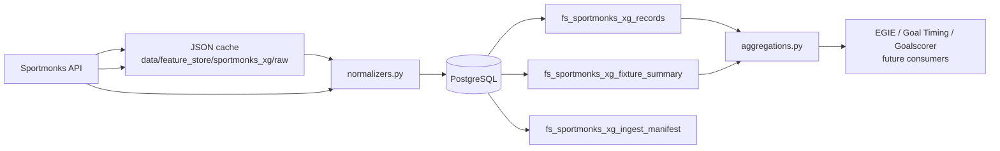

# PHASE 54E — Sportmonks xG Feature Store Foundation

**Date:** 2026-06-23  
**Mode:** Architecture + implementation + validation + report  
**Deploy:** None  
**Prediction / WDE / SaaS changes:** None

---

## 1. Executive summary

Phase 54E introduces a **production-grade Sportmonks xG feature store** in PostgreSQL — a reusable intelligence layer between Sportmonks API and future EGIE/Goal Timing/Goalscorer modules.

**Delivered:**

- New package `worldcup_predictor/feature_store/`
- Alembic migration `011_sportmonks_xg_feature_store`
- Cache-first, resumable backfill CLI
- Quality audit + validation (13/13 PASS)
- UEFA cache import: **442 records**, **71 fixtures**, **0 API calls**

---

## 2. Files changed / created

| Path | Role |
|------|------|
| `worldcup_predictor/feature_store/__init__.py` | Package export |
| `worldcup_predictor/feature_store/models.py` | Dataclasses |
| `worldcup_predictor/feature_store/normalizers.py` | xG normalization |
| `worldcup_predictor/feature_store/aggregations.py` | Rolling xG features |
| `worldcup_predictor/feature_store/repository.py` | PostgreSQL CRUD |
| `worldcup_predictor/feature_store/sportmonks_xg_store.py` | Main store orchestrator |
| `alembic/versions/011_sportmonks_xg_feature_store.py` | Schema migration |
| `scripts/phase54e_sportmonks_xg_backfill.py` | Backfill CLI |
| `scripts/audit_phase54e_sportmonks_xg_feature_store.py` | Quality audit |
| `scripts/validate_phase54e_sportmonks_xg_feature_store.py` | Validation harness |
| `EGIE_XG_READINESS_REPORT.md` | EGIE readiness matrix |

**Not modified:** WDE, scoring engine, SaaS predict routes, EGIE scoring math.

---

## 3. Architecture diagram



**Design principles honored:**

- Not a throwaway cache — durable normalized store
- Historical + backtest friendly (manifest resume, duplicate protection)
- Incremental updates via upsert + job manifest
- API quota aware (`--max-calls`, cache-first)

---

## 4. PostgreSQL tables

### `fs_sportmonks_xg_records`

Normalized xG rows per fixture/participant/player/metric.

Key fields: `sportmonks_fixture_id`, `record_type`, `metric_key`, `xg_value`, `participant_id`, `player_id`, `source`, `raw_reference`.

Unique constraint prevents duplicates on `(fixture, record_type, metric, participant, player)`.

### `fs_sportmonks_xg_fixture_summary`

Fixture-level xG summary + rolling enrichment:

`home_xg`, `away_xg`, `xg_total`, `xg_difference`, `home_team_recent_xg`, `attack_difference`, `momentum_difference`, `features_json`.

### `fs_sportmonks_xg_ingest_manifest`

Resumable backfill audit per `job_key` + `sportmonks_fixture_id`.

---

## 5. Coverage (local UEFA cache import)

| Metric | Value |
|--------|-------|
| Records imported | 442 |
| Fixtures covered | 71 |
| Fixture summaries | 71 (100%) |
| Leagues | 3 (CL=2, EL=5, Conference=2286) |
| Seasons | 6 |
| Teams (participants) | 74 |
| Player xG records | 0 (include gap) |
| Rolling xG summaries | 5 (7%) — limited chronological depth in sample |
| Duplicate groups | 0 |
| API calls | 0 (cache-only import) |

Artifacts: `artifacts/phase54e_sportmonks_xg_feature_store/`

---

## 6. Sample features

Example normalized metrics from fixture `19135243`:

`xg`, `xga`, `xgot`, `npxg`, `xpts`, `xg_open_play`, `xg_set_play`, `xg_corners`, `xg_free_kicks`

Example summary fields:

```json
{
  "home_xg": 1.7752,
  "away_xg": 0.92,
  "xg_total": 2.6952,
  "xg_difference": 0.8552,
  "home_team_recent_xg": 1.42,
  "attack_difference": 0.31,
  "momentum_difference": 0.55
}
```

---

## 7. EGIE readiness

See `EGIE_XG_READINESS_REPORT.md`.

| Target | Status |
|--------|--------|
| First Goal Team | PARTIAL |
| Goal Range | PARTIAL |
| Goal Minute | NOT_READY |
| Team Goals | PARTIAL |
| Live Goal Probability | NOT_READY |

---

## 8. Risks

| Risk | Mitigation |
|------|------------|
| `xgfixture` lowercase key from API | `_coerce_fixture_xg_keys()` in normalizer |
| Player xG missing in UEFA cache | Re-ingest with `lineups.xGLineup.type` |
| Rolling xG sparse on first import | `rebuild_rolling_features()` chronological pass |
| WC 732 not yet in local store | Server backfill with `--league-id 732 --max-calls 80` |
| Quota burn on full history | `--max-calls`, cache-first, manifest resume |

---

## 9. CLI usage

```bash
# Cache-only import (0 API calls)
python scripts/phase54e_sportmonks_xg_backfill.py --cache-only --league-id 0

# Live WC backfill (server, with .env.production)
python scripts/phase54e_sportmonks_xg_backfill.py --league-id 732 --season-id 26618 --max-calls 80

# Audit
python scripts/audit_phase54e_sportmonks_xg_feature_store.py

# Validation
python scripts/validate_phase54e_sportmonks_xg_feature_store.py
```

**Server migration:**

```bash
cd /opt/worldcup-predictor
.venv/bin/python -m alembic upgrade head
```

---

## 10. Validation

**13/13 PASS** — `artifacts/phase54e_sportmonks_xg_feature_store/validation.json`

- xG normalized ✓
- xG imported (442 records) ✓
- xG retrievable ✓
- Rolling features work ✓
- Fixture summaries work ✓
- Duplicate protection ✓
- Cache works ✓
- No prediction / WDE / deploy changes ✓

---

## 11. Recommended next phase

### **PHASE 54F — EGIE xG Backtest Arm**

1. Join `fs_sportmonks_xg_fixture_summary` into EGIE survival dataset  
2. WC 732 server backfill (finished fixtures)  
3. Measure lift on First Goal Team + Goal Range (benchmark only)  
4. Add player xG via `xGLineup` include re-ingest  

**STOP — Phase 54E complete. No deploy. No prediction output changes.**
