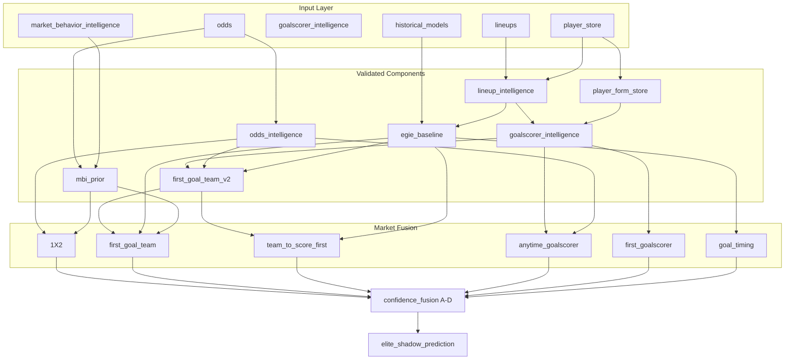

# PHASE 57A — Elite Prediction Orchestrator

**Date:** 2026-06-25
**Mode:** Architecture → Shadow Integration → Ensemble Design
**Status:** Complete — design only
**API calls:** 0

---

## Part A — Component Inventory

**Validated components:** 8 | **Rejected:** 5

| Component | Confidence | Markets | Latency | Readiness |
|-----------|------------|---------|---------|-----------|
| Lineup Intelligence | HIGH_VALUE | first_goal_team, team_to_score_first, anytime_goalscorer… | 120ms | READY |
| Player Form Store | HIGH_VALUE | anytime_goalscorer, first_goalscorer, first_goal_team | 80ms | READY |
| Goalscorer Intelligence Engine | HIGH_VALUE | anytime_goalscorer, first_goalscorer, first_goal_team | 200ms | PARTIAL |
| First Goal Team Engine V2 | HIGH_VALUE | first_goal_team, team_to_score_first | 150ms | READY |
| Market Behavior Intelligence (MBI) | MEDIUM_VALUE | 1x2, first_goal_team, team_to_score_first | 60ms | PARTIAL |
| Odds Intelligence | BASELINE | 1x2, first_goal_team, team_to_score_first… | 90ms | PARTIAL |
| EGIE Historical Baseline | BASELINE | first_goal_team, team_to_score_first, goal_timing | 250ms | READY |
| Hybrid Confidence Engine | PRODUCTION_ACTIVE | first_goal_team, goal_timing | 40ms | READY |

### Excluded (rejected research)

- **pressure_index** (54H-7): Pre-match pressure adds no value; in-play only signal.
- **team_context** (54R): Team context hurts UEFA (−1.9pp). Only is_home positive.
- **availability_overlay** (54S): Lineup-only (67.2%) beats lineup+availability (66.2%) on UEFA.
- **team_xg_general** (54F / 54F-6 / 54F-7): General xG blend hurts FGT. Market-specific xG kept as reference only.
- **full_feature_blend** (55C / 54S): Full blends plateau or degrade vs focused feature families.

Artifact: `artifacts/phase57a_elite_orchestrator/component_inventory.json`

## Part B — Orchestration Graph

**Version:** `elite_orchestrator_v1_shadow`
**Nodes:** 21 | **Edges:** 47



**Execution order:** input_layer → parallel_components → market_fusion → confidence_fusion → shadow_output

## Part C — Confidence Fusion

| Signal | Weight | Role |
|--------|--------|------|
| model_agreement | 0.3 | Agreement between EGIE baseline, FGT V2, and goalscorer team |
| market_agreement | 0.2 | Model pick aligns with implied odds favorite / goalscorer od |
| mbi_prior | 0.1 | MBI bucket prior supports model direction (10% blend feasibl |
| odds_confidence | 0.25 | Sharp consensus, movement stability, market depth |
| data_quality | 0.15 | Lineup confirmed, player history depth, odds coverage |

**Tier thresholds:** A≥0.72, B≥0.58, C≥0.42, D<0.42

## Part D — Shadow Output Object

Single internal object: `EliteShadowPrediction`

Per market: `prediction`, `confidence`, `tier`, `evidence`, `reasoning`, `component_contributions`

Example: `artifacts/phase57a_elite_orchestrator/shadow_output_example.json`

## Part E — Readiness Matrix

| Market | Readiness | Shadow | Production | Primary components |
|--------|-----------|--------|------------|------------------|
| 1x2 | **PARTIAL** | True | False | odds_intelligence, market_behavior_intelligence |
| first_goal_team | **READY** | True | False | first_goal_team_v2, egie_historical_baseline |
| team_to_score_first | **READY** | True | False | first_goal_team_v2, egie_historical_baseline |
| anytime_goalscorer | **PARTIAL** | True | False | goalscorer_intelligence, player_form_store |
| first_goalscorer | **RESEARCH** | True | False | goalscorer_intelligence |
| goal_timing | **PARTIAL** | True | False | egie_historical_baseline, hybrid_confidence_engine |

### Shadow production priority

1. **first_goal_team** (READY) — 55C HIGH_VALUE. Best path: FGT V2 + EGIE ensemble. Shadow before WDE.
2. **team_to_score_first** (READY) — Alias fusion path to first_goal_team. Same validated stack.
3. **1x2** (PARTIAL) — MBI improves calibration modestly. Shadow odds+MBI blend first.
4. **anytime_goalscorer** (PARTIAL) — WC shadow-ready (77% top-3 with odds). UEFA needs odds expansion (55B blocked).
5. **goal_timing** (PARTIAL) — Production exists but elite layer adds confidence only — no new timing model.
6. **first_goalscorer** (RESEARCH) — Include in shadow object but tier-capped at B. Research track only.

## Part F — Decision Questions

### 1. Which modules are production-ready?

- `lineup_intelligence`
- `player_form_store`
- `first_goal_team_v2`

Baseline anchors (already in production, not replaced):

- `egie_historical_baseline`
- `hybrid_confidence_engine`

### 2. Which modules remain research only?

- `goalscorer_intelligence`
- `market_behavior_intelligence`
- `odds_intelligence`

### 3. Which markets should enter shadow production first?

1. **first_goal_team** — 55C HIGH_VALUE. Best path: FGT V2 + EGIE ensemble. Shadow before WDE.
2. **team_to_score_first** — Alias fusion path to first_goal_team. Same validated stack.
3. **1x2** — MBI improves calibration modestly. Shadow odds+MBI blend first.

### 4. Final architecture for Elite Prediction Engine

```
Inputs → Validated Components (parallel) → Market Fusion → Confidence Fusion → EliteShadowPrediction
```

| Layer | Responsibility |
|-------|----------------|
| Input adapters | Lineups, player store, odds, MBI priors, EGIE baseline |
| Component runners | 8 validated modules only — no pressure/team-context/availability/xG blend |
| Market fusion | Per-market weighted ensemble with explicit contributions |
| Confidence fusion | Tier A–D from agreement + odds + MBI + DQ |
| Shadow store | `data/shadow/elite_orchestrator_predictions.jsonl` |

**Boundary:** Zero changes to `PredictPipeline`, WDE, live API, or EGIE scoring.

---

## Constraints honored

- No deploy, production integration, or API changes
- Design and shadow schema only