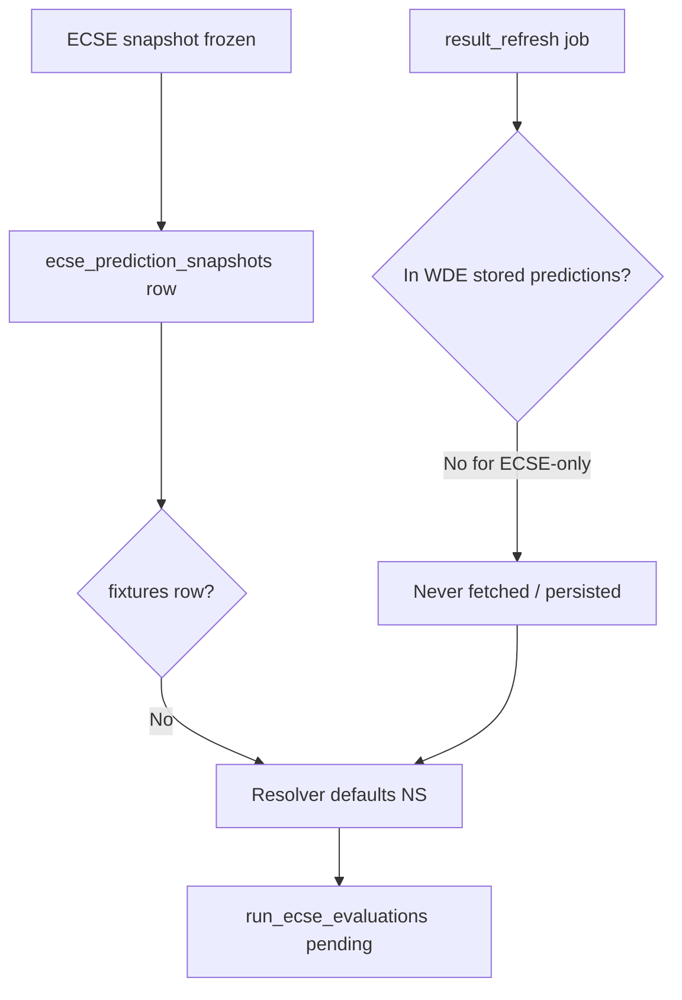

# WC Result Sync — ECSE Evaluation Report

**Date:** 2026-06-30  
**Scope:** Brazil vs Japan, Germany vs Paraguay, Netherlands vs Morocco  
**Script:** `scripts/sync_worldcup_results_for_ecse.py`

---

## Executive summary

Three completed World Cup Round-of-32 fixtures remained stuck at **stored status NS** with **no `fixtures` or `fixture_results` rows**, blocking ECSE-LIVE-1 evaluation. The provider (API-Football) already had **FT** / **PEN** results with scores.

**Root cause:** ECSE snapshots were frozen in `ecse_prediction_snapshots`, but the result-refresh pipeline (`refresh_stored_prediction_results`) only scans `list_worldcup_stored_prediction_rows` (WDE prediction archive). These three fixtures were **not** in that list. `FixtureOutcomeResolver` is **read-only** (SQLite + JSONL only) and never calls the provider.

**Fix:** Ran `scripts/sync_worldcup_results_for_ecse.py` with `force_refresh=True` for the three fixture IDs. All three synced; ECSE backfill evaluated **3/3**.

---

## Per-fixture diagnosis (pre-sync)

| Match | Fixture ID | Sportmonks ID | Stored status | Provider status | Kickoff (UTC) | Kickoff passed | Cache stale? | Result endpoint called? | FT/AET/PEN → finished |
|-------|------------|---------------|---------------|-----------------|---------------|----------------|--------------|-------------------------|------------------------|
| Brazil vs Japan | 1562344 | 19606959 | **NS** (no row) | **FT** 2-1 | 2026-06-29 17:00 | Yes | No (API cache had FT after live fetch) | **No** (not in WDE refresh list) | Yes |
| Germany vs Paraguay | 1565176 | 19606957 | **NS** (no row) | **PEN** 1-1 (pens 3-4) | 2026-06-29 20:30 | Yes | No | **No** | Yes |
| Netherlands vs Morocco | 1562345 | 19606958 | **NS** (no row) | **PEN** 1-1 (pens 2-3) | 2026-06-30 01:00 | Yes | No | **No** | Yes |

### Notes on PEN scores

API-Football reports `goals.home/away` as **90+ET aggregate** (1-1) for PEN fixtures. Penalty shootout tallies are in `score.penalty` only. The sync script stores provider `goals` — no fabricated scores.

---

## Component analysis

### 1. FixtureOutcomeResolver

Location: `worldcup_predictor/api/prediction_history_evaluation.py`

Resolution order:

1. `data/results/match_results.jsonl`
2. SQLite `fixture_results` (+ goal events)
3. SQLite `fixtures.status` (defaults to **NS** if row missing)

**Does not call API-Football.** Pre-sync, all three fixtures resolved to `is_finished=False`, `status=NS`, `final_score=None` because neither `fixtures` nor `fixture_results` had rows.

### 2. Provider result fetch

`ApiFootballClient.get_fixture_by_id()` → `_safe_get("fixtures", {"id": fixture_id})`.

- **Local-first shortcut** (`quota/local_first.py`): if a `fixtures` row exists, rebuilds API payload from DB **without freshness check**. A row stuck at NS would block live refresh unless `force_refresh=True`.
- For these three fixtures, **no local row existed**, so live API returned correct FT/PEN immediately.
- `refresh_stored_prediction_results` (`automation/worldcup_background/result_refresh.py`) calls `get_fixture_by_id` **without** `force_refresh` and only for WDE stored predictions — **ECSE-only fixtures are never scanned**.

### 3. Cache TTL

| Endpoint | TTL | Effect |
|----------|-----|--------|
| `fixtures` (by id) | 1800 s (30 min) | File + SQLite API cache |
| Local-first DB | No TTL | Serves stale NS forever if row exists |

Pre-sync API file cache already held FT/PEN (from earlier ECSE provider runs). Staleness was **not** the blocker; **missing persistence** was.

### 4. Competition mapping

- ECSE snapshots use `competition_key = world_cup_2026`.
- API-Football league **732**, season **2026** — mapping correct; provider returned full fixture payloads.
- Sync script upserts with `competition_key="world_cup_2026"`.

### 5. Fixture ID mapping

| Internal (API-Football) | Sportmonks | Registry |
|-------------------------|------------|----------|
| 1562344 | 19606959 | — |
| 1565176 | 19606957 | — |
| 1562345 | 19606958 | — |

IDs consistent with `ECSE_LIVE_1_REPORT.md`. No ID mismatch.

### 6. Status mapping

`schedule/match_center.py`:

```python
FINISHED_STATUSES = {"FT", "AET", "PEN"}
```

`classify_status("FT")` → `"finished"`  
`classify_status("PEN")` → `"finished"`  

`upsert_fixture_result` gates on `classify_status(fixture.status) == "finished"`. Mapping is correct; data never reached the table.

---

## Failure chain



---

## Sync script

**Path:** `scripts/sync_worldcup_results_for_ecse.py`

### Behaviour

- Accepts fixture IDs as CLI args; default = ECSE snapshots missing results or stuck at NS.
- Skips unless kickoff is in the past **and** stored status is NS (or fixture row missing).
- Calls `api._safe_get(..., force_refresh=True)` — bypasses local-first and file cache.
- Persists `fixtures` + `fixture_results` **only** when provider status ∈ {FT, AET, PEN} and goals are present.
- Appends to `data/results/match_results.jsonl` via `save_finished_fixtures`.
- Runs `run_ecse_evaluations` after successful syncs.

### Usage

```bash
# Explicit fixture IDs
python scripts/sync_worldcup_results_for_ecse.py 1562344 1565176 1562345

# Auto-discover ECSE snapshots needing results
python scripts/sync_worldcup_results_for_ecse.py

# Dry run
python scripts/sync_worldcup_results_for_ecse.py 1562344 --dry-run
```

---

## Post-sync results

| Fixture | Stored status (after) | Final score | ECSE top-1 | Actual | Top-1 hit | Rank |
|---------|----------------------|-------------|------------|--------|-----------|------|
| 1562344 Brazil vs Japan | FT | 2-1 | 1-0 | 2-1 | No | 4 |
| 1565176 Germany vs Paraguay | PEN | 1-1 | 2-0 | 1-1 | No | 7 |
| 1562345 Netherlands vs Morocco | PEN | 1-1 | 1-0 | 1-1 | No | 2 |

**Sync run:** `scanned=3`, `synced=3`, `ecse_evaluated=3`, `errors=0`  
**Artifact:** `artifacts/wc_result_sync_ecse_latest.json`

`FixtureOutcomeResolver` now returns `is_finished=True` for all three.

---

## Recommendations

1. **Wire ECSE into result refresh** — extend `refresh_stored_prediction_results` (or scheduler) to include `ecse_prediction_snapshots` fixture IDs past kickoff, or call `sync_worldcup_results_for_ecse.py` from the ECSE live cycle after FT+15.
2. **Local-first guard** — skip `load_fixture_api_item_from_db` when stored status is NS/TBD and kickoff is in the past (or when `force_refresh` is requested).
3. **Persist fixture on ECSE freeze** — when `ecse_prediction_snapshots` is inserted, upsert a minimal `fixtures` row so downstream resolvers have kickoff/teams without a separate sync.

---

## Files touched

| File | Action |
|------|--------|
| `scripts/sync_worldcup_results_for_ecse.py` | Created |
| `WC_RESULT_SYNC_ECSE_EVALUATION_REPORT.md` | Created |
| `fixtures` / `fixture_results` (SQLite) | Updated by sync run |
| `ecse_prediction_evaluations` | 3 rows inserted by backfill |
