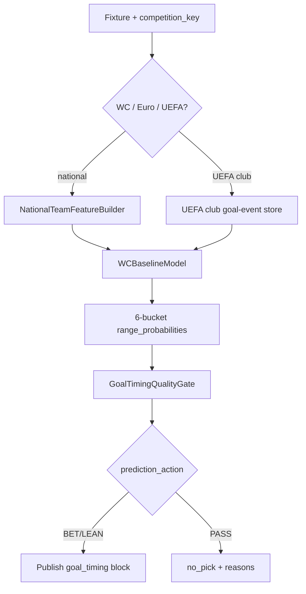

# EGIE_WC_GOAL_TIMING_ENGINE — Implementation Blueprint (Phase A23)

**Status:** Blueprint only — not wired to production WDE or PL EGIE.

## Purpose

Parallel goal-timing engine for FIFA tournaments and national-team football, producing
`goal_timing.range_probabilities` and abstention-aware picks without modifying
`worldcup_predictor/goal_timing/engine.py` (Premier League EGIE).

## Module layout (proposed)

```
worldcup_predictor/goal_timing/wc_engine/
  __init__.py
  config.py              # competition profiles, min samples
  feature_builder.py     # national-team histories via intelligence/national_team/*
  baseline_model.py      # tournament-calibrated minute distributions
  engine.py              # EGIE_WC_GOAL_TIMING_ENGINE orchestrator
  adapter.py             # maps output → stored prediction goal_timing block
  shadow_runner.py       # JSONL shadow before promotion
```

## Competition profiles

| competition_key | type | feature sources | min finished samples |
|-----------------|------|-----------------|----------------------|
| `world_cup_2026` | FIFA tournament | WC 2018/2022 + qualifiers + national_team engines | 120 team-matches |
| `european_championship` | UEFA tournament | Euro 2020/2024 + qualifiers (Sportmonks 1326) | 80 |
| `champions_league` | UEFA club | existing UEFA club EGIE datasets + goal events | 200 |
| `europa_league` | UEFA club | same | 150 |
| `conference_league` | UEFA club | same | 100 |

**Note:** `euro_2024` is not in `COMPETITION_REGISTRY`; map via `european_championship` (SM league 1326).

## Pipeline



## Output contract

```json
{
  "goal_timing": {
    "engine": "EGIE_WC_GOAL_TIMING_ENGINE",
    "model_version": "wc_goal_timing_v0.1.0",
    "first_goal_team": "home",
    "first_goal_time_range": "16-30",
    "estimated_first_goal_minute": 24,
    "range_probabilities": {
      "0_15": 0.18,
      "16_30": 0.29,
      "31_45": 0.17,
      "46_60": 0.14,
      "61_75": 0.12,
      "76_90": 0.10
    },
    "prediction_status": "VALID",
    "data_quality": "MEDIUM",
    "no_clear_edge": false,
    "prediction_action": "LEAN",
    "confidence": 0.62,
    "data_sources_used": ["national_team_form", "tournament_baseline", "lambda_bridge"]
  }
}
```

## Integration points (future phase)

1. **PredOps** — `build_egie_snapshot()` reads `goal_timing.range_probabilities`.
2. **Stored predictions** — merge via adapter after WDE payload build (sidecar, not WDE math).
3. **Lifecycle** — capture gate result in `prediction_lifecycle` rows.
4. **Shadow** — `data/shadow/wc_goal_timing_shadow.jsonl` before public promotion.

## Non-goals

- Do not change `GOAL_TIMING_PREDICTION_LEAGUE_KEYS` for PL engine.
- Do not alter `WeightedDecisionEngine` factor weights.
- Do not auto-promote to BET without quality gate HIGH + shadow validation.
